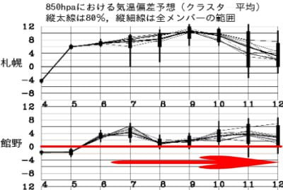
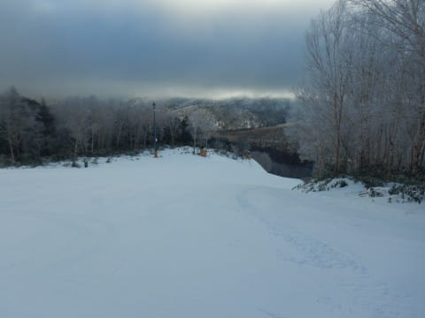
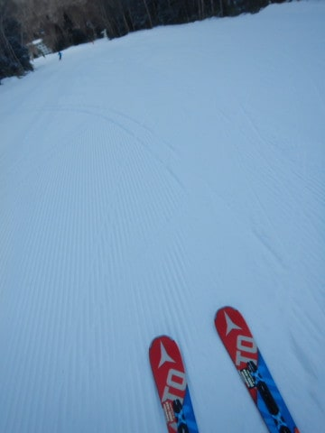
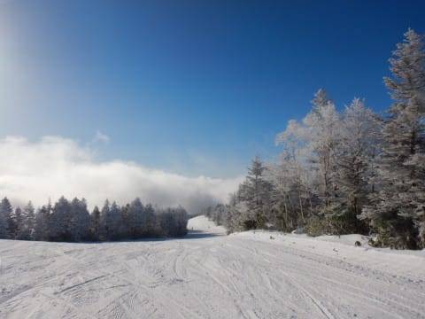
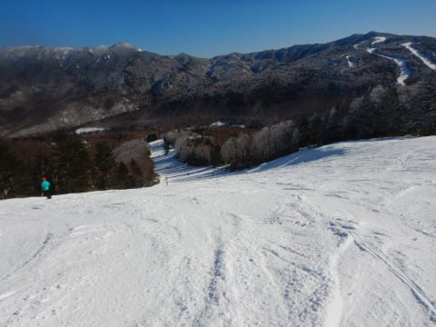
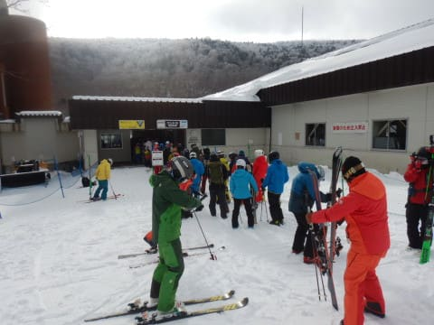
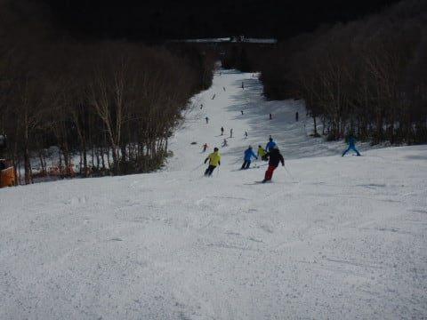
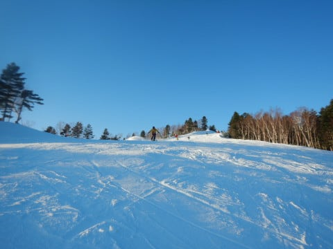

# 2021/12/5(日)オープン翌日の志賀高原焼額山スキー場，速報レポート！…午前ちょっと混んだけど，雪は12月1週としてはいいよ！

📅 投稿日時: 2021-12-06 01:57:20

うーむ．

どうも，6日に標高が低いスキー場は

パラパラと雨に降られて．

その後，また7日の朝から夜中にかけて，

空からかなりの液体が降ってくる

危険性が…(涙）

でも．

7日，志賀高原の標高が高いところて

降るのは，液体じゃなく固体だと

信じたい…

微妙．まだ，液体か固体か，微妙…

今のままの天気図だと，焼額だと

山頂付近で雪，麓は液体…

という感じ(涙）

…しかし，やはり．

冷え冷え祭りは今日の日曜まで．

明日6日からは…

しばらく，平年より気温が高い日が

続きそう（泣）

うーん．

これからしばらく，ドサドサ積もる日は

来なさそう…(涙）

それどころか，人工降雪機も動かせる日は

少ないかも？？？

来週は，今週よりコンディション悪い

可能性が…(激涙)

でも．

今日は良かった．

今日も，焼額は12月1週と思えない

Goodコンディションでした！！

…そして．

今日も帰宅は深夜だったので．

いつもの帰宅日恒例，速報モードにて…

まず．

今日の朝イチは，予想通り雲が多い天気で

始まりましたが…

昨晩からの積雪は2cm程度(涙）

もう少し積もってくれると思ったんだけど…

積雪が少なかったので，

あさイチのバーンは結構締まった硬めの

仕上がりのシマシマ！

…でも，思ったより硬めのバーンで，

板が流され気味だったかな…

その後，予想より早い9時ごろには

空が晴れ上がってきて…

午前中に，すっきり晴天に！

昼ごろには気温も0度くらいまで

上がったこともあり，日が射すところは

暖かさも感じるほどで．

日が射したところは雪がちょっとだけ

しっとり緩んできてました…

でも．

日陰部分，特に人工降雪を打っている

コース下部は，ラストまで硬めのバーン．

…というより，人工雪が固まった，ちょっと

カリカリしたところもあったかな…

コロコロもところどころ出てました(泣）

そして…

午前11時頃まではゴンドラ待ち最大10分と，

昨日より混みましたね…（ちょい涙）

午後は3分程度の待ちに短くなりましたが，

日曜午後と考えれば，かなり人が

多かったかな～．

やっぱり焼額がコンディションいいから

人が集まったのか…

コース上の人は昼過ぎまで，この時期の

焼額と考えればちょっと多め．

とはいえ．

12月第1週のこの時期なのに．

ゴンドラの上から下までコースいっぱい

滑れて，そして土が出てくる気配がない…

という，極めて恵まれたバーン状況で．

営業終了まで，長距離のゴンドラコースを

たっぷり堪能できたのでした！！

うーむ．

良かった．

この週末は，ヘタするとコンディションが

悪い1月より良かったかも…

来週まで，天然雪が積もらなかったとしても．

せめて人工降雪機が動かせて，第2高速が

動くといいなぁ…

## 💬 コメント一覧

### 💬 コメント by (Hide)
**タイトル**: うらやましい・・・
**投稿日**: 2021-12-06 12:25:48

S 様

おひさしぶりです。

いや～この時期にゴンドラが動くとは近年では久方ぶりではなかったでしょうか？

早く行かないと雪がなくなっちゃう（笑）

### 💬 コメント by (レインボー74)
**タイトル**: Unknown
**投稿日**: 2021-12-06 13:17:42

月曜日の志賀高原情報

朝の上林2℃　蓮池-1℃。雨のスタート。昨日は足首に人生３度目の痛風が出て休場。今日は何とかブーツが履けた。大丈夫だ！若者は回復が速い。

ゲレンデは快適だけど、液体で視界が！

そのうち向かい風が強烈になって、超減速運転に！　ゴンドラに1人乗りが4人も続いたりもあって、11時半までに9本しか滑れず終了。ヤケビはやっぱりいいなあ！

### 💬 コメント by (Skier_S)
**タイトル**: 7日が雨にならないよう祈って踊らなくては
**投稿日**: 2021-12-07 03:53:01

＞Hideさま

お久しぶりです～！

12月第1週のゴンドラ営業はおそらく2017年以来です！

ぜひ早めに焼額へお越しください～！！

＞レインボー74さま

復活したんですね！こんな早くに快復されるとは…（若者かどうかは分かりませんが（笑））

レインボーさんレポートが無くて多くの人が寂しがっていたと思います…

今日はコンディション悪かったんですね．

明日も天気が悪いと思います…

