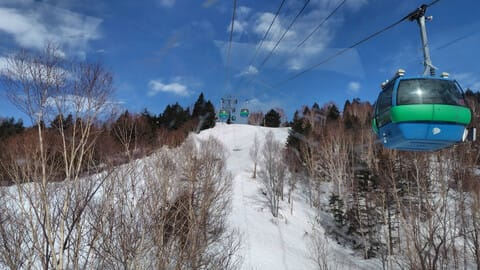
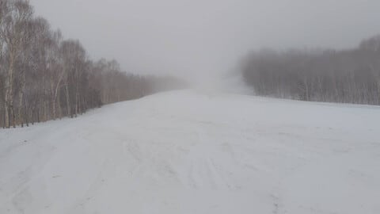
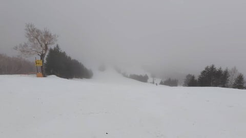
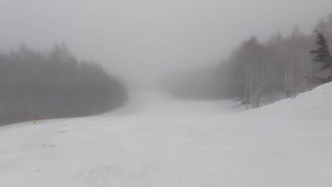

# 今日の志賀高原スキー場は特派員によると晴れ→雨→ガスの悲惨な一日．今週末の天気は非常に読みにくいけど，冷えて晴れたり曇ったり雪が降ったり

📅 投稿日時: 2025-03-29 00:08:24

🏷️ カテゴリ: [日記](cc4b5682fb7b8b144980957a978653fb0.md)

年度末で仕事があまりにもバタバタしすぎて

いて，本来なら土日休んでいるどころじゃ

無いよ（涙）

と思っていたところ…

3月中に終わらせなきゃと思った仕事が，

実は4月締め切りだったということを知って，

必殺，終わったことにするビーム

という必殺技を繰り出すことなく，

何とか今週末も志賀高原へ行けることに

なったSkier_Sです．

助かった…

ということで．

いつも通り週末は志賀高原へ繰り出すわけ

ですが．

週末の前日となる，本日3月28日金曜の

志賀高原．

特派員から送られてきた写真を見ると…

どうやら昨晩は雨が降り，朝は雲が

多かったものの，ちょうどゴンドラの

営業開始直後に青空が出てきて…

なんと，午前中は意外にも晴れたようです！

ただし．

朝イチから気温が7℃と高温で，

朝10時にはすでに9℃まで上がってしまった

本日．さらに晴れの日差しのせいで，雪の

滑りは悪かったようで…

一部，妖怪板つかみの幼体，

「妖怪板ちゅかみ」ってくらいのヤツが

いっぱい出現したようですが．

昼頃にはガスってきて…

そして，午後1時頃にはかなり強い雨が

降り始めてきたようです…！（泣）

ただ，雨が降ったぶん，大量に発生しつつ

あった妖怪板ちゅかみは全滅し，

板の滑りが良くなったらしく．

さらにゲレンデもガラガラになったので．

某特派員からは「待望の雨！」と喜んで

滑っているレポートが送られてきました．

いや…焼額の特派員はやはり何かが違う…

雨は1時間程度で止んだようですが．

その後は全面ガスの午後が続いたらしく．

それでも，白樺・唐松をグルグルして

楽しかった…

と，終わった人やはり何かが違う，見上げた

根性の特派員からレポートがありました…

ってなことで．

そこまでひどい雨ではなかったものの，

高温＆雨でかなり雪がやられた本日だった

わけで．

そこから明日の土曜朝にかけて一気に冷え込む

ので，ガチガチアイスバーンになりそうな

気配…（涙）

でも．

降るのだ．

ちょっとだけでも，これから明日の朝まで

雪が積もってくれるのだ…！

明日の朝，5cmでも積もってくれればかなり

ゲレンデ状況は良くなるんだけど…

うーん．

積雪はせいぜい1-2cmかな…（泣）

ほとんどアイスバーンは隠れないかも…

とりあえず，この土日の天気図は，

プチ高気圧や低気圧がいっぱいできる

予想なので…

はっきり言って，晴れるか曇るかは

プチ低気圧がどこにどうできるかで

全く変わるので，正確に予想は難しいです．

ただ，その中でも何とか予想をしてみると．

28日（土）：早朝までチラチラ雪．

　朝の気温は-5℃と久しぶりに冷えて，

　ガチガチアイスバーンのシマシマの上に

　うっすら1-2cmの積雪．

　運よく5cmほど積もってくれれば

　アイスバーンが隠れてくれるので，

　運が良いことを祈りたい．

　天気は運が良ければ朝は晴れ，

　運が悪ければ曇り．

　気温は昼間も0℃を越えないので，

　下地のガチガチアイスバーンは一日

　緩まなさそう．

　運よく日が射せば，日差しの良い

　バーンはアイスバーンの表面が緩んで

　くれそうだけど…

　おそらく曇りベースの時折晴れくらい

　だと思うので，一日硬いままかな…

　運が良ければプチ低気圧がずれてくれて，

　朝から夕方まで日が射す可能性もあり．

29日（日）：夜中にうっすら1-2cm積もるか？

　朝の気温は-8℃くらいとかなり冷えそう！

　その分バーンは硬いかも…（泣）

　天気は午前中は晴れるかもしれないけど，

　そのあとは曇り空．

　運が良ければ昼過ぎまで晴れが続くが．

　運が悪いと朝も晴れ間なく終日曇り．

　昼間の気温も-3℃程度と上がらないので，

　雪は終日硬め．というか，硬い．

　午後は時折雪もぱらつくかも．

　もしかすると，ムチャクチャ運が良ければ

　午後雪が降って数㎝積もってくれるかも．

ってな感じで．

運が良ければ土曜は雪が5cmくらい積もって

アイスバーンが隠れてくれて．

さらに日が射してアイスバーンの表面が

ちょっと緩んで滑りやすくなる可能性が

あるけど…

運が悪いと1cmほどの積雪でアイスバーンが

隠れず，一日曇りで

春の山ではアイスバーン祭り

になりそうな感じ…（泣）

果たして，運が良いか悪いか？？

土日冷えるんだから降ってくれ！！

お願い，降って！！！

という感じなんですが…

降ってくれなさそう．

贅沢は言わない．

ワガママを言わないから．

今晩，5cmといわず0cmほど雪が積もって

最高のゲレンデになってほしい…←いや，それは強烈なワガママ

ってなことで．

いつも通り，あと3時間半後に起きて

志賀高原へ出発です～！！

3時間寝られるかな…（泣）

では，週末志賀高原でお会いしましょう！！

## 💬 コメント一覧

### 💬 コメント by (hapi44)
**タイトル**: Unknown
**投稿日**: 2025-03-29 10:24:35

お疲れ様です！

なんか雪降りそうですよね😊

楽しめる（Sさんはいつでもですね）事を

祈ってます❗️

妖怪板ちゅかみ！笑いました🤣

### 💬 コメント by (Skier_S)
**タイトル**: Unknown
**投稿日**: 2025-03-29 22:21:06

>hapi44さま

今日は朝はかなり微妙でしたが、午後は楽しめましたよ〜！

明日も楽しんできます！

