# 3月8，9日の週末の志賀高原スキー場の天気は…土曜は基本曇り，ときおり晴れたり雪もぱらつくか？日曜は曇りのち晴れ．気温は冷え気味！

📅 投稿日時: 2025-03-06 04:25:00

🏷️ カテゴリ: [スキー天気予想](c6554f5c3c106093b511a8daae23757e8.md)

ということで．

朝から雨が降ったりやんだりで，

風もそこそこ出る暴風雨になりそう…

という，当たってほしくない悲しい

予想が，どうやら見事当たってしまった

らしく．

5日(水)の昼間の志賀高原，ライブカメラを

見ると…雨だよ(泣)

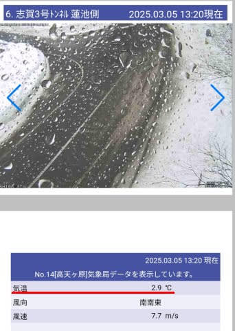

（[北信建設事務道路気象状況カメラ](http://hokushin.pref-nagano-roadcamera.jp/)より）

だもんで．

朝は志賀高原ほぼ全面リフトが動いて

無かったようですが…

焼額は午前中に第4ロマンスが，昼頃には

第2高速が動き始めたようですね…！

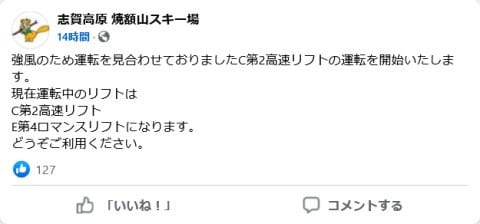

（[焼額山スキー場Facebook](https://www.facebook.com/yakebitaiyama/posts/pfbid0Zx3YuojMLiW42a4wtFe9RgVvQWh4H77UciWhZAn2SJig9euAxWm42q6eXTomcu2dl)より）

しかし，2高と4ロマは動いたものの，

終日第2ゴンドラと第3高速は動かせない

風だったようで．

高温の強い風が吹き付けて，さらに昼間も

小雨が時々ぱらつく天気だった今日一日，

やっぱり雪質はかなり悪化したんだろう

なぁ…（激泣）

で．

さらに．

焼額山の第1ゴンドラの修理が予想外に

手間取っているようで．

第1ゴンドラは，7日金曜まで運休！！！

うーん．

今週はいろいろ呪われている感じが

する…（泣）

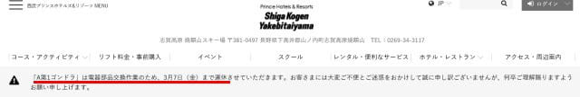

（[焼額山スキー場ホームページ](https://www.princehotels.co.jp/ski/shiga/winter/)より）

ってな感じで，

今日は全国のスキー場の雪がかなりやられたと

思うのですが．

果たして，この悪化したバーンコンディションは

週末までに回復してくれるのか…？？？

週末までに回復するようなら私のおかげ，

回復しないなら皆さんの日ごろの行いの

悪さのせい

ということで，天気図を見てみましょう！←責任を他人に転嫁するな

まずは，6日(木)の850hPa気温ですが…

うむ．水色の-9℃線が志賀高原に近づいて

いるので…

これは3月としては結構な冷え込み！

5日の水曜とは打って変わって，一気に

冷え込みますね…！！

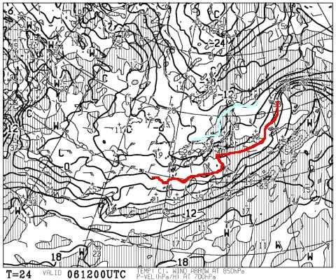

そして，地上天気図を見ると．

ふーむ．

日本海側に降水域がかかっているので…

そこまでドサドサ積もらなさそうですが，

ある程度雪は降ってくれそう．

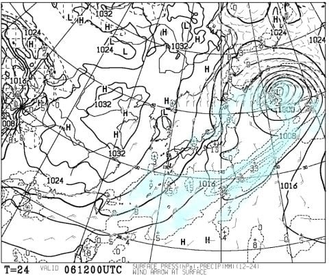

続いて，7日(金)の850hPa気温は…

この日志賀高原に近づくのは-6℃線と，

6日木曜よりは気温が上がるものの．

3月としてはまぁ冷えている方ですね．

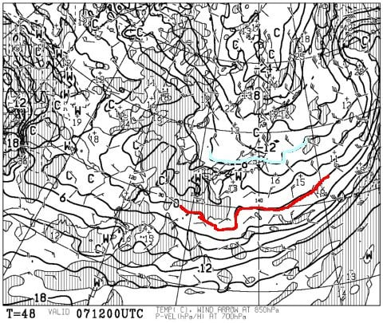

この日の地上天気図を見ると，高気圧に

覆われていそうですが．

北風が吹き込むので，山の上で結構降る

パターン！

志賀高原近辺の降水域はそれほど大きく

ないけど，たぶん，6日の夜から7日の

昼～夕方くらいまで，志賀高原では

そこそこ積もりそうな気がする…

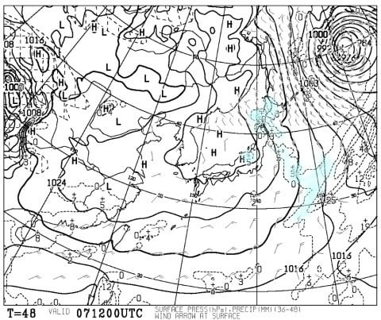

で．

肝心の週末，8日(金)の850hPa気温は…

うううーーむ．

志賀高原は，水色の-6℃線と-3℃線の

間くらい．

これは，まぁこの時期の平均的な気温かな…

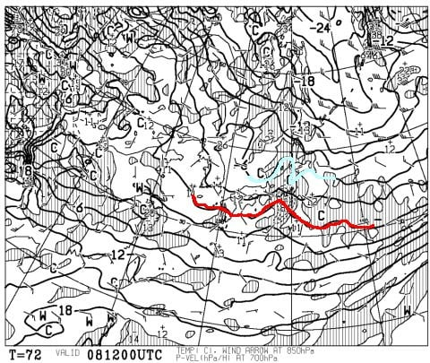

この日の地上天気図を見ると．

うーーーーーん．

一見高気圧に覆われてそうだけど…

日本の周囲にはかなりあちこちに

降水域が点在してますね…

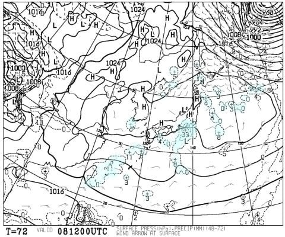

拡大すると，こんな感じでプチ低気圧が

予想されてますが．

…でも，こんなプチ低気圧，たぶんこの

予想通りの時間に予想通りの場所に

できるわけがないので…

このプチ低気圧がどれだけズレるかで

全然志賀高原の予想が変わっちゃいます．

だもんで，今の段階で正確な予想は

難しいです（泣）

まぁ，曇りベースで時々雪もぱらつくか，

運が良くてプチ低気圧ができなければ

結構晴れる…としか言いようがないです．

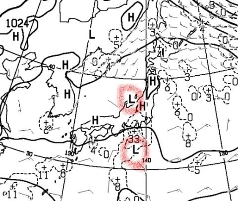

さらに9日(日)の850hPa気温を見ると．

うううーん．この日は志賀には-3℃線が

かかって，平年よりはちょい高めの

気温になりますね…

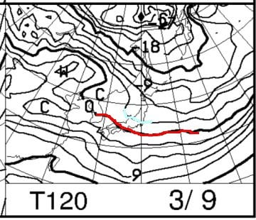

でも，地上天気図を見ると高気圧に

覆われているので…

基本的に晴れそう．

ただ，この日も高気圧の南に降水域が

予想されているという不思議な天気図

なので…

これ，アンサンブル予想の各クラスタの

ばらつきが大きくて，この降水域の

場所に低気圧が予想されるパターンも

あるように見えるので．

予想ばらつきによっては，これが志賀に

近づいて曇り～小雪の可能性もありうるか…

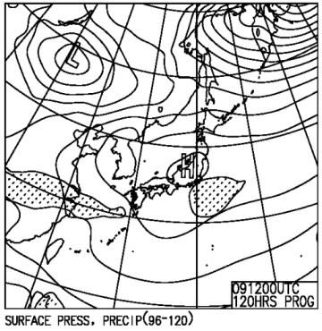

ってなことで．

まとめると．

6日(木)：小雪がぱらつく一日．

　朝までの積雪5-10cm，朝イチ気温は

　-10℃以下とかなり冷え，昼間も-7℃

　くらいまでしか上がらず，かなり寒い．

　昼間も雪がぱらつき，昼間で5-10cm

　くらい積もるか？

　バーンは雨で固まったバーン上に軽い

　新雪が乗った感じで，急斜面では

　下地の硬いのが隠れずに残りそう．

7日(金)：6日の夜からそこそこ降る．

　この日は一日雪が降り続ける．

　朝までの積雪は20cmを越えるか．

　アイスバーンは隠れて，朝イチは

　柔らかめの圧雪に新雪が乗った

　バーンコンディション．　

　朝イチの気温は-12℃，昼間も-5℃

　程度と冷える．

　下界はそれほど降らないけど，

　志賀高原の山の上で降り続ける

　パターン．昼間の積雪も10cmを

　越えるんじゃないかな…

　午後遅くには雪がやみそうだけど，

　午後はバーンがモサモサになっていく．

8日(土)：この日の予想は難しい…

　たぶん，朝までの積雪はほぼ0．

　朝イチの気温は-10℃程度．

　朝は前日の雪が圧雪された，

　トップシーズンのシマシマバーン！

　運が良ければ曇り～晴れで，

　運が悪ければ曇り～雪がパラパラ．

　プチ低気圧の発生状況次第で全く

　予想が変わる．

　ただ，終日気温はそんなに上がら

　なさそうなので，終日いい雪で

　楽しめそう…！！

9日(日)：たぶん朝から晴れ．

　朝イチの気温は-8℃くらい．

　もしかすると前日の夜にcmの

　積雪があるかもしれないけど，

　朝イチはいい感じにエッジが効く

　柔らかすぎないシマシマバーンが

　楽しめそう…！！

　午後は急斜面の一部で，ちょっと

　カリカリした下地がでてくるかも

　しれないけど，

　昼間もマイナス気温はキープしそう

　なので，この日も雪はそんなに悪く

　なく，終日楽しめるんじゃないかな．

ってな感じでしょうか…

うん．

5日の雨でどうなることかと思ったけど，

7日までの雪のおかげで，この週末は

思ったよりいいコンディションで滑れ

そうです…！！！！

…が．

しかし．

だが．

…

ん？？

んんんっ！？？？

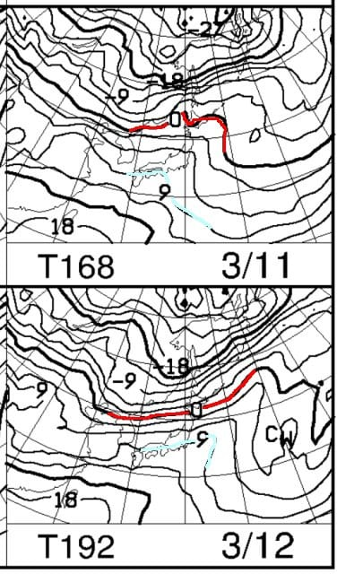

…ぇええええ！！！？？

うげーーーーっ！！！

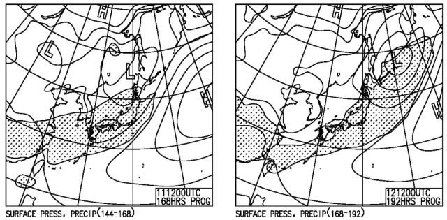

ということで．

この天気図通りなら…

11日～12日にかけて，また空から

液体が降ってきそうなんですが…(激泣)

いや．

空から降ってくるものが液体にならず，

何とか固体でいてほしいんだけど…

このBlogの2億4000万人の読者が，

これから日頃の行いをムチャクチャ

良くして志賀に液体が降らないよう

心がけるか，　

あるいは液体が降るかのどちらかです．

もう，選択肢は決まっていますね．

11，12日に液体が降ったら．それは

皆さんの日ごろ行いの悪さ…（ピシっ）←最後まで

言い終わるのを待たずに読者に狙撃されるSkier_S

## 💬 コメント一覧

### 💬 コメント by (hapi44)
**タイトル**: Unknown
**投稿日**: 2025-03-06 10:00:03

こんにちは！

いつも詳しいお天気解説ありがとございます

天気予報いらずです♪

なかなかもうシーズン後半に入っている事を実感してしまいます…

液体が降らないように念じます😌

### 💬 コメント by (富山県民)
**タイトル**: Unknown
**投稿日**: 2025-03-06 12:00:54

先日は志賀高原でも雨が降ったのですね。

3月に入ると残念ですが雨の確率が上がります。

しかし晴天率も上がりますね。

ただ雪質は悪くなります。

もうスキーシーズンも残りわずかだと思うと寂しいです。

### 💬 コメント by (富山県民)
**タイトル**: Unknown
**投稿日**: 2025-03-06 12:03:17

こんにちは。

ちなみに今週末ですが私は3月8日には福島県のネコママウンテン（旧アルツ磐梯＆旧裏磐梯猫魔）、3月9日には妙高杉ノ原に行く予定です。

これにて今シーズンの早割リフト券をようやく全て消化できそうです。

### 💬 コメント by (アツシ)
**タイトル**: Unknown
**投稿日**: 2025-03-07 00:52:34

天気予想、ありがとうございます。いやー長いブランクでしたね。先週滑れなかったから２週間ぶりです、私も。もう今週は禁断症状が出て大変でした。ではゲレンデでお会いしましょう🫡

### 💬 コメント by (Skier_S)
**タイトル**: 今日はそんなに雪が降らなかったか…
**投稿日**: 2025-03-07 01:12:27

＞hapi44さま

余りにも志賀高原に特化しすぎて，ほかのスキー場ではあんまり役立たない天気予想ですが…

役立っているなら幸いです．

とりあえず，3月も空から降るのは液体でなく，ずっと固体でいてほしいところ…

＞富山県民さま

いやー．志賀でも雨だったようです．

7日は雪が降る音で，8，9日は妙高はコンディション回復すると思います！！

ネコマは，そこまで雪が積もらないかもしれませんが…

### 💬 コメント by (Skier_S)
**タイトル**: ＞アツシさま
**投稿日**: 2025-03-07 01:13:50

今週末は私も滑りに行ける予定です～！

またエキップさんの試乗会もありますし（笑）．

志賀高原でお会いしましょう！

