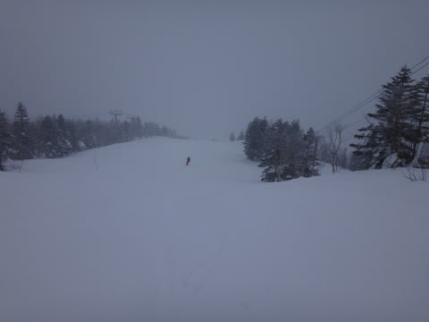
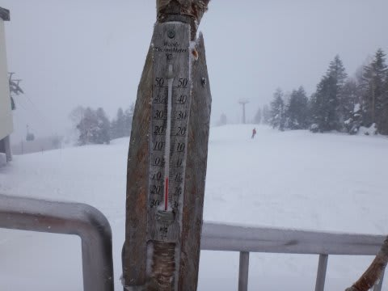
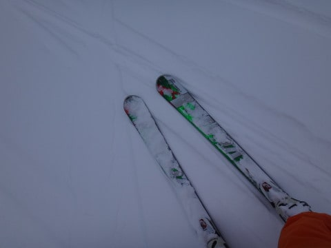
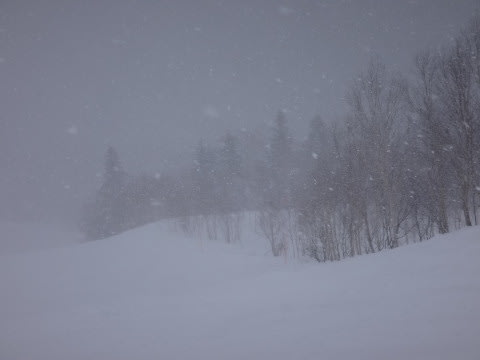
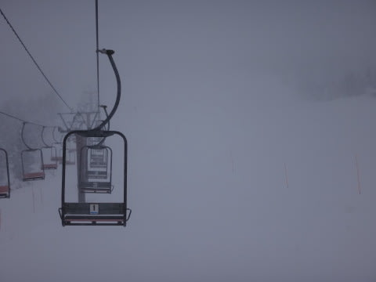

# 1月26日の志賀高原，速報

📅 投稿日時: 2014-01-26 23:57:22

🏷️ カテゴリ: [2014スキー滑走日記](c992167609b6415052179ee69ea1ea7d8.md)

えー．

毎度のことながら．

本日も帰宅が遅かったので，本日の志賀高原の情報を速報モードで…

予想通り，今日は朝から雪が降っており…

気温もマイナス10度近くと，平年並みまで戻り．

朝イチの積雪は5cmほどかな～．

…降り始めが明け方くらいだったみたいで，

そんなに積もってなくて．

朝一は普通の圧雪みたいな感じで大回りできましたよ～！

で．

今日は一日，雪が降り続け．

午後からは風も強くなり，ゴンドラは減速運転．

さらに，午後3時過ぎには第2ゴンドラも止まるくらいの

吹雪になってきて…

今日もガラガラだったので，リフトストップの最後まで，気持ちよく

滑ってきましたよ～！←午後は普通の人が耐えられない天気だったからガラガラだったのであって，

普通は気持ちよくないのではっ？？

ってことで．

詳細はまた明日のお楽しみに～っ！←だから誰も楽しみにしてる人なんていないって

＃明日は朝イチ，ぱふぱふなんだろうなぁ…

## 💬 コメント一覧

### 💬 コメント by (れお)
**タイトル**: Unknown
**投稿日**: 2014-01-27 14:11:01

はじめまして。

アラフォースキーヤーのれおです。

二週間ほど前に、このブログを見つけて、楽しく拝読させてもらってます。

確か、「志賀」「パウダー」とかの検索で見つけたような...。

私も志賀好きなんで、詳細楽しみにしてますよ～。

小学生の息子も、このブログのファンです。

ぜひ、これからも楽しいブログお願いしまーす。

### 💬 コメント by (Skier_S)
**タイトル**: れおさま
**投稿日**: 2014-01-27 20:09:23

ようこそ！

駄文置き場へ（笑）．

息子さんもそろってファンと言っていただき，

恐縮の至りでございます…(汗）．

結構志賀高原には行かれるのですか？

12月第1週～GWまで，確実に毎週

焼額ゴンドラをぐるぐるしているので，

また志賀にお越しの際は私を発見してみて

ください(＾＾）

今後も，ご愛読のほど～

