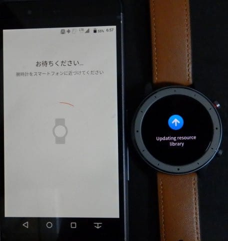
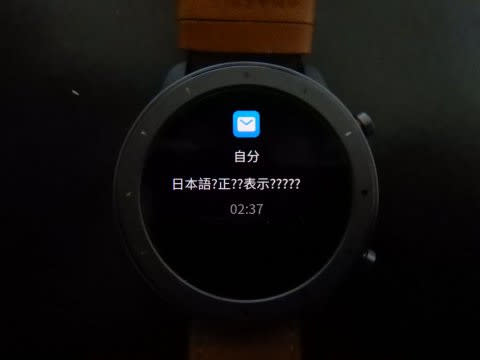

# Amazfit GTRスマートウォッチを買ってみた，その4…スマホと連携させてみた・まずはセットアップ＆各種設定

📅 投稿日時: 2019-09-04 02:28:34

🏷️ カテゴリ: [PC,カメラ&小物](c0d8caed13e597efe97b661a8ae56bed0.md)

ってなことで．

この8月上旬に購入したスマートウォッチ，

Amazfit GTR．

その1．[購入レポート，](e07b216ec3b426f7a5a1462a3b6fd1c02.md)

その2．[開封＆試してみた感じ，](edd1205f6bd9cd6dadb50e4fc6316b747.md)

その3．[アクティビティーログ](ecd7317c7980728b41dae1a21fe835803.md)

と，レポートしてきましたが．

今回は，スマホとの連携についてレポートします～！

まず．

Androidスマホの私は．

Amazfitスマートウォッチ用スマホアプリ，

その名も

「Amazfit」

をGoogle Playからダウンロード，

インストールするわけですが．

マニュアルにQRコードがありますし，

Google Playで「Amazfit」で検索すれば

一発で出てきます．

とりあえず，スマホと連携しないと，

時間すら正しく設定できない

このスマートウォッチ．

アプリのインストールは必須なので，

とりあえずインストールして，

起動してみると．

こんな起動画面が出てきて…

その後，BluetoothがOnに

なっていると，

いきなりスマートウォッチとの

ペアリング画面が出てきます．

うむ．

このアプリ．

ちゃんと日本語が出てくるんだ…！！

それと同時に，スマートウォッチ側にも

「ペアリングを認証しますか？」

という画面が表示されます．

Bluetoothのペアリングは，こんな感じで，

Androidの設定メニューを触ることなく，

Amazfitアプリから自動で実行できます．

ここでスマートウォッチ側の

チェックボタン（Ｖみたいな方，×ではない）

をタップ！

そうすると，スマートウォッチと

ペアリングが完了して…

そこから今度は，さらに自動的に

スマートウォッチ側のファームウェアの

アップデートが行われて…

待つこと5分ほど．

結構長い時間かけて

アップデート完了後，

スマートウォッチが再起動！

ウォッチフェースには，起動画面が

表示されます．

これで起動したら，ようやっと

使えるのかな…

と，思ったら，さにあらず．

今度は，こんな表示が出てきます…

え？

なに？

『スマホのアプリから

「アップデートの確認」を選んで，

アップデートを続けろ』

とな？？

…今，アップデートしたばかりなんだけど．

「続けろ（continue)」というからには，

さっきの続きがあるんだろうなぁ…

と，指示に従い実行すると．

今度は，リソースライブラリの

アップデートがかかりました…

そして，さらに待つこと5分．

無事，ウオッチ全体のアップデートが

完了し．

ウォッチに正しい現在時刻が設定され，

通常画面で立ち上がりました！

92％ってのは，スマートウォッチの

電池の残量です．

ふーむ．

電池残量がスマホアプリでも見れるのは

便利かも…

どうやら，このAmazfitアプリ．

6月にアップデートされて，メジャーバージョンが

2から3に上がって，完全な

日本語対応がなされるとともに，

大幅に使い勝手が変わったようです．

怪しげな日本語ではなく，しっかりした

日本のアプリに見えますね．

ってなことで．

無事に立ち上がったので，

いろいろ設定してみましょう…！

設定画面には，こんな感じのメニューがあって．

まずは，このメニューの一番上，

文字盤設定

を選ぶと．

文字盤設定ができます…

こんな感じで，30種類くらいのウォッチ

フェースを選んで，スマートウォッチに

転送できます．

次に，

スマホの画面ロックを解除

ってメニューがありましたが．

…これは何かというと．

スマートウォッチを信頼するデバイスとして

スマホに設定してやることで．

スマートウォッチが接続されている時は，

パスワードやパターンチェックを

やらなくてもスマホのロック解除ができる…

というもの．

このメニューを選んで，指示に従って

設定してやると…

スマートウォッチが近くにあって，

Bluetooth接続されていれば．

スマホのこのロック画面から，

鍵マークをスワイプするだけで

ロック解除できるようになります！

…スマホから離れて，スマートウォッチとの

Bluetooth接続が切れると，普通に

パスコードかパターンチェックを

入れないと立ち上がらなくなるので，

いちいち毎回パターンチェックするのは

めんどくさいけど，落とした時とか

悪用されるのが心配…

という，私のような無精者なのに

セキュリティーが気になる人間には，

うってつけの機能！

これ，意外と便利です…

ちなみに，Bluetoothの電波は意外と

飛んで，我が家では隣の部屋くらいなら

問題なく繋がっちゃうので，

家にいる時に，他の人にスマホを触られたくない…

とかいう目的だったら，この機能は

使わない方がいいです（笑）．

あくまで，間違って忘れたり落としたり

した時にロックするという目的です．

で，次は．

このメニューの上から三つ目の，着信ってのは．

電話の着信通知で，

イベントリマインダーというのは

スマホで設定した日時に，

スマートウォッチにバイブレーションとともに，

特定メッセージを通知するやつですね…

アラームは，バイブレーションによる

アラームで．スマホでもスマートウォッチでも

どちらからでも設定できます．

上の写真のメニューの

一番下にある，アプリ通知ですが…

こんな感じで，どのアプリからの

アプリ通知を受け取るかとかも，

自由に設定可能です．

通知を受けた時のバイブレーションの

振動パターンも編集可能です．

（アプリごとの鳴らし分けは不可能だけど）

…そのほかの設定としては．

スマホ側から，スマートウォッチの

バイブレーションをならして

腕時計を探す機能やら，

時計を見る腕の動きで自動的に

画面Onにする機能やら

（常時点灯じゃないのが惜しい…），

心拍センサーのOn/Offなどを

設定できます…

こんな感じでいろいろ設定できて，

アプリもちゃんと日本語対応しているし．

なかなかいいんですが．

…こんな感じで，マニュアルも日本語で．

アプリもしっかり日本語対応しているのを

見ると．

なぜ着信通知が日本語対応して

いないのか…

と不思議に思ってしまいます（涙）

ここは，いつか将来のファーム

アップデートで直ることを期待…

ってなことで．

次回は，このアプリのフィットネストラッカー

機能について説明します！

（このレポート，一体何回続くんだ…）
