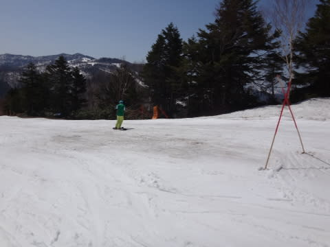

# GW5連休初日，5月2日の志賀高原は…暑くて滑らない雪だったよ（涙）．

📅 投稿日時: 2015-05-03 01:38:26

ということで．

ゴールデンウィークの5連休が始まったわけですが．

5連休初日の志賀高原．

今日も暑かったよっ！！！！！

だって．

まず．

早朝スタートの6時半のゴンドラで山頂に登った時点で…

えーっと．

えーっと．

気温，すでにプラス10℃超えてるんですかっ！！？？？

まだ．朝6時台ですよっ！！！

標高2000mの朝6時で，気温10℃超えって…

7月並みか？？

でも，まぁ．

天気はすっきり晴れだったので．

朝イチは放射冷却のおかげか．

比較的しっかりした，シマシマバーンでスタート！

…だけど．

固かったのは，朝の2本くらいだけ（涙）．

ゴンドラに乗ってると，朝7時台というのに．

「サウナか？？」と思うほどの高温と強い日差しで，

すぐに雪は緩みはじめ…

なんだか，7時半にはもうザブザブした感じの雪に…（激涙）．

なぜだっ！

なぜ，まだ8時にもなっていないというのに，

もうこんな寂しい感じの雪になっちゃうの…？？

通常営業開始の8時半には．

激烈な日差しと高温のおかげで．

かなり粘つく感じの雪に…（悲）．

さらに．

さすが5連休．

昨日までガラガラで，寂しいぐらいだったゲレンデに，

ちょっと人が増えて来ましたね～．

んでも．

ゴンドラ待ちもほとんどないし．

リフト待ちは全く無し．

昨日までが寂しすぎたくらいで．

5連休初日としては，予想よりガラガラかな～．

…でも．

朝9過ぎには．

「夏か！！！」

って日差しと気温のおかげで．

完全に板が滑らない雪になってしまいました（泣）．

あー．そうそう．

昨日，こんな感じで土が出始めた，第2高速降り場付近．

一日過ぎた今日の午前には，もうこんな感じで…

早い！

雪が溶けるの，早すぎ！

で，第2高速沿いの白樺コースも…

ガッツリ穴があいちゃいました（悲）．

もうやばそうだった白樺＆ぶなコースは…

今日でクローズになったようで．

あぁ…

雪が．

雪が溶けるスピードが速すぎる…

とりあえず．

焼額はどこに行っても，スキーに張り付く雪になってしまい，

ちと楽しくないので．

一の瀬方面へ脱出！

一の瀬も昨日より人は多めだったものの．

リフト待ちもなく．

で，朝日が直接当たらない西斜面の一の瀬は，

昼ごろまではそこそこ板が滑る雪でしたよ～！

しかし．

今日も強い日差しの快晴で．

長袖Tシャツでも暑いくらいの一日だったので．

やっぱり一の瀬も昼ごろには粘る雪になってしまい…

そして．

午後は．

一の瀬正面バーンの急斜面．

かなりブッシュだらけに…

午後は結構穴が開いた箇所が出てきたので．

うーむ．

一の瀬正面バーンも，もうすぐ終わりな感じ…

ってことで．

午後は雪が滑らず，雪も減ってしまい．

あんまり楽しめなかったな～．

しかし，ここ数日．

天気がいいのはいいんだけど…

暑すぎるっ！！

雪が溶けすぎるっ！！！

明日あたり，冷え冷えになってくれないかな～．

んで，パウダースノーが1mくらい積もってくれないかな～．

腰パフのパウダー，滑りたいなぁ…（ため息）．

## 💬 コメント一覧

### 💬 コメント by (Goku)
**タイトル**: 今日もユルユル
**投稿日**: 2015-05-03 09:47:01

ゴンドラの上から何回か見かけましたが、一緒になりませんでしたね。今日も朝から10度と夏スキーでした。明日から我が家は神奈川です。

### 💬 コメント by (Skier_S)
**タイトル**: Gokuさま
**投稿日**: 2015-05-04 07:58:49

こちらは昨日に神奈川県だったので、

入れ違いですね(笑)

今日のヤケビ早朝から柔らかいです…(泣)

