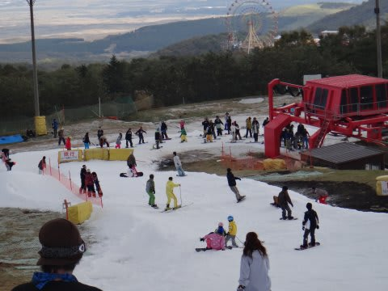

# 2012年10月20，21日のYeti詳細レポート

📅 投稿日時: 2012-10-23 00:43:54

ということで．

長い，実に長かった，オフシーズンの日々．

3ヵ月半にも渡る，禁スキーの日々を終えて．

ついに2013シーズンに突入しました(涙)．

…まだ，モルジブレポートも終わってないけど…

スキーシーズン突入のあまりのうれしさに．

「イエティって，2日間も楽しめるコースじゃないだろ」

という心の声も聞き入れず．

1泊2日で行ってきました…

土曜日は…

寒かったよ～！

終日曇りで風が強くて，ウェアのジャケットを着ていったほうが正解．

ミドルジャケットでは寒かった…

でも，おかげで終日雪が緩まずに，コースに穴が開いちゃうことも無く．

コンディションは良かったかも…

こんな感じで，わずかに穴が開いたところもあったけど…

コースは…

まぁ，幅5m程度．

でも，大雨でオープン直後に溶けてしまった去年より，

コース幅は広いかな？

特に，リフトを降りて，ボードを履くあたりの幅が，去年よりずっと広いですね．

ちゃんとスキーを履いたままリフトの乗り降りできますし．

コースの途中も，去年より広めな気がします．

…でも，コースはかなり混んでるけど…

リフト待ちは，土日ともクワッドは最大5分程度で，

平行している隣のペアリフトはほとんど0．

リフト待ちが少ないのが，イエティのいいところですね～．

…でも，コースはかなり混んでるけど…

午後3時ごろまで滑ったけど．

雪も比較的滑るし，コースも荒れてないし．

コンディション自体は良かったなぁ．

…でも，コースはかなり混んでたけど…（しつこい）

で，次の日曜は…

朝8時オープンから滑りましたが．

オープン直後の人が少ないときは…

イイ！

10月でこれは，イイ！

ちょっとコース整備が荒くて凸凹してたけど．

人が少なく，硫安を撒いてあるのか結構雪も締まっていて，

かなり飛ばせるっ！

コース幅いっぱいの中回り（幅いっぱいでも大回りじゃないところに悲しみが…）で

トップスピードで滑れて，イイ！

人が少なくて，イイ！

…でも．

10時になってくると，コース上の人口密度は昨日と大体同じ感じに…(涙)

リフト待ちも伸びてきました．

で．

さらに．

太陽がサンサンと照り，TシャツでOKなくらいの暑い日差しのため．

雪は滑らない感じになってきちゃいました…(泣）．

まぁ，天気が良くて昨日見えなかった富士山もきれいに見えるし，

よしとしよう(何がよいんだ？）

この時期には珍しい，冠雪している富士山を見つつしばし滑って．

昼過ぎには切り上げ．

シーズンインの日としては，かなりたっぷり滑れたなぁ…

と．満足して帰ろうとしたら．

コースに硫安を撒きまくってあったので．

滑り終わったころにはエッジが錆びまくっていたのを見て，ショックを

受けたのだった…（涙)．
