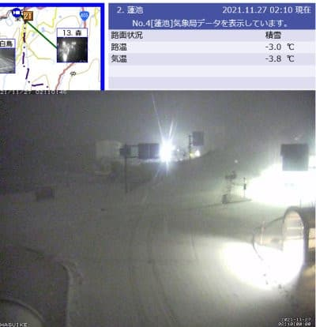
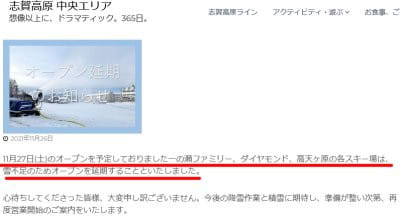
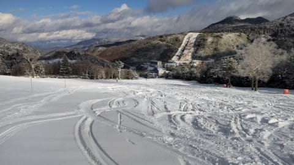
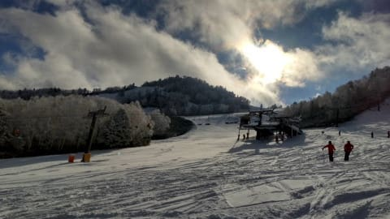
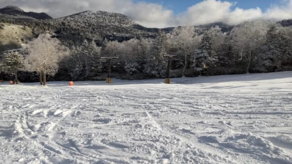

# 2021/11/26(金)，志賀高原熊の湯スキー場オープン！特派員からのゲレンデ状況動画…新雪10cm弱で結構滑り良さそう！

📅 投稿日時: 2021-11-27 02:35:31

🏷️ カテゴリ: [日記](cc4b5682fb7b8b144980957a978653fb0.md)

ってなことで．

志賀高原も，昨晩から10cmほど積雪が

あったようで．

…さらに，今も雪がちらついているようですが…

([北信建設事務所道路状況カメラ](http://hokushin.pref-nagano-roadcamera.jp/)より）

そんな状況にもかかわらず．

志賀高原一の瀬スキー場は，当初予定の

27日オープンを諦めたようです…（涙）

([志賀高原中央エリアホームページ](http://shigakogen.co.jp/archives/13040)より）

あぁ…残念…

とはいうものの．

本日，志賀高原の熊の湯スキー場が

オープンしました～！！！

特派員情報によると．

昨晩からの積雪は7～8cmくらいだったよう

ですが…

でも．

10cm弱とはいえ．

新雪の乗ったゲレンデは気持ちよかったようで…

人も少なく，冷え冷え新雪パフパフで，

日が射す朝って…

うらやましすぎる…！！

しかし，一見かなり広い範囲で滑れそうに

見える熊の湯ですが．

実際は，人工降雪がついているところ以外，

結構雪が薄いようなので，注意が必要

っぽいです…

でも．

この時期にこんなバーンで滑れるのは…

うらやましい…っ！！！

ってなことで．

おこみん特派員による熊の湯スキー場のコース滑走動画．

リフト降り場から，乗り場までのコースの状況や

雪の状態が分かります！

今週末，今晩から明日にかけて，

かなり雪が積もりそうなので…

明日も，熊の湯や横手はコンディションが

良いと思いますよ…！！

でも．私は土曜は仕事（涙）

日曜日帰りで，多分アサマ2000へ出撃予定です…

## 💬 コメント一覧

### 💬 コメント by (m&t)
**タイトル**: Unknown
**投稿日**: 2021-11-27 08:26:35

おこみんさん、うらやましいです！

Sさん、m&tも今週末は仕事でアサマに出没出来ません

来週も仕事が入っていて、今シーズンは出遅れです

YASの皆様には、いつお会い出来るかわかりませんが、今シーズンもよろしくお願いします

### 💬 コメント by (レインボー74)
**タイトル**: Unknown
**投稿日**: 2021-11-27 18:18:38

ゆみり○さん動画を拝見すると、やっぱり志賀ですね！

私は本日初滑り。3000円の安さにつられて八方へ行ったのですが、初滑りでパウダー、それも重たい、しかも視界悪！乳酸がたまってヘロヘロでした。

しかし長岡の友人にとっては、それでも長岡よりははるかにさらさらだと、大喜びでかっ飛ばしていました。

どうせ地獄からしかお呼びがかからないであろう私は、やっぱり志賀の天国をもっと満喫しなくてはと、改めて志賀愛を誓ったのでありました。その舌の根もかわかぬうちに、野沢に問い合わせたところ、日曜日は閉鎖。火曜日はやる！　月曜日は微妙、とのことでした。

### 💬 コメント by (ikkun)
**タイトル**: Unknown
**投稿日**: 2021-11-27 19:17:58

信越のゲレンデも白く染まりました❗滑るにはまだまだですが(笑)  冬季レストランの準備少しお手伝いの午前中でした❗

### 💬 コメント by (Skier_S)
**タイトル**: 明日はアサマ2000！
**投稿日**: 2021-11-28 00:35:02

＞m&tさま

あら…今週も来週も滑れないんですね．

再来週は，ぜひ志賀にお越しください…

みんなが焼額でお待ちしております（笑）

＞レインボー74さま

八方遠征お疲れ様でした…

雪は重かったのかもしれませんが，新雪がいっぱい積もってくれたので，

オープンできないよりは良かったかと…

でも，やっぱり志賀ですよ（笑）．

＞ikkunさま

山は一気に冬になってきましたね～．

レストランオープン準備お疲れ様でした．

