# 1月26日の志賀高原，焼額山＆サンバレーナイターは…ひたすらぱふぱふ！

📅 投稿日時: 2013-01-26 17:07:46

🏷️ カテゴリ: [2013スキー滑走日記](c91dbe557f9a69230b1600e48622fdd61.md)

えー．

予想通り．

今日は一日，パフパフでした．

降り続けでした．

パフパフデーですっ！

今日は朝からしんしんと雪が降り…

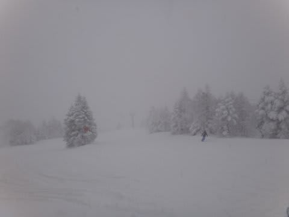

むちゃくちゃ寒かったですよ！

朝はマイナス16度だって…

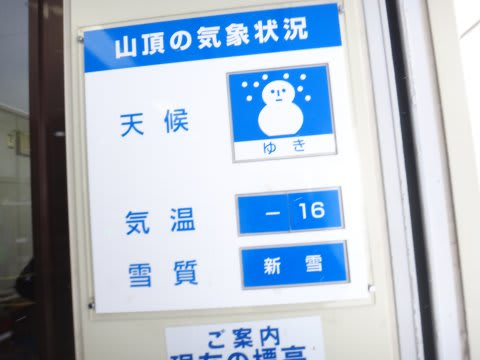

昼間もマイナス13度ぐらいまでしか上がらなかったです…

んで．

圧雪コースは，圧雪の上に5cmほどの新雪．

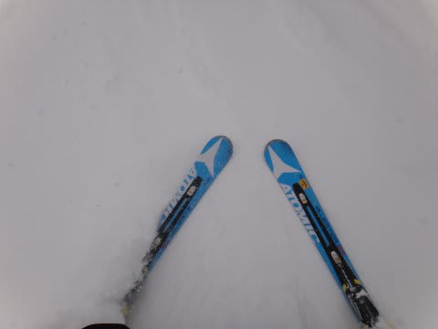

オリンピックコースは，脛程度の新雪でしたね～

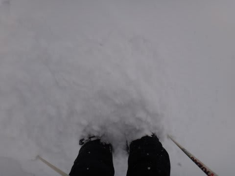

残念ながら，昨晩から降り続けたんじゃなく，早朝から

降り出したようで，それほど深い雪ではなかったけど…

でも，パフパフ！！

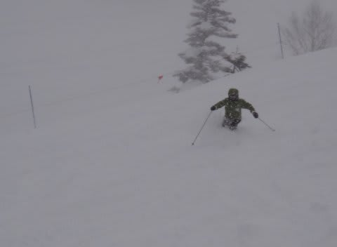

非圧雪コースじゃなくても，コースの端っこなど，

スキー場のそこらじゅうにぱふぱふエリアが！

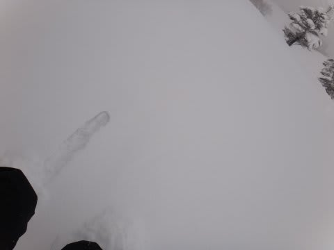

終日天気が悪く，弱まったり強まったりしましたが，一日

ひたすら雪が降り続ける悪天候だったからか…

ゲレンデの人は少なく．

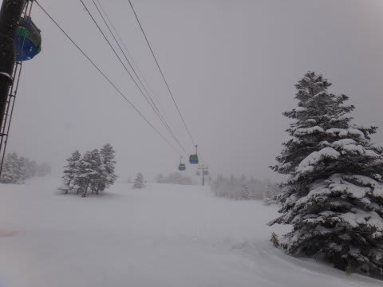

…誰もいませんねー．

んで，雪が積もり続けるので．

非圧雪コースは終日もふもふ．

ノートラックの新雪ではないけど，やわらかいバーンを

昼過ぎまで滑れましたね～．

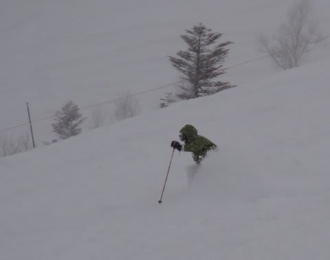

圧雪コースも，終日やわらかいバーン．

多少でこぼこしたけど，人が少なかったから，

そんなに荒れませんでしたよ～．

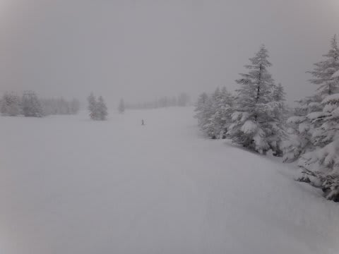

…やっぱり誰もいない(笑）．

スキー場，経営大丈夫か？って心配になるほどがらがら．

…とりあえず．

やわらかいモフモフ大好き人間には．

幸せな一日でした～

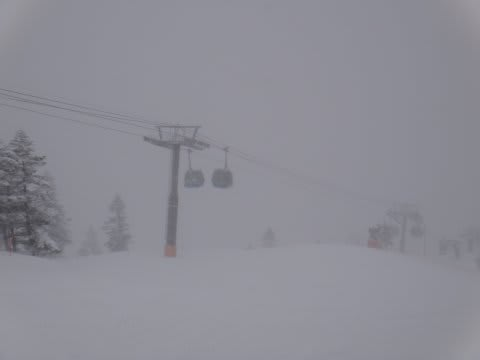

これで視界さえよければ…

そして夜は．

サンバレーナイターに出没してみたわけですが．

圧雪直後というのに，シマシマの上にもう新雪が…

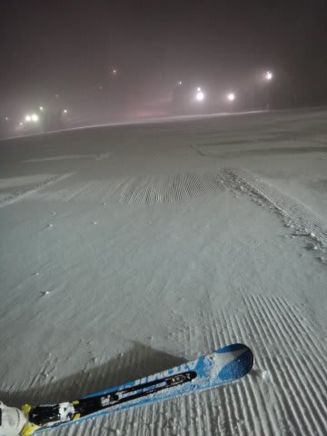

なんだか．

最初の20分，私一人しかおらず．

「私一人のために係員5人が働いてリフト動かしてくれてるのね？？」

って感じでした(笑）．

最後には10人ほど滑ってましたけど…

でも，10人(笑）．

そして…

ナイターなのに非圧雪バーンがあるという．

なんてすばらしい！

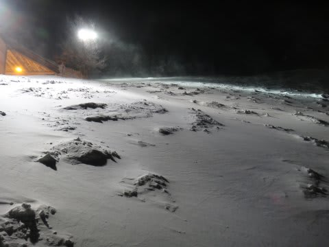

ナイターなのに，こんなぱふぱふ！

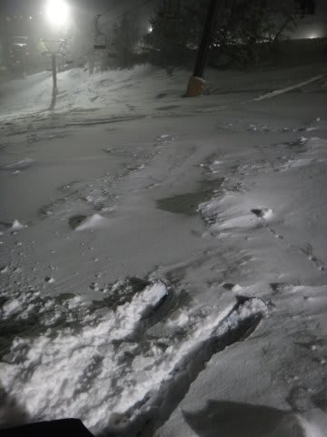

いやー．

すばらしいっ

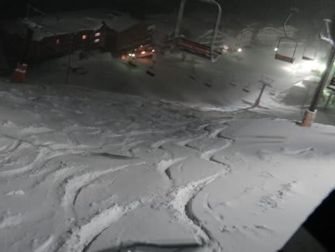

人が少なかったので，ナイター終了でもこんな感じで…

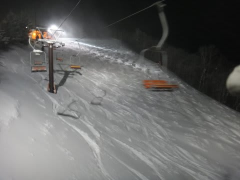

ナイターパフパフを楽しめたのでした．

で．

ナイター中もこんな感じで降ってたので．

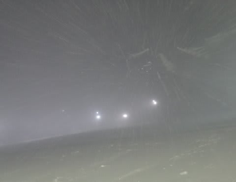

明日もモフモフデーになりそうな予感！
