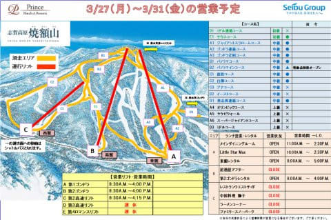

# 2023/3/26(日)の志賀高原スキー場，速報レポート！…強風でゴンドラ動かず，雨降りの一日(涙）

📅 投稿日時: 2023-03-27 01:17:36

ってなことで．

今日も志賀高原で滑っていたわけですが…

かなり悲惨な終日雨降りの日で．

雪もかなり減ってしまいました（涙）

だもんで．

明日からの焼額山スキー場は，雪不足で

滑れるコースが減ってしまい…

・オリンピックコース

・ブナコース

・SGSコース＆イーストコース

がクローズになってしまいました…（涙）

（[焼額山スキー場ホームページ](https://www.princehotels.co.jp/ski/shiga/winter/)より）

まさか，オリンピックコースが4月を待たずに

クローズになるとは…！！

ダメだ…今シーズンはダメだ（泣）

とりあえず．

今日も昨日に引き続き，雪解けが著しく加速する

極めて残念な天気でした…

朝から強風で，焼額第1，第2ゴンドラも

奥志賀ゴンドラも動かず（涙）

焼額は動いたのは2高と4ロマのみ．

それも…天気は雨です（涙）

昨日はまだ山頂付近は雪が降ってましたが．

今日はリフトのてっぺんまで，雨です（泣）

一応，雨の中でもバーンはシマシマですが．

朝から雪は緩く，微妙な感じ…（涙）

天気が悪かったので，あさイチのゲレンデはかなり

ガラガラでしたが．

人が増えてくる時間になると，雪はもう

ザブザブなので，朝からバーンは

結構荒れていきます…（泣）

そして．

雪が解けるということは…

唐松コースも，コースの端に近いところが，

数か所土が出てくるようになってきました（泣）

…これ，とてもGWまでもちそうにない感じ…

雨はザーザーぶりではないものの

終日降り続ける，いやらしい天気だったので，

午前中焼額のゲレンデも，ちょっとだけ

人口密度が上がった瞬間はあるけど

でも．

リフトはガラガラだったし．

昼近くになると，またゲレンデの人も完全に

いなくなってしまいました…

ただ．

昼になると，もう第2高速の唐松リフト沿い．

バーンのかなりの部分が荒れてきてしまい…

さらに雨が降り続けていることもあって．

楽しかったか？

と聞かれると．

微妙…（楽しくなかったのかも…）

と答えざるを得ない天気＆ゲレンデでした…

これからの1週間も比較的気温は高そうで，

志賀高原のGWの営業はヤバそうな感じですが…

明日，明後日くらいはちょっと冷えるかな？

今，ライブカメラを見ると．

蓮池の交差点付近，積雪が！

（[北信建設事務所，道路気象情報カメラ](http://hokushin.pref-nagano-roadcamera.jp/)より）

この積雪が，一晩で1-2m積もってくれれば，

GWまで何とかバーンコンディションは悪化せず

キープできそう…！！！←一晩1-2mは無理だから

しかし．その後しばらくは，雪が降らなさそうな

感じなので…

ヤバい．

ホントに今シーズン，ヤバそうな感じ…

とりあえず，明日体力と元気があれば，

詳細レポート書きます～！！

## 💬 コメント一覧

### 💬 コメント by (レインボー75)
**タイトル**: Unknown
**投稿日**: 2023-03-27 12:24:04

月曜日の志賀高原情報

待ってましたよ、こんな日を。夜に少し雪が降って、最近にしては冷え込んでいる。

今日はまた借り物の180-R21の古い板。重くて硬くて直進性最高。これもまた欲しくなっちゃいました。先が短いとは解っていてもね。

あちこちから硬いとの情報が入るなかで私らは主に、ニゴン→白樺→林道→ニ高→サウスのぐるぐるで、ゆるゆるになってきた11時終了。

朝一の奥志賀ダウンヒルは硬くてその2壁(急斜面)はガタガタ。エキスパは硬くないけど圧雪が今いち、奥志賀は春休みのせいか混んでいたそうな。

### 💬 コメント by (シルバー・ヘッド)
**タイトル**: Unknown
**投稿日**: 2023-03-27 19:30:08

お疲れ様でした。日曜日にライブ配信観てました。雨なのにゴンドラが動かないなか、たぶん、Sさんは滑ってるんだなと思い

配信を観てました。週末に伺い出来ず、本日から焼額に伺ってます。Sさんの〇〇願いが1日ずれてました。少しだけ冬に戻ってました。今週末期待したいです。またお会いしましょう。

### 💬 コメント by (Skier_S)
**タイトル**: コメント回答遅れました
**投稿日**: 2023-03-29 01:17:01

＞レインボー75さま

180cmのR21ですか…物欲が尽きることありませんね（笑）．

でも，3月末の志賀としては，コンディションが悪い日が続いてますね…（涙）

＞シルバー・ヘッドさま

日曜，ゴンドラが動かない雨の中滑ってました（涙）

月曜は良かったんですね…

一日ずれたのが惜しい…

