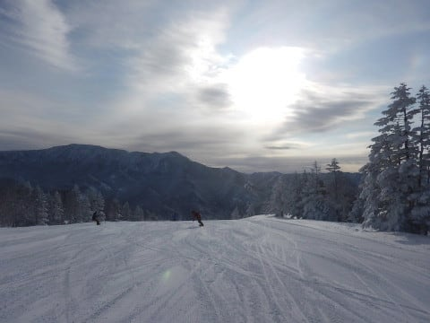

# 1月28日（日）の志賀高原，速報モード…冷え冷え最高の雪質＆青空の恵まれた日！朝イチ最高だったよ！

📅 投稿日時: 2018-01-29 02:05:55

🏷️ カテゴリ: [2018スキー滑走日記](c11b88dc181f34079ab41db74a3587646.md)

良かった…

今日は良かった…

いや．

もう，ホントに．

雪よし，天気よしで．

恵まれた一日でした…

ってことで．

今日も帰宅が遅いので，

日曜恒例，速報モードの志賀高原レポートですが．

うっすら雲が残った天気で始まった本日．

朝の気温は超冷え冷え．

そして，雪質は…

来た，来ましたよ～っ！！！！

ここしばらく，大雪が降ったかと思えば，

雨が降ってアイスバーン化という感じで．

ピカピカ圧雪を滑ってなかった気がしますが…

今日は久しぶりの，冷え冷え雪がしっかり圧雪された，

最高級快楽提供プレミアム圧雪バーンです！！

うほほほほほ！！！

最高っ！！

シーズンそうそうないグッドコンディションっ！！！！

青空の下，最高級の粉雪が圧雪された，

官能バーンだよっ！！

…でも．

強風で奥志賀ゴンドラが動かなかった本日．

ちょっと焼額のゴンドラは混んだかな…

午前中，10時～11時過ぎまではちょっと混んだものの．

午後になると人が減り．

ゲレンデには人がいなくなってきましたよ…！？

昼を過ぎても，こんな晴天最高雪質の日なのに．

これで人がいないってどういうこと！？？

…てな感じで．

人のいない午後をたっぷり満喫して．

いつも通りリフトストップまで滑ってきたのでした…

…本日の焼額第1ゴンドラ朝礼に参加できなかった

方々には申し訳ないのですが．

実に申し訳ないのですが．

本日は最高でした．

でも．

このあと気温が低い日が続くので．

次の週末も，結構いいコンディションが

続きそうです．

今週末は，最高コンディションの志賀へお越しください…

## 💬 コメント一覧

### 💬 コメント by (yama)
**タイトル**: 休日出勤
**投稿日**: 2018-01-29 02:25:46

２日とも休日出勤していました。来週も日曜日日帰りで参戦するつもりです。このところ行けない時は天気が悪く自分を納得させていたのですが。うらやましい天気になりましたね。

### 💬 コメント by (ほっぽ)
**タイトル**: お疲れ様でした。
**投稿日**: 2018-01-29 07:26:05

昨日は相乗りレーンからゴンドラに乗ったら偶然Sさんご一行様と一緒になるという素晴らしいタイミングに恵まれ、お話させて頂きありがとうございました。

皆さんレベルの高い方々が揃っていて素晴らしいですね。

昨日は素晴らしい天気で志賀高原満喫できました。

唯一、風で奥ゴンが運休したのが私には残念でした。

今週末、来週末ともに別の用事で志賀高原お休みですが、2/5から9まで平日志賀高原を満喫する予定です。

次にお会いできるしたら2/17～18ですが、その際にはよろしくお願いします。

### 💬 コメント by (michi)
**タイトル**: やってしまいました（−＿−；）
**投稿日**: 2018-01-29 18:37:42

昨日は最高だったんですね、、、羨ましい。

土曜の寒さに負け、昨日は熱が出て完全にダウンしてました。

何とか回復して本日出社しましたがきつかったです。

健康には気をつけて下さいませ。

### 💬 コメント by (しんちゃん)
**タイトル**: 雪質最高
**投稿日**: 2018-01-29 22:29:05

いや～、日曜は雪、よかったですね。

思わず終礼まで参加してしまいました。

あの後、休憩や食事等休み休み走って何とか無事にお家にたどり着きました。(^^;

### 💬 コメント by (Skier_S)
**タイトル**: 今週は志賀はそれほど積雪なさそう
**投稿日**: 2018-01-30 03:23:04

＞yamaさま

休日出勤お疲れ様です…

土曜は凍死するかと思うほどの天気で，

私もゆっくり西館レストランで休むほどでしたが，

日曜は最高でした…

今週も日曜は良さそうです．

また日曜お会いしましょう！

＞ほっぽさま

絶妙なタイミングでのゴンドラ相乗りでしたね…（笑）

日曜はシーズンにそうそうないグッドコンディションで楽しめました！

次は5日連続平日志賀ですか！！

うらやましすぎます…

また17日の週末にお会いしましょう！

＞michiさま

あら…熱出しちゃいましたか．

土曜は激寒でしたから…

私も1時間くらいレストランで昼休み

しちゃうくらいの天気でしたから．

くれぐれも体調にはお気を付けください…

＞しんちゃんさま

日曜はお疲れ様でした～！

まさかの終礼参加でしたね…

今後は毎回終礼にご出席ください（笑）

あ，ナイターもありますよ．

サンバレーナイターは最高ですよ～！！！

