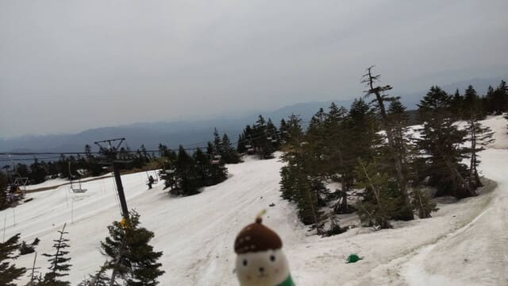
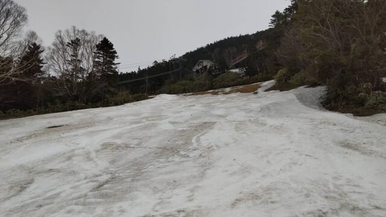
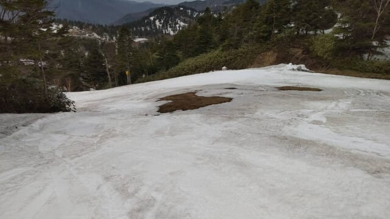
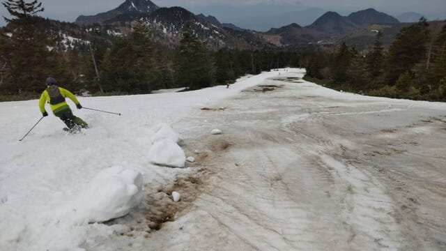
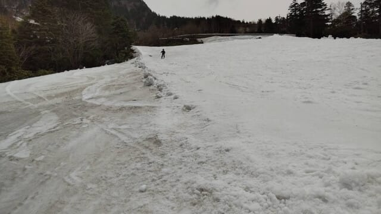

# 5月17，18日の週末の志賀高原・かぐらスキー場の天気は…今の天気図なら土曜は曇り時々雨．日曜は曇り．

📅 投稿日時: 2025-05-15 02:51:26

🏷️ カテゴリ: [日記](cc4b5682fb7b8b144980957a978653fb0.md)

正月に飲もう…と思って12月半ばに

買ったビールの350ml缶6本セットが，

まだ3本冷蔵庫に残っていて．

今年に入ってから，家でお酒はまだ

缶ビール3本しか飲んでいないことに

気づいたSkier_Sです…

いや．

ホントに家でお酒を飲む余裕が全く無い…（涙）

5月でまだ3本の今のペースだと，残り3本を

消費し終えるのは10月になるのかも？？？

ってなことで．

本日もおこみん特派員から志賀高原の

横手山の情報が送られてきましたが…

本日は曇り空だった，横手・渋．

渋峠はまだ行けそうですね…！！

でも．

横手の第2リフト沿いはそろそろ

雪が減ってきてしまい…

うわ．

このあたり，わずか2日でかなり雪が

減りましたね…（泣）

そしてついに．

第2リフト沿いのメインコースは幅が

半分から1/3くらいに雪寄せされたようで．

コースがかなり狭くなっちゃいました（泣）

うーーーん，これだと今週末の終了でちょうど

くらいの感じかな…

しかし，3日前までは全く土が出る気配が

無かったのに，あっという間に雪が減って

行ってますね…（涙）

そして，板が滑ったのは最初の1時間

だけで，あとは妖怪板つかみとの闘い

だったようです（泣）

ちなみに，横手山の第4リフトは，

雪を保存するために5月15日（木）まで運休の

ようです！

16日から運転再開との予定なので，明日

滑りに行く人はご注意ください…

…ってなことで．

今週末はまだ横手山は第2，第4，渋峠と

連絡用に第3が滑れますし．

さらにはかぐらも，まだみつまたが連絡用と

言いながらも滑って降りれて，パノラマも

ジャイアントもエキスパートもメインバーンも，

ほぼ幅いっぱいに滑れるので．

今週末に滑りに行く人は，まだいっぱいたくさん

大勢いるんじゃないでしょうか…←この時期滑りに行く自分が

特殊じゃなく普通のはずだってことをそこまで主張したいのか？？

ということで．本日の本題，水曜深夜恒例の

週末のスキー場の天気予想です！！

…が．おそらくこれが今シーズンラストの

天気予想ですね…

あぁ…もう今回でシーズンラストか…

（ちょっと悲しい）

で．

今日もまだクリティカルな状況が続いている

ので（涙），手短に天気図解説無しで，

結果のみ書いておくと．

15日(木)：志賀，かぐらとも終日晴れ．

　気温は暑いくらいで，朝からザブザブ雪．

　昼間は高温と日差しで，雪の滑りは

　あんまりよくなさそう…

16日(金)：晴れのち曇り．

　朝のうち晴れてるけど，じき曇る．

　気温は晴れていると暑いくらいで，

　日がかげっても暖かい．

　雪質については…もう期待しちゃダメ

17日(土)：おそらく朝は曇り．

　かぐら・志賀ともに昼間時折ポツポツ

　またはパラパラと雨が降ってくる

　タイミングがありそう．

　ただ，リフト営業中はザーザーぶりに

　なることはなさそうかな…

　運が良ければ，リフト営業時間中は

　ほとんど雨に濡れることなく終わりそう．

18日(日)：朝にちょっと雨が残るかも

　しれないけど，終日曇り．

　気温はかなり暖かいが，日が射さないと

　そこまで暑く感じないかな．

　雪の滑りは悪くなりそう…

ってな感じでしょうか…

今の時点では土日の昼間はそこまでひどい

雨にはならなさそうですが．

気温は平年比+5℃くらいまで上がりそう

なので，春スキーというより，夏スキーの

気温ですか…

ただ，雨に濡れると気温が高くても冷えるので，

土曜に雨に濡れる覚悟で滑る人は，ある程度

暖かい恰好を準備していくのが吉ですね．

…しかし，2週連続天気が悪い週末か…（涙）

まぁ，この時期は雨が降ったほうが板が

滑るから良しとしよう

と，自分をごまかすSkier_Sだったのでした…
