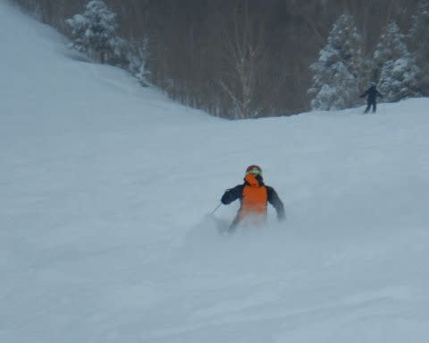

# 2020シーズンはまだ終わってないけど…今シーズンは何回転倒したのかな？

📅 投稿日時: 2020-06-10 02:38:34

ってことで．

まだ，再来週に月山へ復活するはずなので．

2020スキーシーズンはまだ終わってないのですが．

大事な所なので，何度でも繰り返して言いますが．

まだ，スキーシーズンは終わってないのですが

…そろそろ6月なので，スキーシーズンの

まとめネタに入っちゃってます…

で．

毎シーズンやるネタなのですが．

果たして，Skier_Sは，今シーズンは

何回転倒したのか！？？

…ということが，読者の皆さんにとって

気になるところかと←いや，毎回つっこんどくけど，気にならないから．

人が何回転んだかなんて興味ないから

とりあえず．

ここ数シーズンを振り返ると…

2015シーズンは1回，それもぶつかられての転倒（涙）．

2016シーズンは未転倒！

2017シーズンは2回．

2018シーズンは4回と激増（泣）

2019シーズンは1回と．

ここ5シーズンで8回転倒ということで．

大体シーズン1.5回転ぶのがノルマの

ようですね…←なんのこっちゃ？？

2018シーズンだけ，転倒回数が多いのは．

太い板のビンディングの誤開放が多くて．

2回誤開放で転倒

という失態を犯してしまったためです…（涙）

昨シーズンは太板の出番が少なく，

ビンディングの解放値も上げたので

転倒回数は例年通りの1回程度に

なりましたが，やはり昨シーズンの

転倒も，太い板のビンディング誤開放（泣）

そして．

果たして今シーズン．

何回転倒したのかというと…

じゃじゃーーん！（おっさんくさい表現だな…）

1回

でした～！

…今シーズンの転倒も，

太板のヒールピース誤開放が原因でした（涙）

…2シーズン連続，太板誤開放で

転倒1回となりますね…（泣）

確か，[2月9日の新雪が積もった日](eb5e765a7a9284caa3a421648c1741c87.md)だったなぁ…

それも，オリンピックコースの新雪が

適度に踏まれて，凸凹コブ斜面と新雪が

まだらにミックスされていたような

コース状況でコブを乗り越えたところ，

ビンディングのヒールピースが

「パコン」と上がってしまい．

…しばらく片足滑りでこらえるも，

こらえきれずに前転…という，

昨シーズンと同じ転倒パターンです…

ここ3シーズンで，計6回転んでますが．

歩く程度のスピードでストックを踏んで転んだ

という，ほとんどノーカンにしたいような，

情けない1回の転倒を除くと．

残りの5回すべて，オリンピックコースの

新雪で転んでます（涙）．

それも，うち4回は太板誤開放（泣）．

太板のビンディングは，昨シーズンから

解放値を10まで上げて，

もう誤開放はそうそうしないはず…

と，思っていたのですが．

この誤開放が無ければ，

昨シーズンも今シーズンも未転倒

でシーズンを終われたはずなのに…

残念…っ！！

とはいえ．

毎度主張したいところですが．

これだけの滑走量でシーズンで1回しか

転んでないのは，転倒が少ないほうだと

むちゃくちゃ自慢したいところ．

いつも言いますが．

私はセーフティーなスキーヤーなのです…

## 💬 コメント一覧

### 💬 コメント by (Northfox)
**タイトル**: Unknown
**投稿日**: 2020-06-10 12:36:26

開放値10でも誤開放しちゃうんですか！？

太板だと外れやすいのですかね？因みにSXの開放値は幾つにしているのですか？

実は3月に神田で強烈にディスカウントされている太板に遭遇し、フラフラと購入してしまいました。

初の太板ですが、その後スキーに行く事は叶わず部屋で拝む毎日です^_^；

### 💬 コメント by (Skier_S)
**タイトル**: ＞Northfoxさま
**投稿日**: 2020-06-11 03:55:06

SXやSalomon X-raceのVARビンディングは解放値7程度にしてます…

SXは6台，X-raceは3台の計9台，VARビンディングの板に

乗ってますが，VARビンディングはこれで誤開放したことは

ありません…

太板は，ビンディング込み3.8万という激安だったので，

ビンディングがイマイチなのか…

しかし，太板買っちゃいましたか！

新雪滑ったら，「なんで早く買わなかったんだろう」

って思いますよ！

### 💬 コメント by (Northfox)
**タイトル**: Unknown
**投稿日**: 2020-06-11 13:07:26

基礎板の開放値はそんなものですよね。

そういえばフリースタイルの太板を履いている仲間は12まで上げていました。

そんなに激しい滑れではないのにその位にしないと外れちゃうのだとか。

私の買った太板、今期モデルですがもっと安かったです。。。（汗）

物欲を堪えるどころでは無かったです。（苦笑）

ビンは安い部類のものみたいですが自分には十分。新雪を滑るのが楽しみでなりません！

### 💬 コメント by (Skier_S)
**タイトル**: ＞Northfoxさま
**投稿日**: 2020-06-13 01:59:39

解放値12ですか…！！

私は誤解放より，解放せずに足が折れる方が怖いので，

解放値をあまり上げないようにしていますが，

太板はみんなが口をそろえて「解放値上げないとダメ」って言いますね…

しかし，今シーズンモデルの太板がそんなに安かったんですか！！

来シーズンが楽しみですね…

（昨シーズンは1シーズンで計5-6時間しか太板を履いてない気がする…）

### 💬 コメント by (炎の北海道民)
**タイトル**: Unknown
**投稿日**: 2020-06-13 08:24:52

30代の頃は転んでなんぼみたいな感じで怖くなかったのですが、四十肩になって可動域が狭くなってから転ぶのが怖くなりましたね。滑走日数40日程度で3回くらい転んだかな。

今日、大雪山で滑り納めをしようと思いましたが強風でリフト運休でした。さようなら今シーズン。Sさま　月山お楽しみください。

### 💬 コメント by (Skier_S)
**タイトル**: >炎の北海道民さま
**投稿日**: 2020-06-13 22:40:16

私は高校生くらいの頃まではいっぱい転んでましたが，

大人になってからセーフティースキーヤーに切り替えて

転ばなくなりました（笑）．

さて．

私は来週月山に行けるのでしょうか？？

