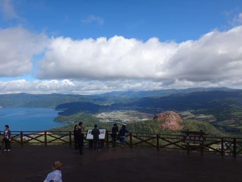

# シルバーウィークは北海道

📅 投稿日時: 2015-10-09 01:57:29

🏷️ カテゴリ: [日記](cc4b5682fb7b8b144980957a978653fb0.md)

ということで．

今シーズンのヤケビが4月上旬で終わっちゃう…

というニュースで受けたショックから，

まだ立ち直れてないSkier_Sです…

…とりあえず．

これまでの記事で，何回か書きましたが．

今年のシルバーウィーク，北海道まで行ってました…

いや．

シルバーウィーク．

5連休なので，どこかに出かけなきゃもったいない…

というか．

せっかくの5日間の休み，

どこにも行かなかったら，死ぬ．

間違いなく，死ぬ

…と，思っていたんだけど．

5連休の飛行機やツアーのお値段を調べると．

…

…なんだ，こりゃ？？

どこに行くにも，

…お盆と同じくらいのお値段だよ…（涙）．

高い，高いよっ！

宿も高いし，何もかも，高いっ！！

いや，これは．

我が家の経済状態では．

シルバーウィークに，飛行機でダイビング遠征に

行くのは無理っ！

どう考えても無理っ！！

…でも，ご無体職場のストレスもあるし．

どこにも行かなかったら，死ぬ．

間違いなく，死ぬ．

…飛行機が，高いんだよな～．

…

…なら，車で行けば，いいんじゃね？

車で旅行だったら，激高な飛行機代も払わずに済むし．

…車中泊かテント泊なら，宿が満室でも気にしなくて

いいし，安く上がるし．

よし！

決めた！

シルバーウィークの5連休，思いっきり車で出かけよう！

と，いろいろプランを練り．

なんと．5日間で，北海道へ行ってきました…

しかし．

5日間で北海道．

かなりの強行軍．

実質，行き帰りに1日で，北海道は中3日．

北海道も，道南メイン，なんとか美瑛・富良野まで

足を延ばしたけど，実際はひたすら車で走り続けた

5日間でした…

だもんで．

あまり面白いエピソードもなく．

ひたすら「車を運転しました」という感じなので．

旅行記は書きませんが…

とりあえず，今回．

写真の一部を掲載しておくにとどめておきます…

そして．

今回もスキー場をいくつか巡りましたが．

私が学生時代．スキーシーズンに住み込みで過ごした，

わが青春の地，懐かしの富良野．

約10年ぶりくらいに再訪しました…

うーん．

今は，志賀高原メインだけど．

学生時代は，シーズン40日以上過ごした富良野．

おそらく，私が焼額ゴンドラの次に数多く乗っているのは，

北の峰ゴンドラかDH第1高速リフトじゃないかなぁ…．

…しかし．

実は．

ダイビングでもスキーでもない，5日間もの長期

旅行をしたのって，すごい久しぶりだった，

Skier_Sなのだった．
