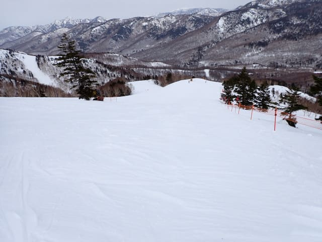
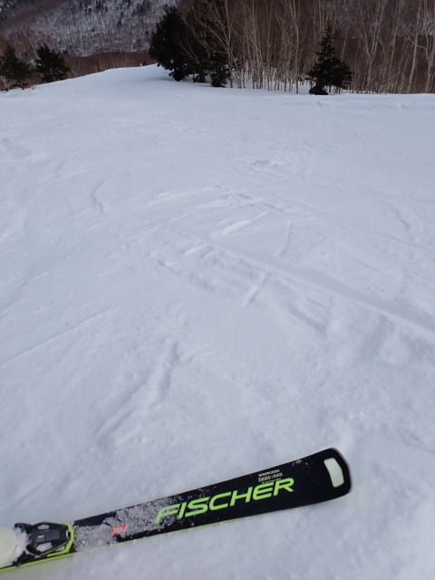

# 2025/3/15(土)の志賀高原焼額山スキー場は…終日曇り，気温はそこまで上がらず終日カチカチバーンの一日

📅 投稿日時: 2025-03-16 00:01:04

🏷️ カテゴリ: [2025スキー滑走日記](cacd3fbf84d4a679ee61a5894c3f95e14.md)

ということで，この週末．

いつも通り志賀高原に来てますよ～！！

ってなことで．

本日の志賀高原ですが…

日が射す晴れの一日

と思ったところ…

終日曇りで，雪が全く緩まず．

がちがちバーンの一日でした（ちょい泣き）

…いや．

湿数が低い冷えた空気が北～北西から流れる

天気図だったから，もしかしたら，日本海側の

雲が山にかかって，山の上は曇るかも…

と思ってたけど．

寒気が入れば，絶対曇り～雪と予想する空気の

流れだったけど．

…土曜はそこまで寒気入らないよね…

そこまで冷えてなければ，日本海で雪雲は

発生しないよね…

と，湿数の低さ＆寒気の弱さで，安直に

晴れの予想にしてしまったところ．

見事に外しました．

前日まで，山の上は曇る可能性と書くかどうか

悩んだのに…

悔しい…←いや，何を言おうと外した時点で言い訳だから

ってなことで．

本日の志賀高原ですが…

いつも通り，朝イチの上り坂を登ってきたところ．

…え？？

スキー場に着くまで，道路に雪がないよ？？？

先週と全然違うよ？？

（注：一部数10mくらい雪が残ってるところがあるので，

　ちゃんとスタッドレスタイヤは履いてきてください…）

これはかなり雪がやられてるだろうな…（泣）

と思いながら，志賀高原にやってきましたが…

朝イチの第1ゴンドラの待ち行列はそこまで

長くなくて…

今日はそんなに混まなさそう！

ってなことで．

8:30営業開始の第1ゴンドラで山頂まで

行くと，朝イチの気温は-5℃と，ここは

予想を当てましたね…

で．

天気は…

晴れるはずだったのに，なぜか曇り空（泣）

結局この日は終日曇り空で晴れることは

なかったです（涙）

…でも．

朝イチのバーンはシマシマ！！！

…だけど．

かなり硬いカリカリした感じのシマシマで，

しっかりエッジを立てて歩いたじゃないと，

ちょっと手ごわいところもあるけど…

ツルツルじゃなくてカリカリした感じなので，

エッジさえ立ててあればエッジが効いて．

朝イチのガラガラのうちは楽しめました！

とりあえず．

天気は悪いものの．

視界は悪くなくて北アルプスは

見えてたし…

人も意外と少なめで，

唐松コースとかは朝10時近くまで

シマシマも残る，朝イチの状態をキープした

完全フラットバーンで，気持ちよく滑れ

ました～！

で．

今日は朝イチの列がそこまで長くなかった

こともあり，そんな混まないだろうな…

と思った通り，ゴンドラ待ちはピークで

せいぜいこの程度．

大体はゲート内に納まる程度のガラガラ

具合だったし．

リフトもほぼ待ちがなく，先週までと比べると

一気に混雑が減った感じではあるんだけど．

でも，なぜかゲレンデの人口密度が

高めなんですが…？？

GSコースも，かなりの人口密度です（泣）

昼頃には，ゴンドラ待ちがせいぜいこの程度

まで短くなったのに．

なぜかコース上の人口密度は高め…（泣）

うーん．

コースが結構ガリガリでスピードが出せない

から，みんな滑るスピードが遅めだったから

コースに人が溜まったのかな…？

まぁ，人が少なめのタイミングでは

こんな感じの時もありましたが．

今日のバーンコンディションは，こんな感じの

カリカリの雪の上に…

ところどころにザラメが凍った感じの雪が

溜まっている感じで，

…私は硬い斜面は嫌いじゃないから楽しい

けど．←あなたはどんな所でも雪さえあれば楽しいでしょ

おそらくほとんどの人は手ごわいと

感じるバーン状況で．

予想を裏切って，昼間もマイナス気温をぎりぎり

キープして，日差しもなかったので…

今日は全く雪が緩まず，終日カリカリバーンの

上にグラニュー糖が乗った感じの，

先週までとは全く違う難しめのバーン状況

でした…

でも．

バーン状況が難しかったからか．

午後は滑っている人もかなり減っていき，

サウスコースのみ人は多めだったけど，

唐松コースは貸し切りに近い状態

だったし…

GSコースはグラニュー糖が溜まった

凸凹ができちゃったこともあり，

こちらも人が少なくなってます！！

…あんまり楽しくなかったけど（涙）

意外と，今日の午後で一番良かったのは

オリンピックコースだったかも．

なぜかいつもなら凸凹になるオリンピック

コース，

硬めの急斜面ということでみんな避けた

からか，午後になってもフラット！！

カリカリ下地が完全に顔を出した硬めの

表面状態だったけど，アイスバーンじゃなく

ざらざらの表面だったので，エッジさえ

研いであれば，いい感じで平らなバーンを

滑れましたよ～！！

ってなことで．

日が射さず，朝から営業ラストまでカリカリバーンの

惜しい感じの一日でしたが．

しっかりエッジを立てた板で，

硬いバーンが嫌いじゃない人なら，

バーンが硬く締まっているせいで

夕方までバーンは荒れずに，

営業終了時間でもこんな感じのフラット

バーンを飛ばすことができたし．

今日も日が傾く16:15の営業終了まで，

ひたすらグルグル滑りまくっていたのでした…

朝からラストまで，アイスバーンでは

なかったもの，ゲレンデ全面カリカリバーン

だった本日．

ほとんどの人は，楽しくないと思う一日

だったんだろうなぁ…

…私は楽しかったんだけど…

ってな感じで，ほとんどの人にとっては

残念だった感じの今日ですが．

明日は朝は雪が積もってくれそうなので，

カリカリバーンは隠れそうだけど…

風が強そうなので，ゴンドラやリフトが

ちゃんと動くか心配だし．

ヘタすると午後から液体が降ってきそうなので…

明日，無事にスキーできるかな？？？
