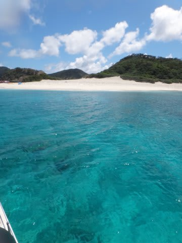
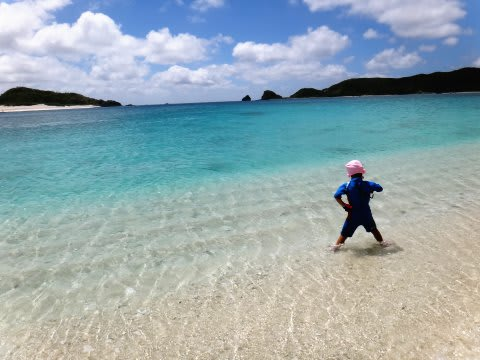

# 2013年のダイビング第一発目は…？

📅 投稿日時: 2013-07-19 01:09:51

🏷️ カテゴリ: [ダイビング日記](ce3a7a8d424d112fce83ee85c81a0e344.md)

えー．

[先々週まで，スキーをしていた](eb511e6c034eff563fb8313fda86dd2bd.md)というのに．

実は．

この3連休．

すでにダイビング遠征に行ってきたんですね～．

＃相変わらず，冬から夏へと極端な季節の移り変わりを見せるSkier_S

で，行き先は．

[去年](e146c8bf698b851c6dd9d0be309cb8e9c.md)，[おととしも行った](eba256f7390db95002c714fc760428d8f.md)，慶良間です．

3連休に2日ほど休みをくっつけて行ったので．

昨日，帰ってきたばかりだったりします…

なぜか例年．

この時期になると繰り出される

「この時期に休むだと？ふざけるなビーム！」

やら，

「普通の神経持ってたら休めないだろうフラッシュ！」

やら，

「どう考えても3連休出社しないと終わらない仕事量投げ込みアタック！」

などの，上司からのご無体な攻撃を受けるわけですが．

「え？なんですか？普通の神経じゃないから休みますよレシーブ！」

だとか，

「3連休初日朝6時過ぎまで会社に残って飛行機出発ぎりぎりに

　仕事仕上げたぞリターン！」

などの必殺返し技で乗り切り．

無事，出発できたのでした…

＃今年もまた，直前まで「かなりやばいかも…」と思った

ってことで．

ついこないだまでは雪山の写真が並んでいたというのに．

明日からは，南の海の写真いっぱいの．

子連れ慶良間ダイビング日記の，始まり始まりぃ～

## 💬 コメント一覧

### 💬 コメント by (KENKEN)
**タイトル**: 夏モード万歳
**投稿日**: 2013-07-19 22:25:36

台風は大丈夫でしたか？

座間味は直撃コースではなかったようですが、連休前半は船は欠航していたみたいですね。

自分も明日より沖縄入りします。

今回は諸般の事情で娘と二人で行きます。

かなり無謀な旅に出ますが無事帰ってこれるか？

私も行く直前になって、仕事山盛り頂きましたが空気を読まず(帰ってくるのは怖いですが)に行ってきます。

夏モード楽しみにしてます。

### 💬 コメント by (Skier_S)
**タイトル**: KENKENさま
**投稿日**: 2013-07-19 23:53:50

夏モード，楽しみにしていただきありがとうございます．

で，3連休ですが，

直前の木曜から，金曜，土曜と3日間に渡り，

フェリーもクイーン座間味も運休だったようで…

私は運行再開第1便となった，日曜朝一のクイーン

座間味を予約していたので，4日ぶりの運行第1便で

座間味に予定通り移動できました．

とまりんには，前日までの船に乗れなかった人のキャンセル待ちの列が

すごいことになってました…

その日は，フェリーにも乗れなかった人が多数いたようで，

慶良間へ行くのをあきらめた人も多かったようです．

おかげで，座間味はガラガラでした…

そういう意味で，ぴったり運行再開第1便を予約していた

われわれはラッキーでした．

では，沖縄楽しんできてください！

