# 夏の志賀高原へ行ってみた…志賀高原散策へ

📅 投稿日時: 2015-09-01 02:00:58

ということで．

ミス志賀高原コンテストも気になるところですが．

時間がもったいないので，志賀高原散策をしてみるべ～，

と，お祭り会場を後にしたわけですが．

まぁ，まずは，スキー場巡りではなく．

冬には行けない，いろんなトレッキングコースを

回ってみますかね…

と，最初に向かったのは，大沼方面．

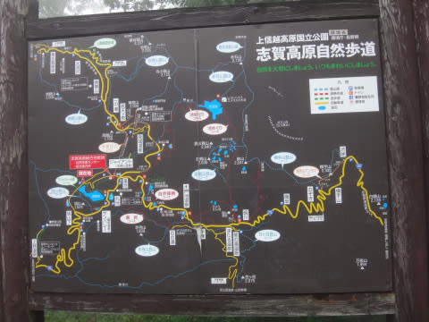

…この，大沼をめぐるコース．

ガスが深すぎて，大沼が見えませ～ん（涙）

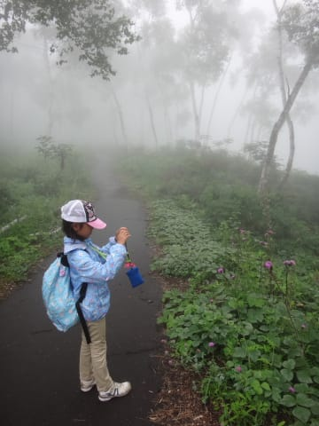

残念…

ちょっと，場所を移動しましょうか．

で．次に行ったのは，蓮池．

ここはたまたま日が射していたので，

一瞬だけ，なんとか見ることができました…

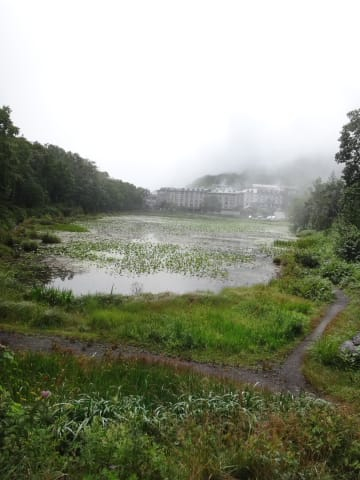

いやー．

しかし．

シーズン中の凍った姿しか知らない蓮池．

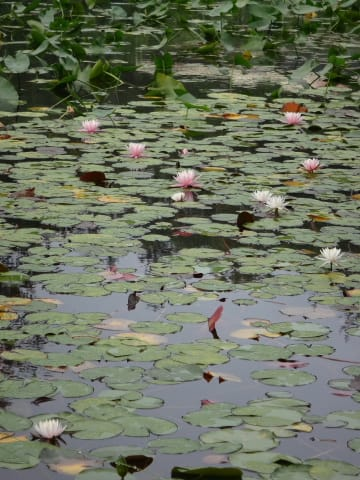

冬は湖面に近づけないので．

じっくり回ってみて，こんな池だったのね…

と，感心することしきり．

で．

蓮池を一周した後は．

よし，今度は夏のスキー場の見学だ！と，

冬の間はちょくちょくやってくる，

高天ヶ原スキー場へ移動．

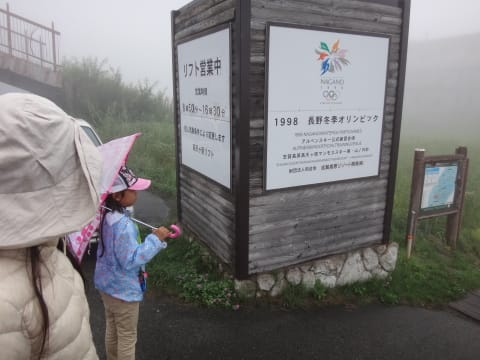

夏のスキー場は，どんなかいな…

と，やってきたわけですが．

…

…

ガスで，ゲレンデが見えない（涙）．

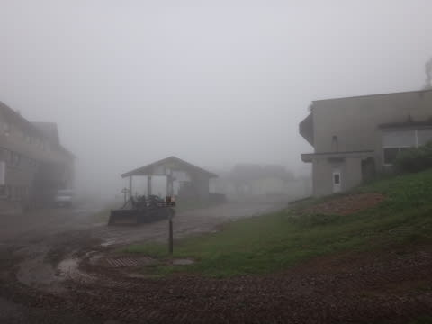

夏山リフトが営業してましたが，

天気が悪いのもあって，全く誰もお客さんがおらず．

なんだか妙に寂しげ…

で．

雨の中，濡れながらリフトに乗って．

何も見えないガスの山頂に行くのも，

悲しみを増すだけなので（涙）．

今回は高天ヶ原リフトには乗らず，

高天ヶ原の下から一の瀬方面に抜ける

トレッキングコースを歩いてみることに．

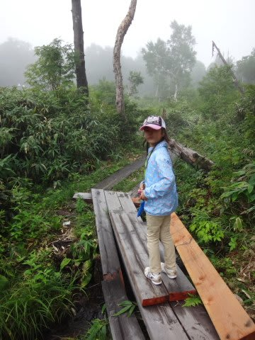

普段は雪に埋もれている，高天ヶ原から

一の瀬方面に抜ける，道路沿い．

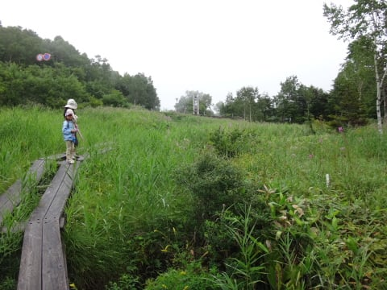

こんな遊歩道があったとは…

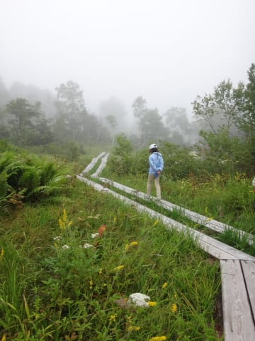

なぜか，この遊歩道を歩いているうちだけは

雨が止んでいて．

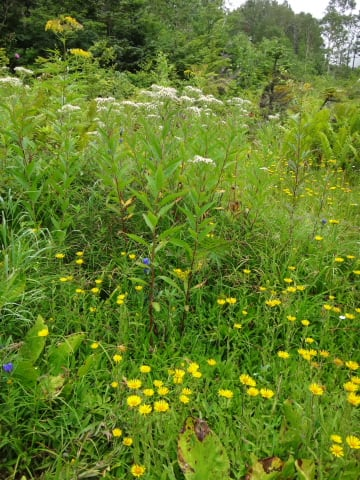

いろんな花が咲いていて，自然たっぷりな遊歩道を，

貸し切り状態で，楽しめたのでした…

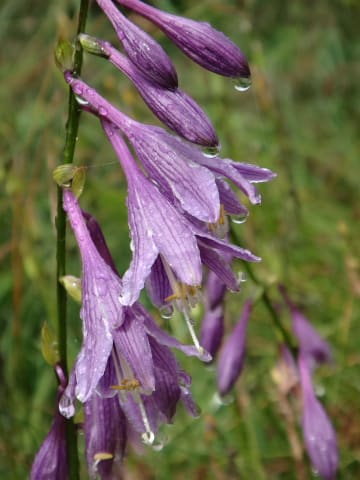

夏の志賀高原，こんなだったとはっ！

結構，楽しめるなぁ…
