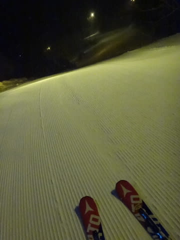

# 3連休中日，1月8日の志賀高原は…混雑＆強風でゴンドラ停止．呪われた一日だったよ（涙）

📅 投稿日時: 2017-01-09 00:53:39

えー．

3連休中日だった本日．

…悲惨な一日でした．

もう，なんというか…（涙）

いや，朝イチは良かったんですよね．

気温はマイナス3℃と，志賀の朝イチにしては

高めでしたが．

うす曇りとはいえ，日が差して．

そして，結構いい感じのハイスピード圧雪バーンで．

気持ちよくシマシマを思いっきり堪能

できたんですけど．

そう．

朝イチだけは，最高だったんですが．

…最高だったのも，わずか2本だけ．

その後，朝9時を過ぎるとゲレンデは一気に混みだし…

営業開始後1時間，9時半にはゴンドラ待ちも

駅舎の外まで延びて，長くなり…

そして．

さらにゲレンデの人は増えだして．

気持ちよく滑るには程遠い，

人の間を縫って滑るような人口密度になり…

うぎゃーーー！！！！

なんだ，これはっ！！

焼額の第1ゴンドラは．

ここ2シーズンほどみることはなかった，

すごい長い列に…（涙）

大体これで，10分ちょい待ちました…

おかげで，ゴンドラから流れた人で．

普段は待たない第3高速リフトまで，かなり混みました（泣）

昼頃にはゴンドラ待ちも解消し，

「あぁ，これでようやっとガンガン滑れる！」

と，思いきや…

お昼を過ぎたころ．

…な，なぬ？？

第2ゴンドラ，強風で営業停止！？

そんなに風があるようには見えないけど…

だもんで．

これだけのゲレンデ上の人が…

動いている第1ゴンドラに集中するので．

…うーむ．

午後も駅舎の外に出るほどのゴンドラ待ちが

続きました（泣）

それも，強風で減速運転しているので，

いつもなら2-3分待ちの列の長さですが，

これで5分近く待ちます…

ただ．

ゴンドラの輸送力が落ちた分，ゲレンデはガラガラに

なりました…

そして，午後2時ごろには，かなり風が強まり…

ついに，第1ゴンドラも…

うげげげげげげ！！！

強風のため，運休ですかっ！！！

この段階で，ヤケビの1ゴン，2ゴン．

奥志賀ゴンドラ，一の瀬ダイヤモンド＆山の神をはじめ．

多数のリフトが強風で運休(泣）．

おかげで，動いているわずかなリフトに人が

集中するけど．

動いているリフトも，強風が吹くたびに止まったり

減速したりなので．

1本上がるのに，すごい時間がかかるよ…（涙）

ってことで．

今日の午後は．

強風＆超長いリフト待ち＆遅いリフト

に悩まされ．

ほとんどまともに滑れない，

残念な一日でした…

だもんで．

はっきり言って，滑り足りない．

やっぱり行っちゃう，ナイターへ！

…今日は，悪天候で一の瀬ナイターが

営業見合わせ（涙）

なので．

丸池ナイターに行ってみました～！

丸池ナイターも，シマシマがお出迎え！

ナイター中も，雪が降り続け…

すごい積もったわけではないですが，

ナイターの2時間でこれくらい積もりました…

うむ．

今日の昼間，やっぱりゲレンデは

雪が薄いところがまた出てきたけど．

こーゆーところが隠れてくれると

うれしいな～．

ただ，今降っている雪．

ウェアに着くとすぐ溶けるような，

南岸低気圧特有の，気温が高い湿った

雪が降ってます．

でも．

降っているのは，雪です．

明日の朝まで，私の祈りのおかげで，

雨になることはなくなりました．

はい．

皆さん，ご安心ください．

今晩は，私の祈りのおかげで

雨にならずに済みそうです．

そして，明日は終日雪が降り続けそうです．

…ただ，明日，強風の荒れ荒れ天気になって，

ゴンドラやリフトが止まらないことを祈るばかり…

## 💬 コメント一覧

### 💬 コメント by (Goku)
**タイトル**: Unknown
**投稿日**: 2017-01-09 08:46:36

昨日の強風・リフト停止には参りましたね。

私は一の瀬からバスで焼額山に戻ると、１ゴンが止まっていたのでそのまま撤収してしまいました。

今日は地元のどんど焼のお手伝いでスキーはお休みです。

### 💬 コメント by (Skier_S)
**タイトル**: Gokuさま
**投稿日**: 2017-01-10 02:35:14

昨日は悲惨でしたね…

今日は朝イチからファーストトラックに荒らされた

ボコボコ＆ガスで見えないゲレンデで，

さすがの私でも「楽しくない…」と思うほどでした．

午後はちょっと晴れて，人も全くいなくなって

良かったのですが．

でも，ゲレンデはボコボコで，ハイスピードで飛ばすのは

難しい感じでした．

しかし，これから一週間はすごそうですよ！

### 💬 コメント by (masa)
**タイトル**: こんにちは❗
**投稿日**: 2017-01-10 02:46:44

こんにちは！

KonSukeさんからこちらのサイトを紹介していただいたシルバー会員です(^^;

アタシも日曜日は奥志賀でエライ目に会ったものです！

ところで今シーズンの奥志賀はこれ迄に無かった混雑ですね！

奥志賀は空いてるって神話と、雪がいいのが浸透して来たのでしょうか？

下の方のゲレンデに雪が無いのも関係してるとは思ってますが、とにかく毎日雪が降ってくれる事を願ってます！

### 💬 コメント by (Skier_S)
**タイトル**: masaさま
**投稿日**: 2017-01-11 02:58:36

コメントありがとうございます～！

日曜に奥志賀行ってましたか…！

朝イチのゴンドラ運転開始も遅れ，

さらに激込み，その上に昼ごろに運休と，

なかなか大変だったようですが…

奥志賀は，ボード解禁＆パークの充実やら，

雪質のよさ，

そして，ゴンドラ＆リフトのスピードが速い（ヤケビは

人が少ないと減速…（涙））など，

いろんな理由で人が増えたんだと思います．

今週は冷えますよ～！

今週末に大期待です！

