# プロジェクトX2…レヴォーグこんにちは．そして，BRレガシィ君さようなら…お疲れ様でした．

📅 投稿日時: 2018-07-18 02:28:39

ってな感じで．

新しいLEVORG君との出会いがあったということは．

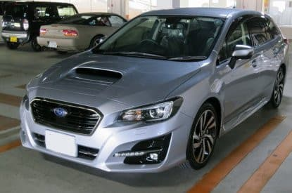

…これまでお世話になったBRレガシィ君との

お別れ，ということでもあり．

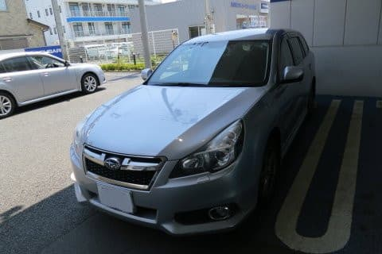

5年間お世話になったBRレガシィ君．

お別れの時の走行距離は，

163,772km

でした…

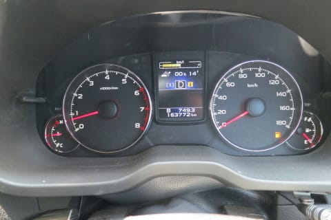

年間平均3.3万km弱．

良く走りましたね～…

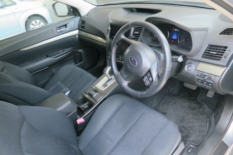

この車も，メインの利用目的はスキー場往復だったわけですが．

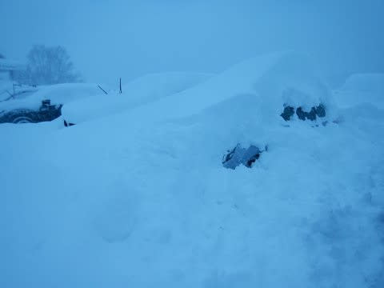

何度も雪に埋まったり．

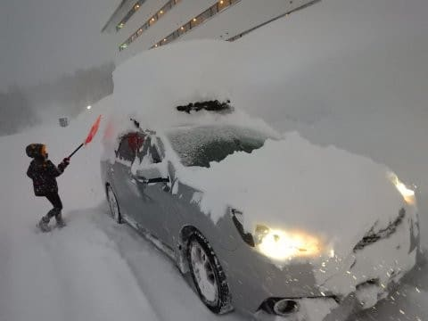

普通の車に比べると，かなり過酷な状況での

酷使だったような気がします…

でも．

いつも通りのことですが．

最後まで足回りも磨き上げてたし．

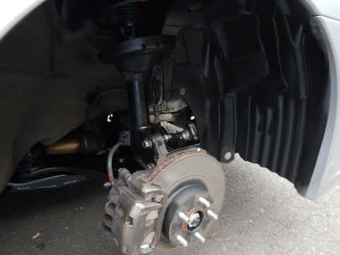

大事に乗ったので，

室内とかも，きれいなままでした…

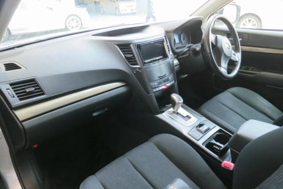

とはいえ．

新車購入1年以内に，

ドアガッツンされて逃げられたり（涙）

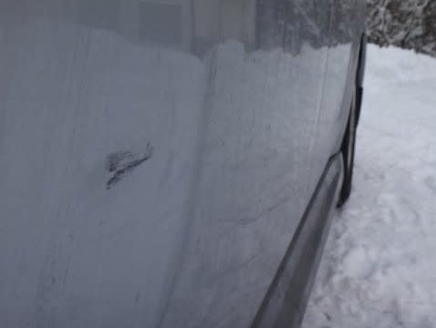

駐車場で当て逃げされてたり…（泣）

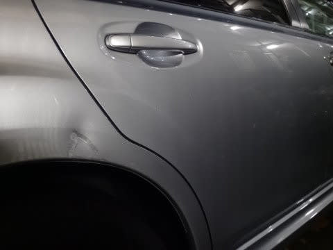

と，受難の車ではありましたが．

そうそう，我が車としては珍しく，

こんな傷もつけちゃったけど．

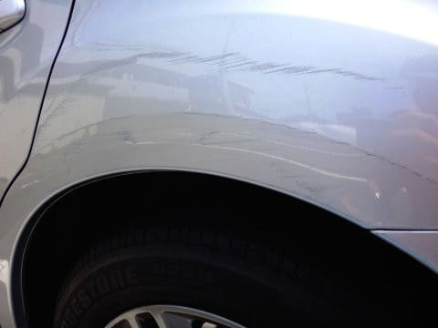

コンパウンドで磨けばほぼ分からないレベルの

傷で，よかった…

ってのも一つの思い出ですね～…

気合のエコランすれば，リッター21km行ったし．

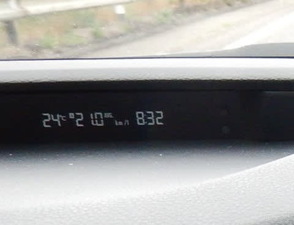

エコラン気味に走れば，フルタンク1000km走ったし．

高速では，アイサイトのオートクルーズも便利だったし．

雪道での4WD性能も良かったし．

車内も広くて，

長距離旅行には便利な相棒でした…

とりあえず．

私の酷使に耐えて．

無故障で，いっぱい走ってくれました．

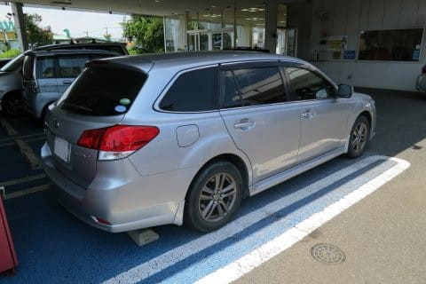

これが，お別れ前の最後の1枚です．

16万km走ってるけど．

また，次のオーナーが見つかって．

大事に使ってもらえると嬉しいなぁ…

長い間，ありがとう．

そして．お疲れ様でした．．．．．．

## 💬 コメント一覧

### 💬 コメント by (ほっぽ)
**タイトル**: Unknown
**投稿日**: 2018-07-18 06:51:45

Ｓさん

これまで愛用してきた車、次のオーナーの下でも活躍してもらいたい、

大事にしてもらいたいと私も思います。

レヴォーグ買い替えの際には、私が意思を継ぎますので、

その節にはよろしくお願いします。

勿論、ノークレームノーリターン厳守です。(^^;

### 💬 コメント by (Schneemonster)
**タイトル**: Unknown
**投稿日**: 2018-07-18 22:27:39

磨き上げて、立派です。素晴らしい！

### 💬 コメント by (Skier_S)
**タイトル**: 大事に乗りました…
**投稿日**: 2018-07-19 02:10:58

＞ほっぽさま

LEVORGは何年乗るかまだ未定ですが，

5年は乗ろうかと思っています…

その時になっても，まだ継ぐ意思がありましたら，

またお願いするかもしれません…

とりあえず，このLEVORGも大事に乗ろうと思ってます．

というか，私は車にしろスキー板にしろ，道具は

かなり真剣にメンテをして使う人なので…

＞Sheneemonsterさま

コメントありがとうございます～！

雪道をいっぱい走って，下周りは腐食の恐れが

あるので．

下周りは特に必死に磨きます～．

なぜかエンジン回りも磨いてしまうので．

我が車を見た自動車屋が，16万km走ったと

思えないと言う状態でした…

ホントに16万kmにしては，いい程度の車だったと

思います…

### 💬 コメント by (ほっぽ)
**タイトル**: レヴォーグ
**投稿日**: 2018-07-19 06:49:16

Ｓさん

最低５年は乗られますよね。５年後なら私にも

心とお金の準備する余裕がありますので全く問題ないです。

７年後でも問題ないくらいですよ。

車の程度って、距離だけじゃないですよね。

前オーナーがどこまで手入れしたか？で全然違います。

Ｓさんのblogを見ていて、ここまで手入れする人の車なら

過走行中古車で買っても全く問題ないだろうなと思っていました。

私もマメに手入れする方だと自負していますが、

Ｓさんの気の配り様には負けます。

レヴォーグ、次はハイパワーモデルは無くなってしまうかもしれませんからね。

もしかしたら最後のレガシィ／レヴォーグハイパワーモデルかもしれません。

最初から中古車しか買うつもりがありませんので、

前オーナーの顔が見える方から買うのは凄く安心感があります。

### 💬 コメント by (Skier_S)
**タイトル**: ほっぽさま
**投稿日**: 2018-07-20 02:45:24

一応，5年は乗ろうと思ってます…

実際に何年乗るかは，今後物欲を刺激する

車が出てくるかどうかが大きいかと（笑）．

とりあえず，またLEVORGのメンテ記録も

適宜記事にしていくと思いますので．

オーナーの顔が見えるどころか，整備記録が

見える車になると思います（笑）．

### 💬 コメント by (ほっぽ)
**タイトル**: Unknown
**投稿日**: 2018-07-20 06:54:07

Ｓさん

そうですよね。買いたいと思う車が出てくるか、大事です。

私も物欲が湧かなくてレガシィをチューニングしていく方向になりました。

流石に今から５年後、７年後なら買い替えても十分かなと思っています。

その時外車に行くか、スバルにするか、スバルならハイパフォーマンス車は必須、

となるとレヴォーグかセダンでも良ければＷＲＸ　Ｓ４だと思っています。

確かに前オーナーさんのメンテ記録がオープンになっている車、とても安心感があります。(^^♪

### 💬 コメント by (Skier_S)
**タイトル**: ほっぽさま
**投稿日**: 2018-07-21 01:38:09

あ，WRX S4．いいですよね…

私もワゴン縛りが無ければS4行きたいんですが．

何人かで乗りあってスキーに行くのに，セダンは

ちょいと積載量が足りない感じで…

今後もメンテ記録（？）公開していきますので，

