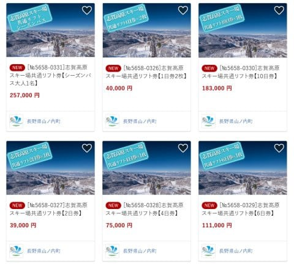
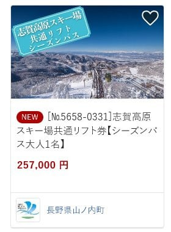
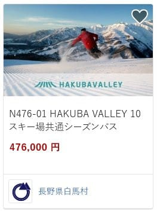
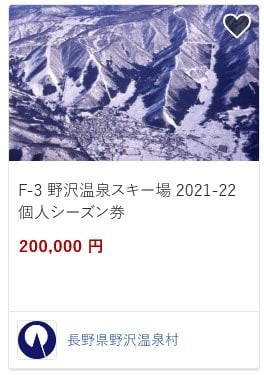
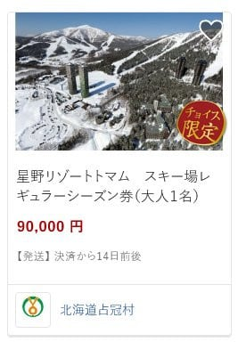
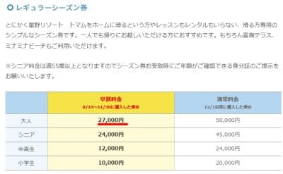

# 2022シーズンの志賀高原のリフト券がふるさと納税で申し込めるようになったよ！

📅 投稿日時: 2021-10-02 05:06:52

🏷️ カテゴリ: [日記](cc4b5682fb7b8b144980957a978653fb0.md)

えー．

昨日，このBlogの更新が無くて．

「Skier_SはBlogが更新できないくらい

　大変なんだろうなぁ…」

と思った人より，

「Skier_S，やっぱりご無体仕事で死んだか」

と思った人の方が多かったのでは…？

と勝手に推測している，Skier_Sです．

いや．

昨日は9月末日．

昨日，無事上期締めの大量の書類を

提出し終え．

「あぁ…終わった…」

と，横になった瞬間．

そのまま朝まで寝てました．

ええ．寝てました．

それまでの数日間，どれだけ仕事の

終わりが遅くても，必死に毎日

Blogを書き続けていたのに．

（なので，9月はちょっと朝更新や明け方更新が多かった…）

ご無体仕事が終わった日に，

日付が変わる前に倒れたように寝てしまい，

更新できなかったという…（涙）

でも．

久しぶりに9時間も寝て，

元気いっぱいに復活しました～！

ということで，本題へ．

半期締めの9月が終わったということは．

ついに本日，10月に突入したということで．

例年，10月に入ると申し込みが可能になる

ふるさと納税の志賀高原リフト券が，

申し込み可能になってました～！！

（[ふるさとチョイスホームページ](https://www.furusato-tax.jp/city/product/20561)より，以下同）

40,000円納税で一日券2枚，

183,000円で10日券ですか…

昨シーズンは169,000円の納税で10日券が

もらえたのですが．

今シーズンは10日券値上がり分，しっかり

必要納税額も上がってますね（泣）

そして，257,000円納税でシーズン券ですか．

シーズン券は今シーズンは値上がりしてないので，

ここは昨年と同じ納税額ですね．

…ただ，ふるさと納税のシーズン券も，

当然のごとく普通のシーズン券同様，

12月からしか使えず，実質値上げですが（涙）

ちなみに．

参考までに他のスキー場を調べてみると．

うおおおー！！

白馬VALLEY 10スキー場共通シーズン券，

納税額476,000円っ！！？？

…これをふるさと納税の控除上限以下に

抑えるには，年収1700万～1800万くらい

要りますね…

そして，野沢温泉は…

納税額200,000円ですか．

志賀高原よりリーズナブルで，

かつ志賀高原より使える期間が

長いし，いいなぁ…

などと．

つらつら探していると…

え？

トマムのシーズン券，

納税額90,000円でいいの？？

納税額9万円って…

志賀高原10日券の納税額183,000円と

比べても，その半分なんですけど…

志賀高原5日分で，トマムは1シーズン

滑れるってこと？？

…と，トマムのシーズン券料金を調べてみると．

早割料金で，大人27000円…

安い…っ！！！

（[トマムスキー場ホームページ](https://www.snowtomamu.jp/winter/ski/ticket/season.php)より）

そうか…

シーズン券27000円なら，返納品上限30％ルール

だから，納税額90000円になるのか．

ってことは．

焼額限定シーズン券の超早割が30000円だった時代．

10万円の納税額でシーズン券がもらえた可能性も…

…でも．

プリンス系列のスキー場は，ふるさと納税の

返納品になったことないんだよな…

残念…

とりあえず．

年収3000万くらいになれば，ふるさと納税の

控除上限額100万円くらい行くらしいので．

将来，ものすごい高給取りになって．

志賀高原と白馬と野沢のシーズン券を

ふるさと納税で全部タダでもらえる

くらいになってみたいなぁ…

と思った，Skier_Sなのでした．←そのくらいの高給取りになったら，わざわざふるさと納税しなくてもリフト券くらい自分でいっぱい買えるから．それにそもそも志賀にしか行かないよね？

## 💬 コメント一覧

### 💬 コメント by (Unknown)
**タイトル**: Unknown
**投稿日**: 2021-10-02 10:33:02

Sさんの年収なら志賀高原は余裕φ(❐_❐✧ﾒﾓﾒﾓ

### 💬 コメント by (Skier_S)
**タイトル**: ＞Unknownさま
**投稿日**: 2021-10-02 23:18:25

そうです．

私の年収なら，ふるさと納税で志賀高原の1日券は余裕で…（ちょっと違う）

### 💬 コメント by (urawa_skier)
**タイトル**: ふるさと納税
**投稿日**: 2021-10-03 14:29:43

緊急事態宣言明けの３月２８日、強風でゴンドラが止まった日ですが、朝一の焼額高速リフトでご挨拶させていだいた者です。いつも読ませていただいております。

薄給の身ですので、シーズン券には届かず、山ノ内町の宿泊券の返礼を選んでおります。トレールランの時の宿泊など夏場も使えますので、ありがたいです。

そのシーズン券ですが、昨シーズンは１６日しか使えず、今年はどうしようか・・・思案中です。

### 💬 コメント by (Skier_S)
**タイトル**: >urawa_skierさま
**投稿日**: 2021-10-03 16:21:37

あ，あの第2高速で朝お会いした方ですか！

お久しぶりです～！コメントありがとうございます！

私も宿泊券か，家族用のリフト券を申し込んでます．

宿泊券は利用期間があって，1枚使えずに終わった時もありました（涙）

シーズン券，悩みますよね．

また，コロナによる緊急事態宣言とかが無ければ買いだと思うのですが…

ぜひいっぱい志賀高原に来てください！！

### 💬 コメント by (いちと)
**タイトル**: Unknown
**投稿日**: 2021-10-04 14:01:51

ひさびさに拝見しました

お元気で何よりです

ふるさと納税は私も狙ってまして、3万円の宿泊券でいこうと考えてるのですが、何故か嫁からそんなので支払うと恥ずかしいと言われリフト券にしようか悩んでいます

何故に恥ずかしいのか？意味不明ですが、素直に従う私です

### 💬 コメント by (Skier_S)
**タイトル**: ＞いちとさま
**投稿日**: 2021-10-05 00:53:20

ダメですよ！毎日見ないと！（噓）

久しぶりの来訪ありがとうございます．

…私は何のはずかしげもなく，ふるさと納税のクーポンで宿泊料払ってました…

恥ずかしいかな～？あんまりそんなこと思ったことなかったです．

