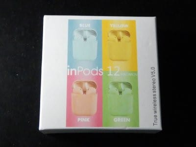
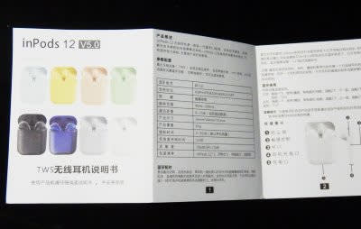
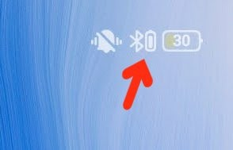

# Airpodsコピーの激安Bluetooth TWSイヤホンをもう一つ買ってみた…今度はinpods 12＠800円

📅 投稿日時: 2020-08-18 02:15:45

ということで．

前回，[Airpodsコピーの800円程度の激安
Bluetoothイヤホンマイクを購入](c0d8caed13e597efe97b661a8ae56bed0.md)してみて．

こいつが安いわりに意外とよくできて

いたのを見た，わが妻．

「私も欲しい…」

と，のたまいましたので．

もう一つ購入することにしてみました…

で．

$6.59と激安の，前回買ったi11をもう一つ

買おうかと思っていたのですが．

(前回のi11)

いつも通り，通販サイトのGearbestを

さすらっていると．

前回買ったi11とは違うけど，

InPods 12とかいう名前の，

ほぼ同じような形＆機能の

モノが見つかりました…

外観，機能は，前回買ったi11と

ほぼ一緒ですね！

カラーも何種類かあるようですね…

で．

お値段は$6.99と，

前回買った，i11の6.59よりは

40セントほど高いけど．

(以上，[Gearbest商品紹介ページ](c0d8caed13e597efe97b661a8ae56bed0.md)より）

なぬ？

Free Shipping！？？

この商品，送料タダなの？？？

となると…

送料$0.73がかかって，トータル$7.32になった

前回のi11より，送料込みだと安くなるじゃ

無いですか！！←差額はわずか33セント…35円くらいだけど

(こちらは前回のi11)

送料込み$6.99なら，

送料を入れても，800円を切るじゃないか…！！

ってなことで．

「同じのを二つ買ってもネタにならんけど，

　違うの買ったらBlogネタにもなるな…」

と．

今度はこっちを注文してみたのでした…

注文：7月4日

出荷：7月5日

到着：7月21日

ってな感じで．

送料無料だったけど，注文から15日，

半月ということで．

1か月はかかるんじゃないかと

覚悟していたところ，思ったより早い

到着ですね．

箱の中を開けてみると…

内容物は極めてシンプル，

ケース入り本体，マニュアルと

Lightning 充電ケーブルが1本

だけです．

マニュアルは…

をを．カラー印刷じゃないですか！

ちょっとお金がかかっている…

表面は中国語．

裏面は英語ですね…

i11ほど壊滅的な文章ではないですが，

ちょっと理解しにくい表現が数か所…

でも，まぁ，これを見なくても

大体使い方は分かりますね．

外観は…

左がi11，右が今回買ったInPods 12ですが．

今回買ったInPods12の方は，ケース表面が

マット仕上げで，つやのあるi11より

ちょっと高級に見えるかも…？

大きさは全くi11と同じ．

で，ご本尊のイヤホンを出してみますが…

ケースだけじゃなく，本体も艶消しに

なってます．

イヤホン本体も，左側のi11と，右側のInPods12を

比べてみると，両者全く同じ寸法ですね．

うーん．

右側のInPods12の艶消しの方が，

i11のつや有より，ちょっと

高級っぽい仕上がりに見えますね…

しかし，これで送料込み800円とは…！

ただ，表面にマット仕上げされている分，

中の光が透過しにくいかな…

中のイヤホンが充電されているかどうか，

充電中の赤ライトがちょっと見にくいか．

でも，まぁ使うには問題なし．

これで十分！！

ってな感じで．

早速スマホにつないでみますが…

こいつは，「i12」って名前で

スマホから認識されます．

スマホに認識されたら，矢印で

示すように，イヤホン本体のバッテリー

残量もスマホから確認できるようになり…

ちゃんとマイクも認識されて，

電話もこいつで受け答えできるように

なりますね…

で．

これもi11と同様，スマホ画面上の

Bluetoothアイコンに，電池残量が表示

されるようになります．

ってなことで．

スマホにつながったので，早速音楽を

聴いてみますが…

…

…おっと．

これ，i11より音質がいいかも！？？

i11は，ちょっとボーカルの下あたりの

周波数と，わずかに高めのバイオリンとかの

周波数が，ボディでダンピングされるのか，

心持ち抜けが悪い感じがありましたが…

こいつはそのあたりがイコライズで

持ち上げられているのか，抜けがいい感じ！

ちょっとイコライズが強めに感じますが…

でも，普通に聴くと，i12の方がクリアに

感じます！

操作系も，i11と同じで．

本体にはボタンが無く，イヤホン本体を

タップすると操作できます．

左or右1回タップで，電話の着信・切断または

音楽の一時停止・再生．

左2回タップで1曲送り，右2回タップで1曲戻し，

左3回タップでボリュームUp，

右3回タップでボリュームdown，

左右どちらでも5秒長押しで電源on/off天

となっています．

ってなことで．

…いや，十分．

普通に作業のBGM用として聴くには，

もう，これで十分です…

これが800円でお釣りが来るって，

すごい．

凄すぎる…
