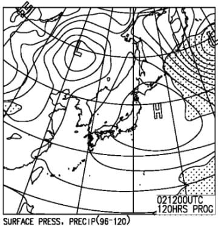

# 12月1日の週末までに，スキー場に雪は積もるのか！？これから週末までの志賀高原の天気を予想してみる

📅 投稿日時: 2018-11-29 03:10:11

🏷️ カテゴリ: [スキー天気予想](c6554f5c3c106093b511a8daae23757e8.md)

えー．

どうやら本日昼間は，予想通り結構気温が

上がったようで，結構雪が解けてしまい（涙）

3連休はクワッドが動いていたかぐらも

ペアリフトのみの営業になり．

…さらに，今日はゲレンデに雪出し作業を

しなくてはならなかったようです…

（[かぐらFB](https://www.facebook.com/snowkagura/posts/1804284423032203)より）

志賀高原は，深夜になってようやく

雪が降り始めていますが．

（[北信建設事務局HP](http://www.q0.ws302.smilestart.ne.jp/index.htm)より）

…まだ気温は0.1度と，十分に冷え込んで

おらず．

人工降雪機はまだ動かせてないようです…（泣）

一応，今晩からは冷えるはずなので．

明け方には人工降雪機が動かせるように

なるはずなのですが…

で．

こんな状態の志賀高原．

残り木，金の2日でコースオープンできるのか…？？

と思っていたところ．

…一の瀬は早々に12月1日のオープンを

諦めたようです（涙）

（[志賀高原リゾート開発FB](https://www.facebook.com/ShigaKogen.Ski/posts/1923222177793976?__xts__[0]=68.ARBvx6sZ1tGHNbaZEaq-5ipnLTwF4e7dDdkHARIU2ZCok5DwsYPep9CzOdinkVZbhhFfo_srpRTGwS4M7h7MdwzTD5vE0gLzeqQEzzBMAJca321nfsWf6bjVrmZHfMQ5t5YOfewxSqZVBHXgqOCrlHypUZMfO4gZPY19s0e8KVyQgjVwhX6KniurR2rDCn4HaLStowgPSAMk5g7e4416ip0gZviLp6c0raGvqh-GFRwIOK0FmY6l86VPJxHyoHmAekUsn9ch6Laj5l3a5FzDxQQAXQ9M1wSTRPKhXXTh5V0n0W860d0ip41-AcTiwm7Qm0Mv0_XX0nYrcM2C0apnVkn_yw&__tn__=-R)より）

高天ヶ原トリプルリフトはオープンらしいけど…

うーーーーん．

焼額は，まだ延期のアナウンスが出ていませんが．

大丈夫か！！？？

焼額…

ってなわけなので．

志賀高原常連としてはすごく気になる，

これから週末にかけての，志賀高原の

天気を予想してみましょうか…

まず．

29日木曜，朝9時の850hpa気温図を見てみると．

うむ．

やっぱり今晩から冷えて．

赤く印した0℃線は志賀高原より南に

下がっています！

そして，水色の-3℃線が志賀に近づいてきているので…

29日は終日人工降雪機が動かせそう！

がんばれ，人工降雪機っ！！

そして．

30日金曜の850hpa気温は．

うむ．

この日も赤く印した0℃線は志賀より南

太平洋側に近いところまで下がり，

水色の-3℃線が志賀に掛かってます．

地上天気図では，残念ながら水色に塗った

降水域が志賀にギリギリかかるかかからないかの

レベルなので…

雪が降ってもパラパラと降る程度で，

積雪は全く期待できず（涙）

この日も人工降雪機頼みです．

ということなので．

これからの2日間，木・金と．

人工降雪機はフル稼働できそうですが．

天然雪は全くちっとも全然すっかりこれっぽちも

期待できないので．

人工降雪機パワーがかなり強いスキー場じゃないと，

今週末はちょっと厳しい感じですね…

で．

週末の12月1日の土曜ですが．

朝9時の地上天気図を見ると…

うむ？？？

なんだ，このいやらしい低気圧は（涙）

土曜朝は，この赤くマークした低気圧に

向かって，矢印の方向に南風が吹き込むので…

850hpa気温図を見ると．

南風が吹いた部分．

見事に0℃線が北向きに押し上げられてます（泣）

そのおかげで，0℃線は志賀高原より北に

押し上げられてしまっているので．

金曜深夜から土曜朝にかけて．

人工降雪機が動かせないかも…？？

それどころか．

ヘタすると，朝にぽつぽつと液体っぽいものが

落ちてくるかも…（涙）

でも，水色の降水域がかかるかからないかという

感じなので．

まぁ，そんなにひどく降らないはずです…

しかし．

土曜日の午後9時の850hpa気温図を見ると…

をを！

赤く印した0℃線．

志賀高原より南に下がってますね…！

地上天気図にも，日本海の寒気吹き出しの

雲っぽいのが出てますが．

ただ，見事な西風パターンなので．

志賀高原には雪は積もるほど降らなさ

そうです…（涙）

だもんで．

土曜も，夕方からの人工降雪機頼みに

なりそう…

そして，2日の日曜ですが．

850hpa気温図を見ると…

なんだ，これは（涙）

赤い0℃線は，はるか東北まで北上して，

志賀高原は+6℃線が掛かるレベルです…

ただ，地上天気図では，網掛けの降水域が

かかってないので．

晴れてくれそう．

気温が上がっても，雨にならないだけ

マシと思うべきか…

ってな感じなので．

これから週末にかけての志賀高原の天気を

まとめると．

29，30日（木，金）　気温は結構冷えるので，終日人工降雪機フル稼働！

　ただ，天然雪での積雪はなさそう…（涙）

1日（土）　朝は気温が上がるので，人工降雪は打てず．

　朝イチの焼額は0度前後の曇り空．

　ただ，昼間も気温は上がらず，ずっと0度前後で推移．

　天気は…時折晴れ間もあるが，雲が多い一日．

　風向きによっては雪もちらつく（積もらないけど…）

　夜になると冷え込み，人工降雪機が動かせるか．

2日（日）　朝のうちは0℃以下に冷え込み，リフト営業

　開始までは人工降雪機が動かせそう．

　天気は朝から終日晴れ！

　…でも．昼間はぐんぐん気温が上がり，

　志賀高原でも最高気温は+8℃くらいまで上がっちゃうか…

　日が射すと暖かく感じるくらいの天気．

　

って感じで．

全く天然の積雪に期待できません(涙）

がんばれ，人工降雪機！

ってな感じで．

あまり過大な期待はできない今週末ですが．

来週月曜，3日以降の天気図を見ると…

ふが！？？

なんだ，こりゃ！！！！

特に3日…水色の+9℃線が志賀高原に近づいてるよ！

4日も気温が高くて，天気が荒れそうなので…

ヤバい．

3，4日はヤバい．

なんだ，この平年比+8度の超高温は…（泣）

3日の超高温と，4日の雨で．

ゲレンデはかなりやられそう…

今週末もヤバいけど．

来週も危険…

5日以降は冷え込みそうなので．

そこに期待か…

とりあえず．

今シーズン，ヤバいシーズンになりそうです…

だもんで．

皆さん．

ここはやっぱり，踊らねばなりません…

スキーヤーの熱くて強い願い（怨念？）を込めた，

「今シーズンは冷え冷え踊りを踊らなくても大丈夫な冷え冷えの日々が

　続くよう，神に必死に願う踊り」

を！！！←だから，それは結局踊らなきゃならないことに変わりないから

あぁ…

踊らなくていいシーズンが来てほしい…（懇願）

## 💬 コメント一覧

### 💬 コメント by (musi)
**タイトル**: またこの季節が
**投稿日**: 2018-11-29 13:26:55

Sさんの予報を心待ちにし、良く見えない天気図？を目を細めて睨みつつ、予報にうなずき（わかってないけど、とりあえずうなずく）、週末の予定を悩む季節がやってきました。早く、悩まなくて済む積雪が欲しいですね。今年は軽井沢のオープン日に、志賀高原の早割リフト券を買いに行くなどいつにない計画的に動いたのに・・・。踊ります。冷え冷え。冷え冷え。

### 💬 コメント by (Skier_S)
**タイトル**: musiさま
**投稿日**: 2018-11-30 00:58:39

コメントありがとうございます～！

いや，ホントに悩まずに済む積雪量が欲しいのですが．

ヤバいです．

今シーズン．

かなりやばい感じです…（涙）

とりあえず．

踊ってください．

必死に，止まらず，休まず，情熱的に．

あの踊りを…

