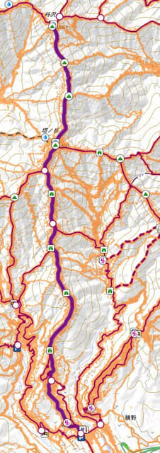

# 丹沢山に登ってみたその1…Garmin Fenix7Xを使っての登山はどうだったのか？？

📅 投稿日時: 2022-08-10 01:15:59

ってなことで．

Garmin Fenix7Xの購入レポートを

書き続けようかと思ったのですが．

そればっかりじゃ飽きるので，

今日は登山レポートを書いてみようかと…

でも，実態は

「Garmin Fenix7Xを登山に使ってみた！」

レポートなんですが（笑）．

で．

時は7月初めの週末…

残念ながら，この時期は仕事が困ったほど

忙しく．

土日のどちらか一日を丸一日を登山で

潰すというのは望めなさそうな状況…（泣）

だもんで．

昼までには家に帰れるような近場ということで．

我が家から一番近い百名山，丹沢山に

行くことにしました～！

ただ．

丹沢山って，普通は大倉スタートで

登ると思うんですが…

（大倉スタートの地図．一番上が丹沢山）

大倉スタートだと，往復17.9km．

ヤマレコでは往復の

標準コースタイム11時間6分．

…さすがにこれでは，午前中に帰宅するのは

無理．

だもんで…

赤矢印で示した大倉よりはかなり山頂に近い，

水色矢印で示した，戸沢山荘前の駐車場

スタートとしました…

…これでも，標準コースタイムは

8時間34分．

5時スタートで標準タイムで歩くと，

休みなしで下山したとしても13時34分ですね…

まぁ，これでも昼までには家に帰るつもりで

行ってみましょう！

ってなことで．

まずは車で「戸沢の出会 駐車場」へ向かいますが…

この道，すごく狭くて未舗装でアプローチが

大変って情報だったけど．

部分的にコンクリート舗装もされてるし．

道に穴が開いてたり，大きな石が

ゴロゴロしてたりするわけでなく．

問題なく，車高が低いLEVORGでも

アプローチできますね！

まぁ，狭いところもあるけど．

行き違いができないのに交通量が多い，

ヤビツ峠よりはマシかも…？

ってなことで．

やってきたのは戸沢の駐車場．

ここは，協力金300円の心づけ（？）で

車を止めさせてもらえます．

駐車場到着は，予定通りの朝5時．

朝5時5分には，駐車場を出発！

戸沢から，丹沢のメインの大倉尾根までは

天神尾根って言うみたいですが…

谷川岳の天神尾根とはえらい違いだな…

杉木立の中の，かなりの急坂ですね…これは．

朝日が差し込んでいい感じの景色ですが…

既に気温は28度近く．

この気温の中，ひたすらこんな急登が

続くので…

スタート直後から，すごい汗だくになります（涙）

距離1.3kmほどで標高550m以上のアップなので，

かなりの急登が続き．

途中，こんな梯子もあったりしますが…

延々急登を登り続け．

大倉から登るメインストリート，

大倉尾根に合流！

大倉尾根と天神尾根ルートが合流する，

「天神尾根分岐」到着時間は，6時2分．

標高は1110mくらいのはずですが…

Garminさん，1090mって言ってますね．

スタートからの獲得標高差，528m．

次のポイントはカヤバ平で，そこまでの距離が0.06km…

スタートから56分．

うむ．Garminさん，次のポイント名と，

そこまでの距離が出るのがいいな！

山を歩いている間，この「次のポイントまであと何m…」

ってのが，むちゃくちゃ役立ちます．

ほとんどの人が，山を歩いている時

「次の○○まで，あとどのくらいだろう…」

と思いながら歩いていると思いますが．

腕時計にこれが表示されていて，

この数字が減っていくのが，歩く時の

すごい励みになります…

ってなことで．

大倉尾根に合流しましたが．

ここからは，結構立派な木道やら

階段やらが続きますね…

さすが，メジャーな山は違う…！

立派な木道をえっさほいさ登っていくと．

（天神分岐からわずか60mほどだけど）

次のポイントとして示されていた．

茅場平へ到着！

…ここまでの経過時間58:54と，

まだ1時間かかってませんね．

そして，次のポイント，花立山荘までは

0.58km．

まだ1時間歩いてないから．

ベンチはありますが，ここで休まずに

登り続けましょう！

（続く）
