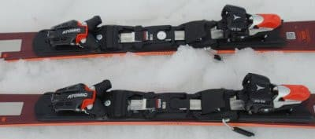

# 2022シーズンモデルのスキー板，試乗レポートその12…ATOMIC Redster S9 REVO

📅 投稿日時: 2021-06-29 02:33:25

ということで．

物欲選手権の負けっぷりにさらに貫禄が

出てきた，Skier_Sです．

無事（？），物欲選手権の連載が

終わったので．

今日は2022シーズンモデルのスキーの

試乗レポート．

今回もアトミック編です．

では，どうぞ～！

○ATOMIC Redster S9 REVO 165cm

SL競技用セカンドモデル

…というより，前回のS9iとコア材のみ

違う板…と言った方がいいかもしれません．

S9i REVOが軽量カルバウッドコアですが，

この板は普通のウッドコアで，ちょいとだけ

S9iより重い感じ…

それ以外は，サイドカーブもビンディングも

何もかもS9i REVO同じです．

履いてみた感じ…

軽い！

S9iの方が軽量コアで軽いはずですが．

履いた順番としてS9i PROのあとに履いた

からか…

すごい軽く感じる！

そして，S9i PROの方が重い分，安定感を

感じます…

エッジグリップも，圧倒的にS9i PROの

方が強い感じ．

逆に言うと，谷回り・山回りどの局面でも

板を自由に動かしていけるので，リスクの

低い滑りができる板．

フォールラインに絡むマキシマムを過ぎた

あたり．

本来の競技用の板ならガッツリグリップして，

板なりに走っていくところで，

気楽に板をずらしてラインを動かしていける

気楽さがあります．

ガンガントップスピードを出していくと…

しっかりグリップさせようと思うとグリップ

していくけど，ある程度以上圧をかけると

板が逃げるような挙動も．

…うーん．

板のエッジが立ってなかったってことは

ないだろうなぁ…雪もザブザブの春雪だし，

エッジが立ってないっていうより，やっぱり

板のトーションがあんまり強くないんで

しょうね…

逆に言えば，板が軽さと相まって，

スピードを出して行った中でも，

結構好きなようにに振り回せる

自由度があります．

板の返りもかなりマイルドで，

板が吹っ飛んでいくリスクも

全く感じなくて．

競技用というよりは，ゲレンデで

気楽に履ける小回り板…

という感じの，気合を入れずに

履ける板です．

いや．

競技用と思って履いたから，

思いのほかのマイルドさに「？」と

思ったけど．

中速域程度でゲレンデで滑る板と

考えれば，カービングもズラシも

思いのままにできるし，

軽く取り扱いやすいので，

悪くないかな～．

でも，S9iと同じ値段だから．

これなら，もっと軽くて取り扱いやすい

S9iの方がお勧めかな．

## 💬 コメント一覧

### 💬 コメント by (ikkun)
**タイトル**: Unknown
**投稿日**: 2021-06-29 11:10:13

おはようございます再度(笑)

試乗報告ってムズいですよね？改めて(笑)   当然脚前に体重もありありですしね？ でもさすが❤️(笑)  乗っている雰囲気が？ってレベル違いますが(笑)

### 💬 コメント by (Skier_S)
**タイトル**: ＞ikkunさま
**投稿日**: 2021-06-30 03:01:30

試乗レポート，書くのは結構大変です…

でも，「素人試乗レポートだから許してね♡」

って感じで個人の感想をひたすら書いてます

