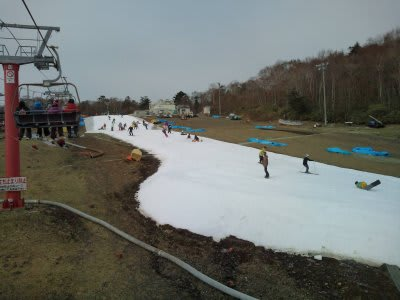
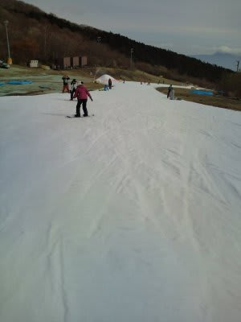
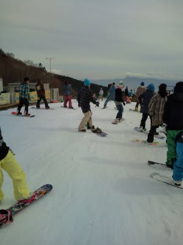
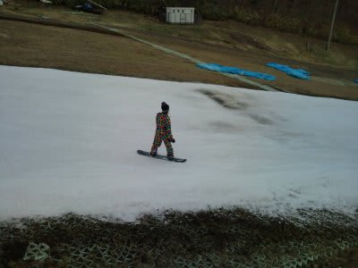
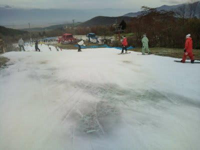
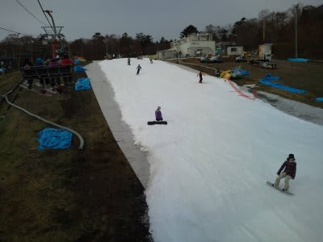
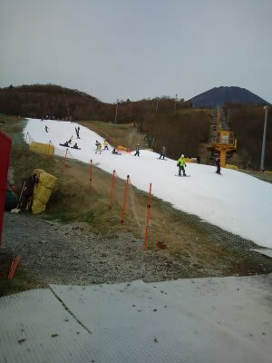

# 11月5日土曜日のイエティは…

📅 投稿日時: 2011-11-05 21:01:50

今日のイエティは…

なぜか，先週よりすいてるんですけど．

リフト待ちも，最大待ち時間は5分と先週と変わらない感じですが，

平均待ち時間は先週より短かったですね…

1-2分しか待たないことも．

あー．

これは，クワッドの待ち時間．

ペアリフトは相変わらず待ち時間0です．

乗り場，降り場でそれぞれ40秒ほど歩くのを我慢すれば，

まったく同じ時間で山頂まで着くので，私はペアリフトを

愛用してます…

これなら，ほんとにまったくリフト待ち0．

で．

コース幅もちょっと広がり，ボードを履くところの

混雑もひどくなくなりましたね～

コース全体にわずかに幅に広がったので余裕ができた感じ．

ただ，ちょっと先週より雪は薄くなったかな？

ところどころ，穴があきかけているところも…

下のほうの急斜面，ところどころ下地が透けて

見えてきますね…

天気自体は曇り時々日がさす程度．

ちょいと寒いですが．薄手のジャケットで十分かな．

…でも，明日は雨のようで．

それもひどい雨．

明日，雪が溶けちゃわないか心配…

…

…

状況によっては．

明日も滑ってます…

