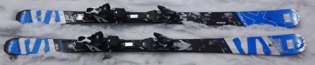

# 2017シーズンモデル，スキー試乗レポート第15回…SALOMON編その4

📅 投稿日時: 2016-06-07 02:17:07

そして…

そろそろ飽きてきたころかもしれないけど．

まだまだ続く，2017シーズンモデルのスキー板試乗レポート．

本日はサロモン編．

板自体は，すでに前回レポートしている

[X-RACE SW](e9cb1b271bf4c3f6181f34fa44f038b0c.md)と，[X-RACE SC](ef19146e29ad10c3581821c577c54d184.md)の2種類です．

また，試乗コンディションもちょっと雪が固い，

一の瀬と比べるとマシな感じの熊の湯での試乗なので，

ザブザブの雪と違う観点でのコメントも追加されています．

では，どうぞ～！

○SALOMON X-RACE SW 170cm

FIS非対応GS競技用…というより，大回りベースオールラウンド？

今回，結構固い斜面で試してみましたが…

今シーズンまでのX-RACEよりは軽い板ですが，

割と張りも強く，固い斜面でも思った以上に

エッジグリップがしっかりした，

かなりグリップ重視のカービングマシンで

あることが分かります．

ただ，その中でもフレックスは現行X-RACE

（Xビンディング付き）よりは柔らかく感じ，

テールをたわませるように乗ってやると

エッジに乗ったまま，良く回っていきます．

やはりSALOMONらしく，かなりテール荷重で乗っていく

板です．

170cmっていうと，スピードを出していくと

中回りっぽくなってしまう感じですが…

ホントの大回り用にするなら175cmが欲しいかな．

現行のX-RACEほど，固い斜面でどこまでスピードを

上げて行っても，どっしりとしてびくともしない

激烈な安定性や，どこまで横Gをかけても

耐えるようなグリップの過激さは無いですが．

＃逆に言えば，今シーズンまでのX-RACEは，

＃低速での扱いやすさやズラしやすさは考慮されていない

しっかりグリップした中で，比較的スピードを出して

たわみに乗って切っていくという板なので．

そこそこ攻め気味に滑る人にターゲットを合わせた，

エッジに乗って落ちていく快感を味わう

板かな～，と思いました．

ただ…今シーズンまでのX-RACEの後継機を求める人には，

ちょいと物足りないと思います．

○SALOMON X-RACE SC 165cm（2回目）

SL競技用…というより，小回りベースオールラウンド？

この板も，一の瀬に次いで2度目の試乗ですが．

一の瀬で試乗したのと，長さも全く同じ板になります．

今回，固い斜面で履いてみたところ…

ああ．

かなり優しい板ですね．

おとなしいですね．

グリップレベル，フレックスともにXMAX12より弱い気がします．

昔で言うと，24hoursのS5より弱いかも…

かなり柔らかく．クルクル回ります．

トップとテールが頑張らないので，

仕掛けていくと板が逃げていきます．

簡単にズラせます．

エッジグリップはかなりマイルド目です…

アイスバーンでは，ちょっと板が逃げ気味でした．

そんなに体力がない人・体重が軽い人にとっては，

フレックスが柔らかく，板も動かしやすいので

操作性はいいかと思うのですが…

そういう方には，やっぱり軽いX-MAXの方を

お勧めしたくなります．

うーむ．

やっぱり，ちょっとどういったターゲットの人に

売ろうとしているのかよくわからない板でした…
