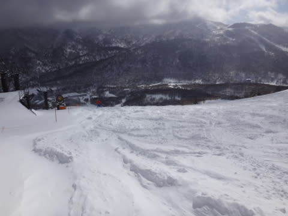

# 1月18日の志賀高原詳細…トップシーズンの恵まれた一日だったかな！…だけど，22日が…（涙）

📅 投稿日時: 2015-01-20 00:48:03

🏷️ カテゴリ: [2015スキー滑走日記](c09ea645cfc085f86dfcd80f49599dd89.md)

ってことで．

昨日，速報しましたが．

日曜日の志賀高原の，詳細レポートです…

が．…その前に．

その前に，だ．

なんだ，これは．

げげげげ！！

22日，平年比8度くらい高いだと？

で．

なんだっ！なんだっ！これはっ！！！！！

志賀高原に向かって，赤矢印の強烈な南風が吹き込み，

赤線の0℃線は志賀高原のはるか北に行っちゃうどころか，

青線の+6度の線がかかってるよ！

…これは，22日の木曜．

降れば，絶対絶対ぜーーーーったいに，雨．

で…地上天気図は…

…（死）

…これは…

降るよ…

木曜，低気圧接近時に確実に降ります．

それも，雨が．

…これは，祈っても踊っても叫んでも，雨です．

転がっても飛んでも，怒っても嘆いても，どうやっても雨です．

それも猛烈な南風が吹き込み，横殴りの暖かい雨が（激泣）．

…残るは，私が神のように日ごろの行いをよくするしかないか…

って，悲しいニュースのあとは．

本題の，日曜の詳細レポートへ…

さて．

日曜の朝．

起きてみると．

昨晩ドサドサ降っていたわりに．

意外とすぐ降りやんだのか，積雪は30cmほどで．

「うーむ．もう少し積もってほしかった…」

という感じで始まった朝でしたが．

いつも通り，焼額第1ゴンドラへ向かうと…

ふむむ？

強風で，第1，第2ゴンドラともに減速運転？

さらに，奥志賀はゴンドラと山頂近辺のリフト運休？

…そんなに風は強そうじゃないんだけどなぁ…

ってことで．

ゴンドラに乗ってから10分以上と，いつもより4割ほど余計に

時間をかけて，山頂まで登ると…

うっすら日が射すタイミングもあるけど，

曇り空のゲレンデ．

…でも．

圧雪ゲレンデは，きれいなシマシマバーン！

ううううーーーむ．

朝イチは，ひざパフ新雪コースを攻めるか，

快楽のシマシマバーンを攻めるか．

悩むところだけど…

まずは新雪コースへ！

と，飛び出したオリンピックコース．

ふむ．

脛パフですな．

…でも，早朝のファーストトラックで，

かなり新雪は食い荒らされちゃってますな（涙）．

でも，雪はひざパフで，そこそこ楽しめるけど…

まぁ，新雪コースは一本でいいかな．

今度は，圧雪コースだ！

こっちはところどころ新雪がうっすら乗っているものの．

きれいな圧雪バーン！

予想以上にしっかり締まった，スピードが出るバーンです．

ゴンドラが減速運転ってのもあって，

ゲレンデの人は朝10時を過ぎても少な目だよ！

気持ちよく大回りができますな！

…でも．ゴンドラは減速で遅いけど（涙）．

同じ時間で，いつもの半分ちょっとくらいしか滑れない…

さらに．

人は少ないけど，ゴンドラが遅いので，ゴンドラに待ち時間が（泣）．

列は短くても，ゴンドラ自体が遅く，これで5分近く待ったよ…（残念）

でも．

午前10時を回ってくると．

うはははっはは！

日が射してきましたよ～！

見よ，私の天気予想通りではないかっ！！←どこの天気予報も，今日午後の晴れは予想していたから

そして．

午前11時ごろには，ゴンドラの待ち時間も解消され．

ゲレンデの人も少なくなり，

こんないい感じの雪質のゲレンデを飛ばしたい放題！

…ゴンドラは遅いけど（ぼそ）．

そして，コース脇ところどころ，まだ新雪も

残ってますね～

ピカピカ晴天で，新雪も，圧雪も楽しめるなんて．

いや．

絶好のスキー日和だなぁ…

…ゴンドラは遅いけど（ぼそ）．

で．

ゴンドラが遅かったので，一の瀬方面へ

足を延ばしてみたところ．

いやー！

晴天！

景色もいいねぇ…

一の瀬も，人は少なめ．

ところどころ雪は荒れてたけど．

まぁ楽しめたかな～．

そして．

焼額ゴンドラは，終日減速運転で，いつもより滑る人が

少なかったからか．

ゴンドラ終了時間まで，コースはそれほど荒れず，

大回りができるコンディションをキープ！

いやー！

トップシーズンで，夕方まで大回りができるなんて…

シアワセ！

…ゴンドラは遅いけど…←しつこい

ってことで．

夕日が沈むころまで，晴天の中気持ちよく大回りをすることができて．

かなり満足度の高い1日を過ごせたのでした！

…しかし．

22日の雨で．

この最高の雪質も，ダメになってしまうのか…？？

と．

心配で夜も寝られないSkier_Sなのだった…

## 💬 コメント一覧

### 💬 コメント by (いか)
**タイトル**: Unknown
**投稿日**: 2015-01-20 11:55:09

このあいだの週末は人が少なかったですねー。

八方も平和な週末でした。

日曜日はよく晴れて、なんでもやりたい放題！

しかし今年は雪が多いです…

### 💬 コメント by (Goku)
**タイトル**: Unknown
**投稿日**: 2015-01-20 19:09:05

なんか行動パターンがほとんど同じなのに、全く一緒にならなかったですね。

車もポールポジションにあったし、板もいつもの所に差してあったし、ゴンドラから滑っている姿も見たし、ゴンドラに乗るところも見たのに・・・・

ストーカーかっ！（笑）

### 💬 コメント by (Skier_S)
**タイトル**: いい週末でした
**投稿日**: 2015-01-21 02:56:24

＞いかさま

動画みました…

いや～，楽しそうですね～！！！！

朝イチ一番乗りですか！

志賀高原も良かったですよ～．

…今年は雪が多いですが，22日が心配です…

＞Gokuさま

焼額1ゴン→一の瀬→焼額1ゴンと，同じ

パターンだったようですね…

私は「Gokuさんきてるかな～」

と思いつつ探していたんですが…

なんで全く見かけなかったんだろう？

でも，逆にこちらはしっかりウォッチされてたみたいで（笑）

だけど，日曜は恵まれた一日でしたね！

土曜じゃなく，日曜で正解でしたね！

