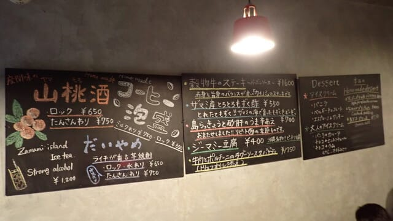

# 2024年8月，今年も座間味で親子ダイビング！その3…座間味到着の夜～2日目の朝

📅 投稿日時: 2024-08-23 07:25:47

ってなことで．

ご無体仕事で食事時間も取れず，

ついつい痩せていってしまう

今日この頃…というか，いつもの

日々の恒例行事ですが．

この夏休みパート1で，座間味でおいしい

ものを食べてのんびりしたおかげで，

減りすぎた体重がちょっと増えて喜んで

いたわけですが．

夏休みパート2でも，さらに体重が増えて

くれるに違いない…！！

と期待していたところ．

帰ってきたら，なぜか座間味出発前と

同じ体重に戻っていた，Skier_Sです．

…なぜだ．

なぜ，座間味と同じように3食きちんと

食べて，お酒も飲んでいたというのに，

体重がむしろ減っているんだ…？？

全く心当たりがない…←3日で10本も

潜ったからじゃないの？

ということで．

ダブルの休みからいつものペースの仕事に

復帰したリハビリが終わってなくて．

ついつい休みの間の幸せさと仕事の

ギャップに悲しさを感じているというのに．

そのギャップをさらに深くしてしまう，

座間味ダイビング旅行記です…

いや．

ホントに楽しい日々を思い出してしまい，

仕事をやるのが嫌になるので．

ダイビング日記を書くのが辛い…

ーーーー

（[前回はこちら](e86399c76375d8de37328d5f1eb8e0788.md)）

ってな感じで，無事に座間味に到着して，

明日からのダイビングの準備が終わったら，

ちょうど夕食時．

残念ながら，かつてのように星砂さんは

美味しい夕食の提供をやめてしまったので．

夜ご飯を食べに，外に出かけなくては

なりません…

さて．今日はどこに食べに行こうかな？

と悩んだけど．

去年行って好評だった，リトルキッチンへ！

このお店，なんで座間味にこんな店が…！？

と思ってしまうほど，ピザとパスタが

美味しい店です…

このマルゲリータ，お代わりするほど絶品！

パスタも結構いけます！

ただ，このお店．

午後6時から7時くらいまでは混むので，

その時間に行く人は予約したほうがいいかも．

お肉系も結構いけますよ～！！

ステーキとかスペアリブとかも美味しかった．

ってなことで．

沖縄初日は，移動だけで終わっちゃったけど，

美味しいものを腹いっぱい食べて，

明日に備えます…

夕食後は，夜10時までやっている105ストアで

ビールを買いこんで．

星砂さんの特別室でゆっくりだべりながら，

夜を過ごしたのでした…

そして翌朝．

朝7時からの朝食に間に合うように

起きますが．

すっきりいい天気！！

絶好のダイビング日和ですね…！！

夕食はやってなくても，朝食は提供

してくれる星砂さん．

いつもの食堂で朝ごはんです！

1日ごとに洋食と和食が入れ替わる

朝食ですが…

今日は洋食の日ですね．

この朝ごはん，ワンプレートなので多く

見えないですが，めちゃくちゃ量が

あって，かなりお腹いっぱいになります…

ってな感じで，朝ごはんを食べたら．

朝8時過ぎに宿を出て，港へ歩いて

向かいます…

そして．

やってきました，1年ぶりのザマミセーリング

さんの船，ティンガーラ号！

いやー．

かなり昔から乗ってますが，相変わらず

きれいに整備が行き届いた船ですね…

ってなことで．

器材のセッティングが終わったら．

いざ，今年の1本目のダイビングへ向かって

出港！

（[続く](ecf604baa121e50e13cb5565c197bbf40.md)）
