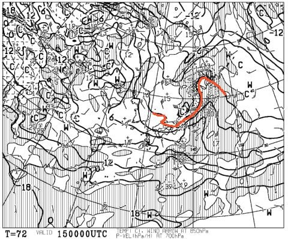
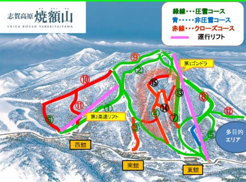

# 今週末もいつも通り志賀高原！…土曜は晴れ！朝は冷えるけど，昼はちょっと緩みそう…日曜は春だよ

📅 投稿日時: 2019-04-13 00:07:30

ってことで．

どうやら本日も，志賀高原はかなり

いいコンディションだったようで．

…この4月．

平日にいいコンディションが続きますね（涙）

あまりものいいコンディションに，

ついついシーズン終了宣言した人が

志賀高原に戻ってきたようで．

いつもの焼額特派員が，本日コメントを

残してくださってますが．

「朝イチサイコー（中略）オリンピック、gs、唐松、うーん良い。奥志賀良い」

ということらしいので．

今日滑れた人は，良かったですね…（羨望）

とりあえず．

明日はまたいい天気のようで．

朝のうちは冷えるので．

水曜の予想通り，午前中は

晴天で冷えた雪の，いい感じで

滑れそうですよ～！！

…午後はちょっと緩みそうですが．

そして．

やはり日曜は気温が上がるので．

あまりコンディションは期待しない方が

良さそうな感じ…

まぁ，この時期としては普通の

春スキーの感じで．

…で．

日曜夜から．

降ります．

降り始めは雨ですが…

月曜15日の朝には．

また，赤い0℃線は志賀の南に

下がるので．

…これは，月曜の明け方から

午前中にかけて．

また雪が積もりそうです…！！

…まぁ，そんなにたくさん積もら

なさそうですが…

で，月曜朝はかなり風が強めで，

荒れた天気になりそうです．

そのあとは．

少なくとも天気図が出ている1週間は，

気温が平年並みかわずかに低い程度なので．

雪が降ることは無さそうな感じ…

うーむ．

もう一降り来てくれると嬉しいんだけど…

まぁ．

この土曜日は，少なくとも午前中は

いい感じになりそうなので．

楽しんできます～！

でも．

焼額山．

今週から，下のマップで赤く囲んだ

SGSコースやイーストコースが滑れなく

なってるようですね…（涙）

うーん．

これらのコースもまだ雪がたっぷりあるのに，

残念…

ってことで．

あと3時間半後に出発です．

…いつものことだけど，3時間弱しか

寝られない（涙）

では，この週末も志賀高原でお会いしましょう～！

## 💬 コメント一覧

### 💬 コメント by (かず)
**タイトル**: Unknown
**投稿日**: 2019-04-13 16:38:13

今日朝から向こうでした　朝のバイブレーションきつかったです　上は全くつかまれなかったですね　帰りのゴンドラ側所々妖怪いました　明日の午後は妖怪撃退チェックです　今シーズンまだ来るかこのアイテムにかかっています

### 💬 コメント by (なるなる)
**タイトル**: Unknown
**投稿日**: 2019-04-13 20:36:21

先週で志賀高原とはお別れしたと思っていたのですが、何でだか志賀高原に居ます。

一の瀬をグルグルしていたのですが、S様の予想通り、午前中は、これハイシーズン並みなんじゃないかと!!　4月中旬とは思えない雪でした。

12時を過ぎるとまぁ…　これも、S様の予想通り…

でも、強烈なブレーキがかかるまでの雪にならず良かったのかなぁ。

やはり明日は、全開春スキーでしょうか??

まぁ、そうだよと言われても来てしまったからには、リフトが停まるまで?滑るしかないのですがw

### 💬 コメント by (Skier_S)
**タイトル**: 今日は良かった！
**投稿日**: 2019-04-13 21:57:15

＞かずさま

明日は早朝勝負ですが，かなり硬いと思います．

そこから，通常営業までに一気に緩みそうな感じです．

午後，雨が降らないといいんですが…

＞なるなるさま

今日は私の予想が100%当たった感じでしたね…

でも，板が張り付かなかっただけマシです．

明日は…来ます．

早朝は硬いですが，通常営業のころには春の雪です．

おそらく，昼には妖怪板つかみが出そうです…（涙）

営業終了まで，雨が降らないことを祈るばかり…

