# 2018年8月，モアルボアルで小5の娘をダイバー化！その3…ダイビング1日目，スタート！

📅 投稿日時: 2019-07-06 04:13:05

…そして．

明けて2日目．

ダイビング初日の朝がやってきました…

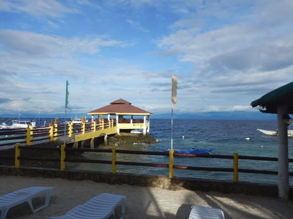

うむ．

天気は良さそうですね！

…だけど．

なんだか，海がちょっと荒れてる

気が…（ちょい涙）

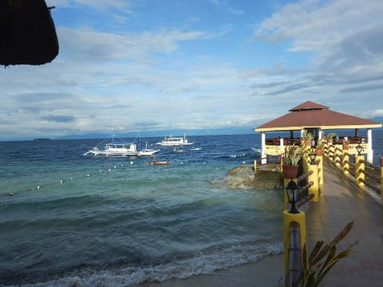

とりあえず．

朝の日差しの中，

海が見えるテラス席で

朝ごはんです！

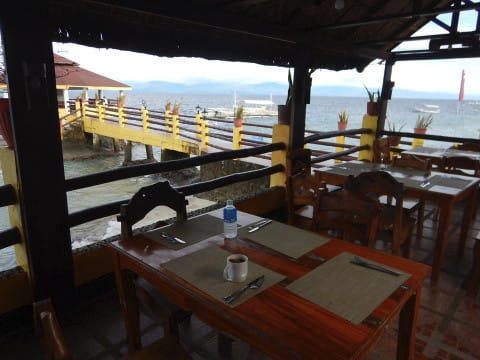

今回，ホテルは朝食付きで

申し込んだので．

朝7時から，ホテルのレストランで

朝ごはんが食べれるのですが．

選べるメニューは，

コンビーフのフィリピン風

ブレックファーストと…

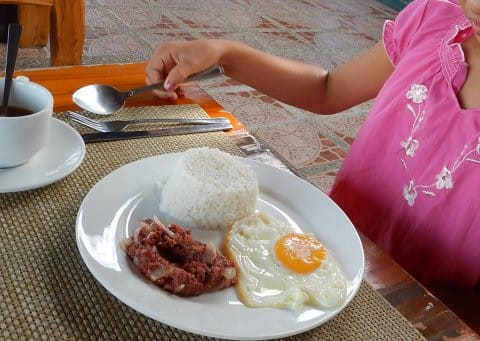

アメリカンブレックファースト．

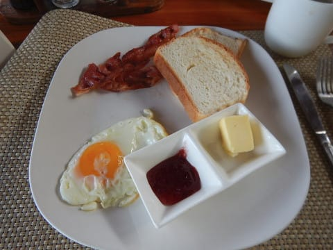

そして，フルーツブレックファースト．

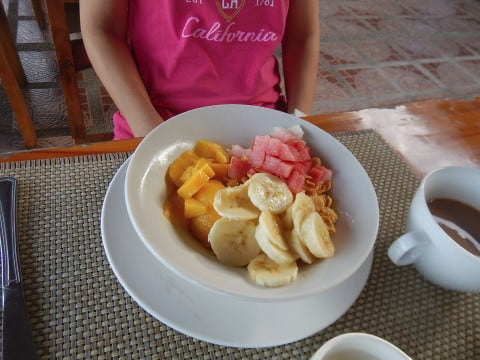

この下に，コーンフレークが入ってます．

海を見ながらの朝食…

リゾートにやってきた感が

増してきますね～！

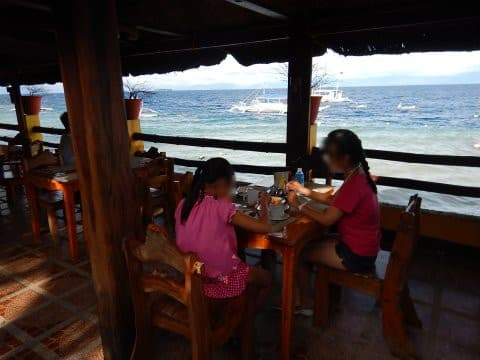

こんな海を眺めながら，

朝食を食べた後は．

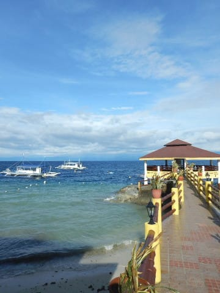

8時ごろに，ダイビングショップの人が

ダイビング器材をホテルまで取りに来て

くれるので．

ショップの人に器材を渡して，

我々は身軽にダイビングショップへ

向かいます…

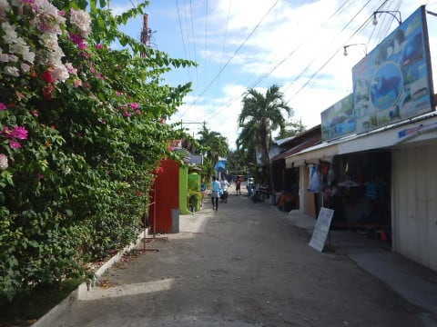

もう同じホテル＆ダイビングショップの

利用も3回目となると，慣れた道．

この，モアルボアルのメインストリートを

歩いて，徒歩3分ほどのショップへ

向かいます．

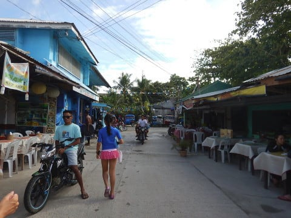

そして．

「おいしい」とひらがなで書かれた，

ダイビングショップ前にある謎のお店．

今年もまだ健在でしたね…

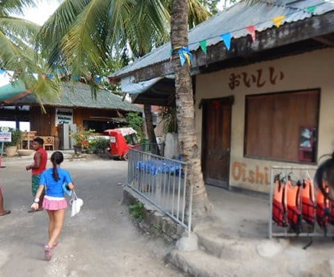

で．

今年もやってきました，

エメラルドグリーンダイビングセンター！

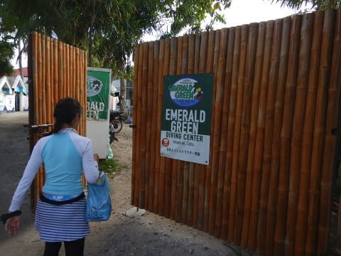

以前も書きましたが，

夏はどこのショップも混んでいるので，

ジュニアオープンウォーターの講習を

引き受けてくれるところがなかなか

見つからず．

ダメもとで過去2回利用したこのショップに

問い合わせたら．

「ジュニアオープンウォーター？

　講習できますよ」

と，想定外の一発OKの回答だったので，

今回，3度目のリピートとなりました…

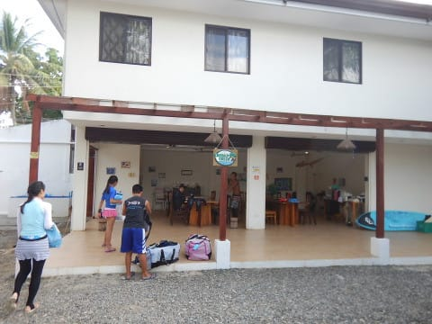

ってなことで．

娘は日本でe-Learningによるテキスト講習を

終えていて．

学科テストも合格点を取っているので．

このショップで，ついに今日から

プール＆海洋実習を受るのです！

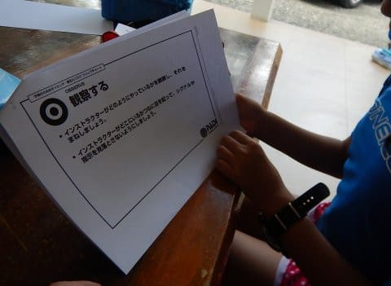

…日本人向けショップなので，

ちゃんと教材は日本語で，安心…

まずは，学科テストの復習から始める

ようですね．

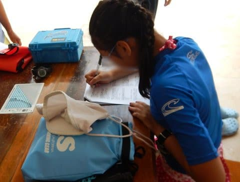

その間．

両親＆他のゲストはファンダイブに行くわけ

なので．

ファンダイブ組は本日のポイントについて，

説明を受けます…

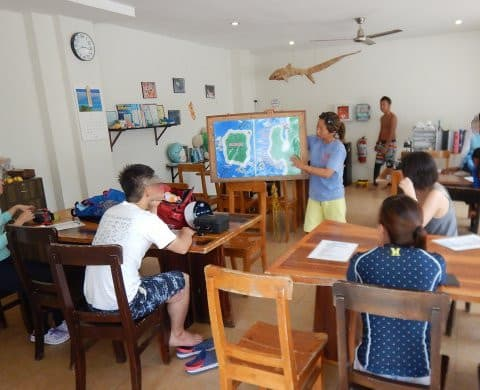

今日はちょっと波が高めだけど．

どうやらぺスカドール島には

行けるようですね…

ってなわけで．

復習テスト＆プール講習の娘を

インストラクターのアサミさんに

預けて．

我々両親はファンダイブへ向かうのだ！

（こう書くと，なんだか娘を置いていく

ひどい両親みたいに見えるな…）←いや，ひどい両親だから

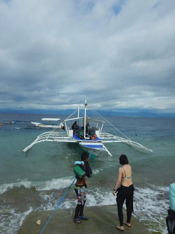

ボートに乗り込んで．

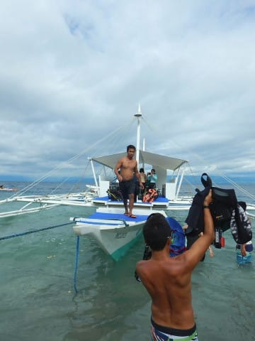

いざ，出航！

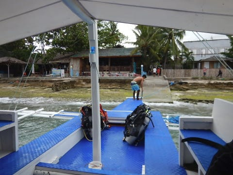

船は，ぺスカドール島へ

向かいます…
