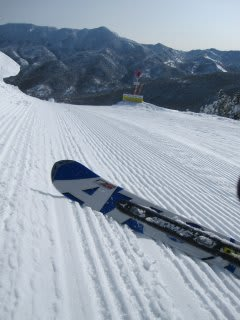
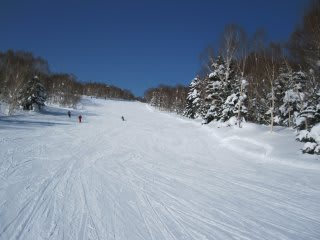
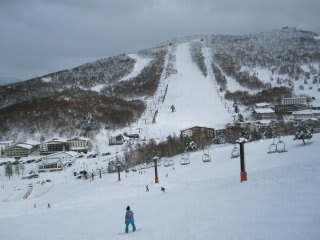

# 今日の志賀高原

📅 投稿日時: 2011-01-29 21:52:44

🏷️ カテゴリ: [2011スキー滑走日記](ca488c98cfb9169941c3e73770dcefb56.md)

土曜日の志賀高原は．

朝から晴天！！！

ひさしぶりの太陽の下でのスキーではないでしょうか…

昨夜からの積雪もなく，きれいな圧雪バーン．

雪質もよく，コンディションは上々．

先週より人は多かったけど，焼額ゴンドラは待ちがほとんどない

という程度．

いつもなら10分待ちぐらいになる焼額第2ゴンドラも待ちなし．

晴天でこんなに人が少なくていいのか？

ただ，雪がちょっとやわらかすぎるかな，

もう少し固い方がスピードがのって面白いんだけど…

でも，やわらかいと普通は夕方にはぼこぼこになっちゃうけど，

そこまでひどくならなかったです．

あ，でも，吹きさらしの場所など，やわらかい雪の下地は

結構しまった感じのちょっと固めのところがあり，

固いのとやわらかいのが混じったところが

あって，難しかったところもあります．

午後からはちょっと雲が増えてきて，4時過ぎからは雪がちらつき

はじめました．

今もそれほどではないですが，降り続いてます．

明日までに10cmくらいつもるかな～，って勢い．
