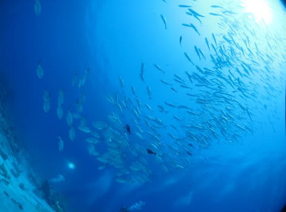

# 2014年10月，小学生の子連れでパラオへダイビングに行ってみた，その14…2本目は，私がブルーコーナーへ！

📅 投稿日時: 2015-08-15 00:52:53

ということで．

ブルーコーナーでの1本目のダイビングから，

ダイバーたちが戻ってきましたが．

船は全く動く気配もなく，しばらくその場で停泊しています．

ガイド「2本目は，ブルーホールに行きま～す」

あ，ブルーコーナーのすぐ隣のポイントですね…

なら，船を動かす必要はないわな…

私「2本目，ホールですか…

　ホールからコーナーに行けそうですかね～…？」

ブルーホールとブルーコーナーはすぐそばのポイントなので，

流れの状況さえよければ，両方のポイントを1ダイブで攻めることも

できます．

んだもんで．

今回の1本目でコーナーを潜れていない私．

コーナーにも足を延ばせないかなぁ…

と，ガイドに尋ねてみたところ．

ガイド「ちょっと無理ですね～」

流れは完全に上げ潮（コーナーからホール方面への流れ）なので，

まぁ，無理かな～…とは思っていたけど…

うーむ．

ホールも悪くないけど，やっぱりコーナー行っときたいなぁ…

と，思ったとき．

ガイド「…2本目も，ブルーコーナーに行きたい人いますか？」

をを！

ガイドさん，ナイス質問！

…で．

この質問に対し，半数ほどのゲストが手を

上げてるじゃないですかっ！

ガイド「じゃ，2本目はグループを分けて，ホールグループと

　コーナーグループの2グループで潜ります」

をを！

ラッキー！

ということで．

2本目のコーナーグループに紛れ込んだ私．

うはははは．

では，行ってきます～！

と，上げ潮のコーナーにエントリー．

水面集合のあと，ガイドの合図で潜行すると…

いきなり現れた，ギンガメアジの群れ！

ちょっと深くて，あまり群れに近づけなかったのが残念…

そして，ドロップオフに群れるユメウメイロなぞ眺めつつ…

棚の上に上がったところ…

うはーーー！

これは，すごい．

なんだ，このグルグルな群れはっ！

さ，さすが，ブルーコーナーっ！！！！
