# 2019/2/24(日)の志賀高原スキー場，速報モード…今シーズンでは珍しい一日晴天！昼間は気温がプラスになったものの雪は固め．日が当たるところは緩んだけど…

📅 投稿日時: 2019-02-25 01:59:03

🏷️ カテゴリ: [2019スキー滑走日記](c3e4496fc0fb7f9c17ff21214a35b1ace.md)

えー．

今日も関越道の渋滞にやられて，

日付が変わる頃に帰宅した後．

スキー板の手入れだなんだしていると，

いつも通りのこんな時間なわけなので．

日曜深夜定番，今日の志賀高原を

速報モードでお送りします…

とりあえず．

本日は朝から，すっきり晴天っ！！！

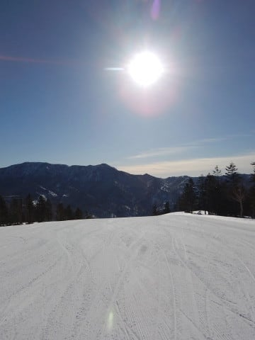

ふはははははは！

今日は見事に予想通りの天気だよ！

で．

朝のバーンはちょいと固めながら，

見事なシマシマっ！！！

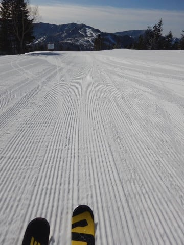

2月2日以来，久しぶりの

あさイチ晴天シマシマだっ！！

…と，喜んでいたものの．

冷えて硬めの圧雪は．

すぐに表面が崩れ出し，

あっという間に殺人コロコロ

バーンに…（涙）

焼額は，スキーヤーを狙う刺客に

ばらまかれた殺人コロコロだらけに

なってしまったので（涙）．

奥志賀へ脱出してみると…

うはーーー！

こっちには，殺人コロコロが

全然ないよ！

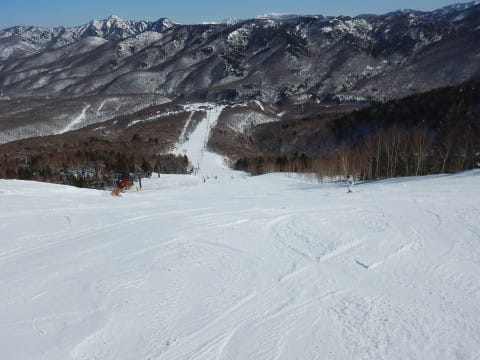

…でも．

その代り，バーンはかなり固めで．

これだけしっかり硬かったら，

コロコロにならないわな…

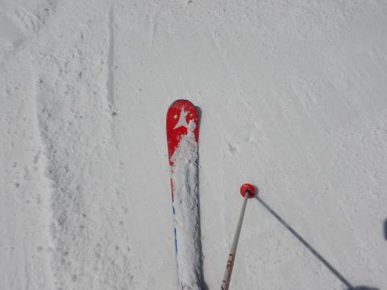

今日は，今シーズンでは珍しく，

一日中すっきり晴天で．

昼間の気温もプラスに上がり…

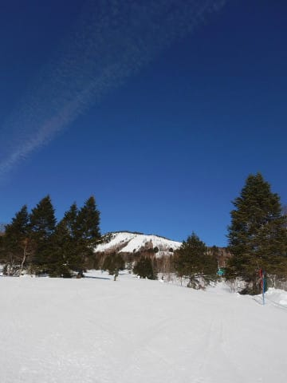

…そのため．

朝日が当たる東斜面側は，

ガチガチバーンが緩んで，

春の重い雪みたいになった

ところもあったけれども．

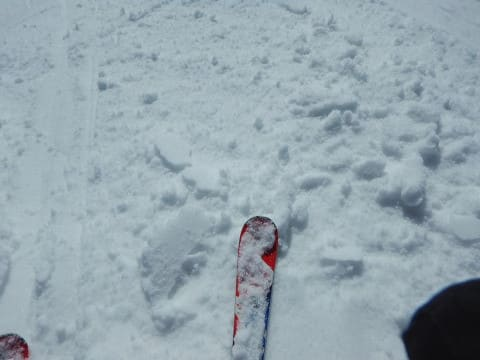

でも．

日が当たる一部以外は，

終日結構固めのバーンをキープ．

…逆に言うと．

今日のバーンは．

硬いか緩んでいるかのどちらか

という，両極端なバーンコンディションでした…

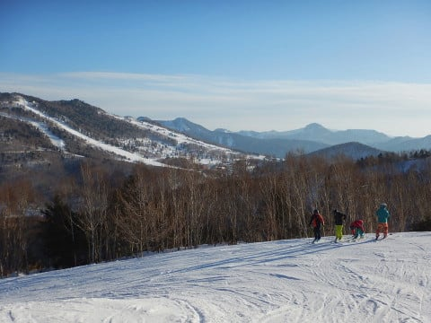

うーむ．

天気が良かったのはいいけど．

2月のトップシーズンの志賀の雪では

ない感じだったのが，ちょいと

残念だったか…

また明日，今日の志賀高原の状況の

詳細レポートしますが．

今，天気図を見てみたところ…←深夜に帰宅してるんだから，

そんなことせずに早く寝ようよ（常識的なツッコミ）

うむ？？？

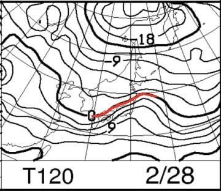

そして，降水域が本州全体を

覆っているので…

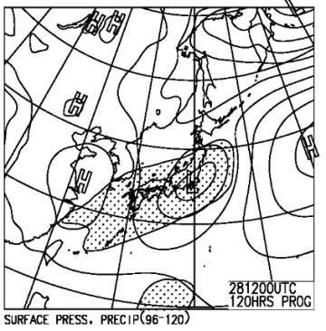

28日の木曜．

2月というのに．

また液体が降ってくるのか？？（涙）

さらに．

次の日曜の，3月3日は…

えええええ！？？？？

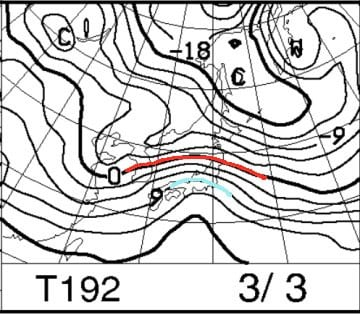

この水色は，+9℃線なんですけど？？

3月上旬にはありえないレベルの

気温上昇なんですけど！？？？

しかし．

降水域がかかっていなければ．

気温が高いだけで済むのだ！

果たして降水域は…？？

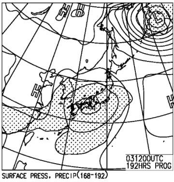

…

…

…

うむ．

見事なほどに，日本全体を

降水域が覆っていますね（止まらない涙）

3月3日の日曜日．

このままの天気図だと，壊滅的な

天気です（戦慄）

おそらく．

3月上旬に，こんなひどい天気に

なるはずがないので．

これは，

気象庁のコンピューターが狂ってるに違いない

と信じて．

次の週末も，晴天最高雪質になるように

祈り続けましょう…

## 💬 コメント一覧

### 💬 コメント by (地元民)
**タイトル**: 最近の３月の高温は異常だな・・・
**投稿日**: 2019-02-25 07:11:56

この何年か３月が異常に暖かいですね。

長野市の桜も４月５日頃開花が当たり前になってきた感も。

このままだと５月連休には、雪がないってのが普通になってしまうかもです。

初春がなくなってきた感じ・・・。

### 💬 コメント by (ほっぽ)
**タイトル**: 2/24
**投稿日**: 2019-02-25 07:21:34

Ｓさん

昨日は１ゴン乗り場で後ろに並んでいる姿をお見かけしました。

友人が一緒だったので失礼しました。

でも３／９には確実にお会いできると思うので、よろしくお願いします。

昨日は日当たりのよい斜面はすっかり春の雪でしたね。

今週末は志賀高原以外で滑る予定でしたが、日曜日が雨ということで、

どうしようか考えています。

私も昨日の滑走レポートを上げておきました。

http://www2.tokai.or.jp/nana_hoppo/

### 💬 コメント by (若杉勲71)
**タイトル**: Unknown
**投稿日**: 2019-02-25 11:32:39

志賀高原情報

本月曜日、オリンピックポールポジションをゲットするものの、硬めで圧雪が悪く快感ゼロ。聞けば、夕方に雪を入れて圧雪しているとか。湿った雪を入れたら凍りますよね。

GSは柔らかかったけれど、残念、コロコロ出現。

白樺はレースで閉鎖の影響か、二重丸。

唐松はコロコロ。

イーストは硬めできれい。

ダウンヒルは朝一番は最高だったらしいけど、まあ普通。

エキスパートは二重丸。

今日も春の陽気。明日は5どほどさがりそう。もう贅沢は言ってられませんね。

### 💬 コメント by (michi)
**タイトル**: Unknown
**投稿日**: 2019-02-25 22:55:27

昨日はお疲れ様でした。

珍しくSさんがヤケビから出られたので私がヤケビで留守番してました(^^)

先週のバーンコンディションから急に変わり、アイスバーンかザクザクという難しいコンディションでしたね。

この先昨年と同じような状況になりそうで心配です。

### 💬 コメント by (べー)
**タイトル**: Unknown
**投稿日**: 2019-02-26 00:21:05

日曜は9時頃から11時頃まで1ゴンでGSとオリンピックコース。

その後は一の瀬第3クワッドで12時頃まで。

ワタクシはスキーサイボーグではないので昼上がりです(笑)

天気が良かったので後ろ髪を引かれる思いでしたが(涙)

次回は3/21から参戦予定です…

### 💬 コメント by (大阪のS)
**タイトル**: Unknown
**投稿日**: 2019-02-26 00:47:49

私は今週は日曜出勤のため、土曜日帰りで近場の兵庫のスキー場に行ってましたが、ゲレンデ中部〜下部では上白糖のようなドサっと重い雪でした。ここらも標高がもう1,000mほどあれば良いのですが。いずれにせよ近々終了の気配が漂ってました。近畿は近いうちに終わりそうです。３月にもう一度志賀高原に行きたいと思ってます！

### 💬 コメント by (Skier_S)
**タイトル**: トップシーズンは終わったのか…（涙）
**投稿日**: 2019-02-26 02:44:04

＞地元民さま

昨シーズンも3月は暖かかったですが．

今シーズンは2月下旬からもう暖かくなり始めてます（涙）

ここ30年ほどは安定してGWまで雪が残っていたのに．

昨年，3年前と，この3年間で2度も中央エリアが

GWまで雪がもたないという悲劇を味わっているので．

今年こそは，GWまで雪がもってほしいと願う今日この頃です…

＞ほっぽさま

午前11時ごろ，奥志賀エキスパ滑ってらっしゃいません

でしたか？

気づいているかな～？

と思ったら，目の前をスルーして滑って行かれました(笑)．

今週末ですが，今の天気図では，日曜は夜まで降らず，

雨になるのは月曜にずれこみましたよ～！

＞若杉さま

月曜も春の陽気でしたか…

まだ2月というのに，季節が1か月以上進んでしまった

感じですよね．

あぁ…冷え冷えパウダーがどさどさ降ってほしい！

＞michiさま

ヤケビの留守を守っていただきありがとうございます(笑)．

しかし，とても2月と思えない残念な雪でしたね…（涙）

2シーズン前のように，3月下旬からの奇跡の冷え込みがあって，

GWまでたっぷり雪が残ることを祈るばかりです…

＞ベーさま

おっと．

10時ごろまでなら，焼額1ゴンですれ違っているか

もしれませんね…

次回は3/21から，飛び石の谷間を埋めて4日滞在ですか？？

こちらもおそらく，4日間志賀に籠っていると思います…

＞大阪のSさま

志賀高原も，日が当たる斜面は2月と思えないほどに

雪が緩みました（涙）．

また3月に志賀高原にいらっしゃるのですね．

志賀はGWまで大丈夫ですので，また4月，GWにも

志賀にお越しください～！

### 💬 コメント by (ほっぽ)
**タイトル**: エキスパ
**投稿日**: 2019-02-26 06:50:24

Ｓさん

日曜日、奥志賀に行きましたが１１時はゴンドラ下で休憩してました。(^^;

１２時ならエキスパを回していました。

イエティでも志賀でも、同じ配色のウェアの方が居て、

私と間違えて声かけた方がいらっしゃいます。

尤も、どっちがニセモノなのか？

はそれぞれに言い分があるので難しいところです。

今週末、雨は降らないようで安心しました。

この時期にカッパ着用は考えたくないですから。

### 💬 コメント by (大阪のS)
**タイトル**: Unknown
**投稿日**: 2019-02-26 06:56:08

私は今週は日曜出勤のため、土曜日帰りで近場の兵庫のスキー場に行ってましたが、ゲレンデ中部〜下部では上白糖のようなドサっと重い雪でした。ここらも標高がもう1,000mほどあれば良いのですが。いずれにせよ近々終了の気配が漂ってました。近畿は近いうちに終わりそうです。３月にもう一度志賀高原に行きたいと思ってます！

### 💬 コメント by (Skier_S)
**タイトル**: 今週土曜は晴れそう
**投稿日**: 2019-02-27 03:23:03

＞ほっぽさま

午前11時というより，厳密にいうと11:45くらいでしたが…

似た方だったのかな？

とりあえず，今週土曜はきれいに晴れそうですよ～！

＞大阪のSさま

やっぱり，もう春の雪ですか…（涙）

シーズン終了感が漂ってきましたね．

今年はトップシーズンが短かったですね（泣）．

3月，また志賀高原でお会いしましょう～！

