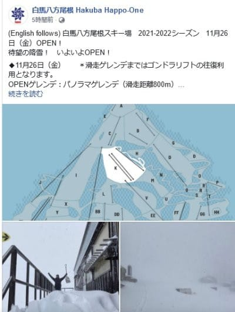

# 11/25昼から白馬五竜オープン！26日(金)は八方尾根スキー場オープン！…そして1か月予想では，12月は平年並み～ちょっと冷えるくらい

📅 投稿日時: 2021-11-26 02:00:34

🏷️ カテゴリ: [日記](cc4b5682fb7b8b144980957a978653fb0.md)

どうやら，私の予想通り日本海や白馬方面は

積雪があったようで…

なんと．

驚くことに．

本日…というか，もう日付的には昨日ですね．

25日木曜の昼に，白馬五竜のアルプス平が

オープンしたようです！！！

([エイブル白馬五竜Facebook](https://www.facebook.com/hakubagoryuofficial/)より）

そして．

八方も週末を待たずに，金曜26日からの

営業を決定しました！！

まずはパノラマコースがオープンです！

（[白馬八方尾根Facebook](https://www.facebook.com/hakuba.happo/)より）

今日の昼間まで全く雪が無かったかぐらも，

今はうっすら白くなってますよ…！！！

（[かぐらスキー場ライブカメラページ](https://live.monitorbox.jp/site/kagura/90/#d0)より）

志賀高原も，西風なので積もらないと

思ったところ．

深夜1時の時点で，それほどの量ではないけど

雪が積もっているようです…！

（[北信建設事務所道路状況カメラ](http://hokushin.pref-nagano-roadcamera.jp/)より）

ちなみに．

おこみん特派員から送られてきた，

11月25日（木）の志賀高原は…

横手山は，うっすら天然雪が積もった

おかげで，これまでのカリカリに比べると

かなり滑りやすくなったようです！！

コース幅も広がり，茶色いところも

無くなってますね…！

今日はリフト待ちもなく，快適

だったようです…！！

…いいなぁ…

で．

横手山以外の写真も送ってきてくれましたが…

熊の湯も，26日金曜オープンの準備が

着々と進んでいるようで．

かなり白くなっていますね…！

22日に完全に雪が消えた一の瀬も，

また人工雪を積み始めたし…

高天ヶ原も，人工降雪開始です！

…ただ．

一の瀬ファミリーと高天ヶ原は，

昼間には天然雪が解けて無くなって

いるし．

人工雪もまだまだ積み始めたばかりだし．

この調子だと，やっぱり27日オープンは

無理ですね…（涙）

ちなみに，予定ではこの一の瀬ダイヤも

27日オープンだったんですけどね…

ダイヤはまだ全然ダメですね（泣）

ってなことで．

志賀はちょっと積もっただけで，昼間に

消えてしまう程度の天然雪だったけど．

白馬は五竜・八方がオープンできる

くらいに積もってたみたいなので…

昨日予想した，

　25日（木）：志賀は降らない．白馬・新潟の

　標高1500mくらいから上は積雪！

って予想が大体当たったのかな？

ふはははは．

見事だ，私の天気予想！！！←気象庁の予想天気図がすごいだけ．あなたはすごくないから

ってなことで．

本日木曜は，1か月予想図の発表日なので．

これから1か月の予想を見てみると…

12月26日までの1ヶ月の850hpa気温を

[QXVV14](https://www.sunny-spot.net/chart/QXVV14.pdf)で見ると．

まぁだいたい

平年並み～わずかに低め

で推移しそうですね…

[FCXX92](https://www.sunny-spot.net/chart/FCXX92.pdf)を見てみても．

気温は，

1週目（11/27～12/3）は平年並みになる確率が50％，

2週目（12/3～12/10）は低くなる＆平年並みになる確率がそれぞれ40％

3，4週目（12/11～12/26）は平年並みになる確率が40％…

と．

まぁ，気温は概ね平年並みか，ごくわずかに

低くなる程度みたいです…

…今日はご無体仕事の疲労のため，

一か月予想の細かい解説をする

パワーがもう残ってないのですが…

サックリ話をすると，

12月後半の予想ばらつき（スプレッド）が大きい状態のため，

「12月3，4週は平年並みにしておくか～」

といった感じみたいです．

予想ばらつきが大きいということは…

12月3，4週は，

皆さんの普段の行いがよければ

ガッツリ冷えた最高ウハウハパウダー

天国になる可能性もあるし，

行いが悪ければ高温の雨が降り続け，

残念なドロドロゲレンデになる可能性もある…

ということで．

…これは．

スキーヤーの皆様におかれましては．

困った人がいれば助け，

飢えている人がいれば施し，

苦しんでいる人がいれば最後のとどめを

刺してあげるなど，

くれぐれも普段の行いにお気をつけて

くださいますよう，なにとぞよろしく

お願いいたします…←最後の一つ，何か間違ってないか？

## 💬 コメント一覧

### 💬 コメント by (northfox)
**タイトル**: Unknown
**投稿日**: 2021-11-26 15:48:38

ごめんなさい🙏

こないだ駐禁を切られるという悪しき行いをしてしまいました…

でも免罪符は納めたのでチャラということで良いですかね😓

9000円だからリフト二日券分くらい。まだスキー滑っていないのにお金だけが消えていきました。😫

### 💬 コメント by (かず)
**タイトル**: Unknown
**投稿日**: 2021-11-26 20:14:34

野沢共通来ました！何年ぶりだろう？もう野沢には行かないって思ってたけど…ビック3買ってたのが最後かな  今年は管理外にいってみます！ヤケビゴンドラの規制の情報知ってますか？

### 💬 コメント by (Skier_S)
**タイトル**: 熊の湯オープン！
**投稿日**: 2021-11-27 03:03:55

＞northfoxさま

…あぁ…

これで，今シーズン志賀のコンディションが悪ければ全て

northfoxさんの責任になりますのでご安心を！←安心するところじゃない

でも．

免罪符代，いたかったですね…

＞かずさま

おっと．久しぶり野沢ですか！

…でも，27日オープンは延期になったみたいなので．

28日にぎりぎりオープンするかどうか…って感じでしょうか．

