# 2021/5/3(月)の志賀高原スキー場は…朝は激冷え最高！終日曇り~雪がぱらつく，冬か？と思う奇跡の一日

📅 投稿日時: 2021-05-03 23:20:22

🏷️ カテゴリ: [2021スキー滑走日記](c2b0fc073d6357d3b786f6ca655147f7d.md)

えー．

本日も志賀高原で滑っていたわけですが．

本日は，

すべての週末で雨

という，3月よりもマシだったんじゃないか？？

という感じの，5月と思えないいい感じの

天気でした…！

まず．

昨晩からの積雪で，朝イチの道路は完璧な

積雪路…！！

ノーマルタイヤではかなり

命へのチャレンジ

って感じの路面だったので，スタッドレスで

来ないと無理なレベルでした…

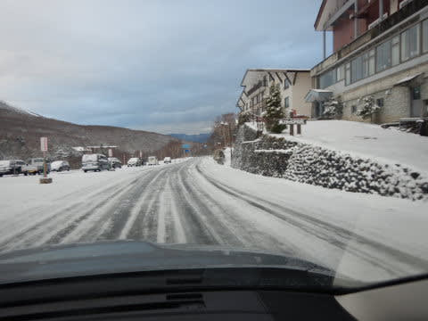

昼頃には解けて，午後にはノーマルタイヤで

来れるレベルでだったので．

明日は早朝に凍ってなければノーマル

タイヤでも大丈夫かな…？？？

そして．

さすが冷えた朝は，ベストコンディションを

狙ってか…

朝6:30の早朝に並んでいる人は，このGWで

最高の人数かも！

駅舎を超えて並んでます…

あさイチのゴンドラから見る景色は．

かなり白くなっていて…

え？

いま，5月でしたっけ？？

なんだか，11月ごろの

シーズンインのころの景色みたい…

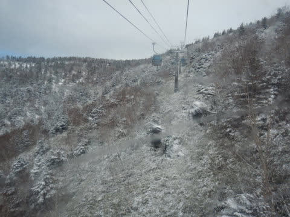

で．

朝6:30の気温は-2℃と，ここ数日で

なかった冷え冷え気温！！！

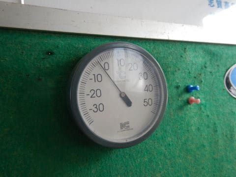

そして．

冷え冷えの新雪5cm！！！

…え？いま，5月ですよね？？

天気も，適度な曇り空で日差しが

当たらず，雪も全く緩んでなく…

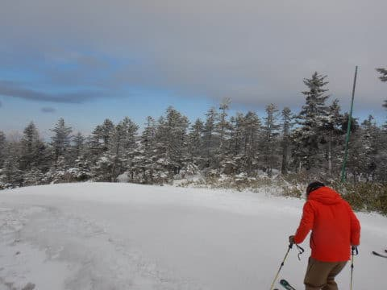

え？

これ，5月ですか？？？

これ，今年の毎週末雨の3月よりも

コンディションいいんじゃない！！？？

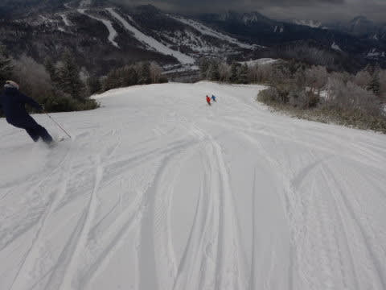

これは…

最高なんですけど！！！！

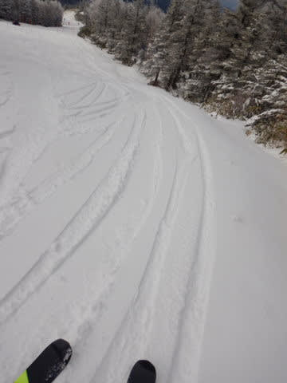

とても5月とは思えない…っ！！

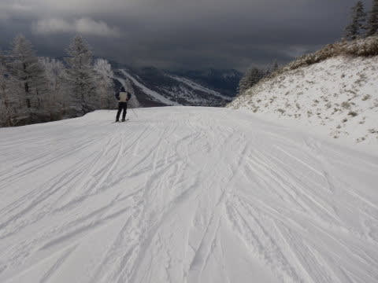

やはり，日頃の行いが良い私のために，

神様は最高の条件を準備してくれたに

違いありません！！←だから違うから．29日の雨の日にも滑ってたけど…あれは誰のせい？？

うほーーーー！！！

最高！！シアワセっ！！！

天気は曇り空で雪が解けなかったので，

早朝営業終了の8時過ぎでも…

全然雪は融けず，トップシーズン並みの

いい感じの圧雪！！

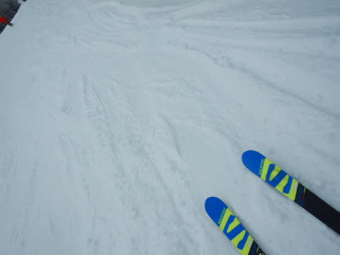

朝9時を過ぎても…

気温が低くて，雪が緩まないので，

ところどころ固まったままでシマシマが

残ってます！！

いい！

これはいい！！

そんな感じで．

今日は昼になっても気温はわずかに0℃を

超える程度の，とても5月とは思えない

気温で…

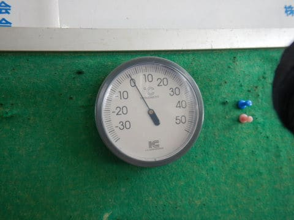

だもんで．

昼になっても，雪は5月と思えないほどの…

というか．

今年の3月よりマシなんじゃないか？？？

というほどの，最高コンディション！！

これが5月の11時過ぎのバーンと

思えない！！

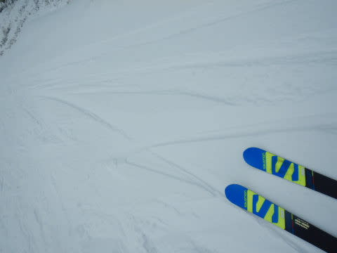

ってな感じの，5月としては最高の

コンディションだったので．

やっぱり人はこのGWで一番多かったの

ですが…

それでも，ゴンドラ待ちはこの程度で．

搬器2-3台待つかどうかというレベル．

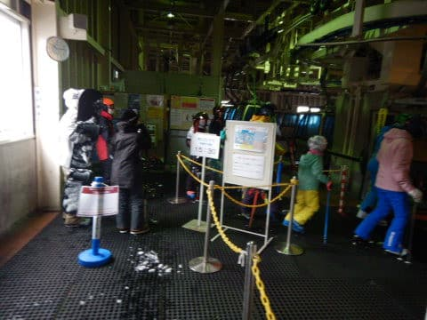

これまでが飛び乗りだったので，

「ゴンドラで，前に人が待っている！」

というだけで驚くレベル…

このGW，ホントに人は少ないです…

人が多いと言っても，ゲレンデはせいぜい

この程度．

これまでの無人バーンが続いたのに

比べれば，人が視界の中にいるだけで

「人がいるなぁ…」

という感じ．

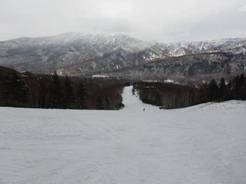

で．

ホントに今日は日差しがほとんどなかったのが

恵まれていて．

日差しがなかったおかげで，ゲレンデの雪は

午後になっても全く緩まず！！

さすがにゲレンデの下の方はちょっと重い雪に

なってきてましたが…

でも，5月と考えれば．

ドボドボざぶざぶじゃなく．

気温も寒く，板も滑るし．

超最高！！

午後になっても時折雪が舞うほどの

低い気温が続き…

これはいいよ…！！！

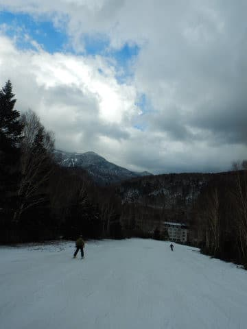

と，アホのようにグルグル滑っていたら．

午後2時半ごろから風が強くなり，

ゴンドラが超減速運転になったかと思うと…

15:30の営業終了を待たずに，15:15で

強風のためゴンドラ営業終了(涙)

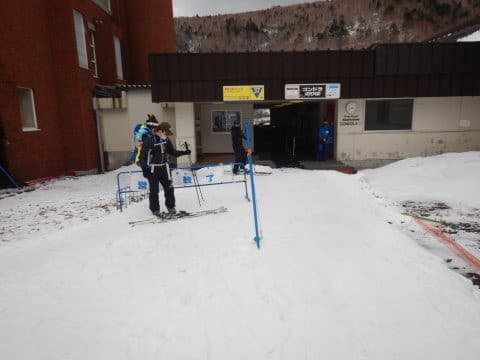

…昨日も営業終了時は強風で

超減速だったし．

一昨日も強風で4ロマ営業になったし…

ここ数日，最後は毎日強風でやられてますね（涙）

ということで．

ちょっとゴンドラが早く終わってしまった

のが残念だったものの．

とても5月と思えないGoodコンディションが

早朝から営業終了まで続いたという．

すごい恵まれた一日でした…

いや．ホントに良かった…

これから毎日，来シーズンインまで

毎日ずっとこんな天気が続けば

いいなぁ…

と思った，Skier_Sだったのでした←だから，来シーズンまでそんな天気が続いたら，氷河期だから

## 💬 コメント一覧

### 💬 コメント by (ikkun)
**タイトル**: Unknown
**投稿日**: 2021-05-04 10:41:10

おはようございます❗それはおめでとうございます(笑)  あ私しノーマルにしましたので昨日は無理でしたが……まさに神様がくれたお天気と雪でしたね🎵   ……ずっとは無理でしょうが？(笑)

### 💬 コメント by (Unknown)
**タイトル**: Unknown
**投稿日**: 2021-05-04 14:49:59

今日は良い天気の中でみなさん滑っているようですね。明日の悪天候予報から、

マイアは今日が最終日となってしまいました。

志賀高原同様に少しだけ降雪があって

綺麗な景色が広がっています。

https://asumo-g.co.jp/mia-ski/news/

来シーズンはコロナも雪も心配なく過ごせますように、

今からずっと祈っておきます！

### 💬 コメント by (Skier_S)
**タイトル**: 今日はすごい高温…（涙）
**投稿日**: 2021-05-04 21:13:31

＞ikkunさま

3日は，すごい恵まれた一日でした…！！

ずっとこんな天気がつづけばいいんですが…

＞Unknownさま

あら…マイアは最終日までもちませんでしたか…（涙）

志賀は3日の積雪で，問題なく5日までもちそうです！

…来シーズンは，コロナでいろいろ自粛にならないことを

祈るばかりです

