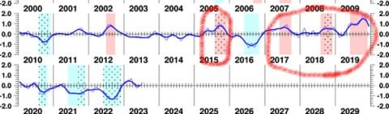

# 9，10，11月の気象庁3か月予想を読み解いてみる…スキーヤーにとってはエルニーニョより恐ろしい，正のインド洋ダイポールモードが強い（涙）

📅 投稿日時: 2023-09-07 02:26:26

🏷️ カテゴリ: [スキー天気予想](c6554f5c3c106093b511a8daae23757e8.md)

えー．

いまさらではありますが．

2週間ほど前の8月22日に，気象庁の3か月予報が発表に

なっています…！！

スキーシーズンの始まる11月が含まれた，

9，10，11月の予想なので，スキーヤーに

とってかなり気になる3か月予想となりますね…

だもんで．

今回はざっくりと[3か月予想（FCCX93)](https://www.sunny-spot.net/chart/FCXX93.pdf)を読み解いて

みましょう…！

まず．

一番気になる気温傾向から見るわけですが．

うぎゃーー！！

やっぱり高温傾向が続きそう（泣）

11月になっても平年より高いか

気温が同程度の確率が40％ずつ，

平年より低くなる確率がわずか20％と．

11月も高温が続きそうという

悲しい予想です…（涙）

なぜこうなるのかを，この3か月の傾向から

見てみるわけですが．

相変わらずエルニーニョ指数は高く，

来年の2月になってもまだまだエルニーニョが続きそう

という予報で．

それも，10～11月ごろには，エルニーニョと

しては最強（最凶？）レベルの，平年比＋3℃まで

海水温が上がりそうという予想…（泣）

ただ，例年のエルニーニョなら，この下の図の

赤で示した部分にあるように．

夏から秋にかけては，平年より気温が低い

可能性が高く，冷夏や涼しい秋になるはずで．

こんなくそ暑い夏にならないはずなんですが…

それもこれだけの最凶レベルのエルニーニョなら，

激烈な冷夏になってもいいところ．

なぜエルニーニョなのにこんなにくそ暑い夏になり，

そして11月まで高い気温になりそうなのか？

…という理由がここに書かれてます…

それは

正のインド洋ダイポールモード

のしわざです！

正のインド洋ダイポールモード…

それは，この図にあるように．

②部分のインド洋東南側の水温が低く，

③部分のインド洋西側の水温が高い

状態を示します．

ちなみに，①部分の太平洋ペルー沖の水温が

高いのがエルニーニョ現象ですね．

で．

正のインド洋ダイポールモードが起きると

どうなるかというと…

ぶっちゃけ，日本の気温が激烈に上がります（泣）

7，8，9月の3か月だと，正のインド洋ダイポール

発生時，東日本の気温が平年より高くなる

確率は75％だし…

さらに恐ろしいのが10，11，12月．

東日本の気温が高い確率が80％と，

スキーヤー殺しの11，12月を招きます

（上記2枚，[気象庁「正のインド洋ダイポールモード現象時の日本の天候の特徴（詳細版）」ページ](https://www.data.jma.go.jp/kaiyou/data/db/climate/knowledge/ind/iod_nihon_month.html)より）

なぜ正のインド洋ダイポールモードが高温を

招くかというのを下の図でざっくり説明すると．

①（赤でくくった部分）インド洋南東の水温が低いため

上昇気流が弱く，この辺りは晴れの天気になる

②（水色でくくった部分）①の影響で，その東側の

赤道上のフィリピン東岸あたりで上昇気流が活発になり，

その結果，平年より低気圧発生部分が南西に寄る

③（緑でくくった部分）②のように，低気圧発生が

南西にずれる影響で，高温の太平洋高気圧の勢力が

広がり，日本は高温になる

という経緯で，日本が高温になります…

ただ，過去のインド洋ダイポールモードの

過去の歴史を振り返ってみると…

（気象庁　[「インド洋ダイポールモード現象の発生期間と指数」ページ](https://www.data.jma.go.jp/kaiyou/data/db/climate/iod/iod_data.html)より）

2015年と，2017年から19年が正のインド洋

ダイポールモードの年．

この年の焼額のシーズンインがどうだったかを

振り返ってみると…

2015年の12月は，記録的な雪不足のシーズンで．

年末に近い12/26にやっとゴンドラが動き出した年．

2017年の12月は，1週目から第2ゴンドラが動いた

いい年でした！

2018年の12月は，2週目まで第4ロマンスしか

動かない悲惨な年で，3週目にやっとゴンドラ運行．

2019年の12月は，3週目になってもゴンドラが

動かない悲惨な年でした…

他の年は11月ごろまで正のインド洋

ダイポールモードが続いていたけど．

2017年は9月の早めに正のインド洋

ダイポールモードが終わっていたので，

2017年だけは影響が少なかったのか…

でも．とりあえず．

正のインド洋ダイポールモードが出た

次のシーズンは，雪が積もり始めるのが遅い

という傾向が読み取れます（涙）

あぁ…

エルニーニョで暖冬になる可能性が高いし．

正のインド洋ダイポールモードでシーズンインの

冷えが遅い可能性も高いし．

長期予報を見ても，いい知らせがない…（泣）

これで[正の北極振動](e5bde56aeb97978df16133d718c475baf.md)が出たら，

スキーヤーを殺す暖冬3大要素がコンプリート

ですが．

まだ正の北極振動が出る予想じゃないだけ

マシなのかも…

とりあえず．

今シーズンも冷え冷え踊りを踊らなくては

ならないシーズンになりそうな予感…（涙）

## 💬 コメント一覧

### 💬 コメント by (副院長)
**タイトル**: Unknown
**投稿日**: 2023-09-07 09:01:39

S様、なんとなく理解できるのですが、結局最初はペルー沖海水温なのかな？　　てことはいいのですが、個人的には、スキー経費が、ガソリンや、リフト代、宿泊料金などなんとなく、２，３割アップしそうな感じで、どないしょ？です。

### 💬 コメント by (Skier_S)
**タイトル**: >副院長さま
**投稿日**: 2023-09-08 01:01:40

今回の夏が暑いのは，ペルー沖のエルニーニョよりインド洋のダイポールモードが

効いてるっぽいって感じです…

でも，次のシーズンはリフト券も宿代もすごい上がりますね(涙)

ガソリン代も高いし，キツイです…

### 💬 コメント by (ねも)
**タイトル**: Unknown
**投稿日**: 2023-09-08 06:53:24

Ｓさん　谷川岳に返信ありがとうございます(^^)v

来季はスキーヤー泣かせ予報ですか……　外れることを祈りましょう(笑)

過去の年末レビュー、そうだったなとうなずきながら読みました。

最近の衝撃は、コロナ騒動に突入した19－20シーズン。年明けても滑れないスキー場いっぱい、八方尾根でもベースには全く雪なし😰

逆に超うれしかったのは17－18シーズンと21－22シーズン。12月中旬には、滑りまくりでした。

私は、初滑りに白馬五竜に行くことが多いですが、ペンションのオーナー夫妻も笑顔😄　来季も笑顔に会いたいもの。

なお残念ながら、まだ11月に滑ったことはありません😅

### 💬 コメント by (おおすぎ)
**タイトル**: Unknown
**投稿日**: 2023-09-09 10:07:06

S様、

もう来月は、シーズンINですね！！

（何だか、1年過ぎるのが早いのは、気のせいでしょうか・・・））

### 💬 コメント by (Skier_S)
**タイトル**: コメント回答遅れました！
**投稿日**: 2023-09-09 17:39:29

＞ねもさま

どう見ても，今のところ11月までは冷える予想になりそうな根拠が1ミクロンもないです…（涙）

21年の12月はめちゃくちゃよかったですよね～．

また，あんなシーズンになってほしいものです…

＞おおすぎさま

シーズンインまであと1か月ちょい！

イエティが10月20日オープンなら，私のシーズンインは21日か22日の予定なので，あと40日ほどです…！

