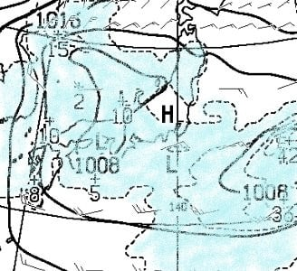
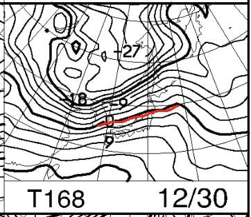
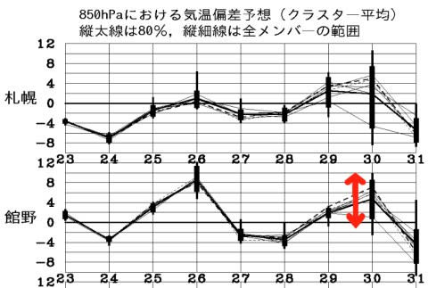

# 26日の志賀高原スキー場の天気，雨のリスクは減ってきた！27日は30～40cmの積雪かっ！？31日も年末寒波で積もる！…が，30日がちょいヤバめ

📅 投稿日時: 2019-12-25 03:38:11

えー．

どうやら24日の志賀高原．

10cm程度の積雪があったようですね…

でも．

予想した20cmは積もらなかったか…（涙）

（[志賀高原リゾート開発Facebook](https://www.facebook.com/ShigaKogen.Ski/posts/2605648222884698)より）

…とはいえ．

この雪のおかげで，滑走可能なゲレンデの

雪のコンディションは結構良くなった

ようですが．

この雪では，滑走可能コースはほとんど

広がらず．

…焼額ゴンドラはまだ動かないし．

奥志賀はまだオープンしてない状況です…

うーーーーん．

もう一降りほしいところ…

ってなことで．

本日．

この日曜の志賀高原，焼額＆高天ヶ原の

詳細レポートをやろうと思っていたわけですが．

もう，それよりも．

スキー場のこれからの積雪が気になり，

スキー場レポートに手が着きません…

もう，ライブカメラやら天気図を

眺めまくっているわけですが．

ここで，

(選択肢1)これから雪が降るかどうかの

　　天気図を読み込んだ結果は，

　　私一人の胸のうちにしまっておき，

　　スキー場詳細レポートをやるべき．

(選択肢2)スキー場詳細レポートはいいから，

　　これから雪が降るのかどうか，惜しげもなく

　　みんなに教える．

…このどちらをやろうか悩んだのですが．

…

…

今日は選択肢2を選びました～！！

いや．

無いですよ．

選択肢3なんて．

スキー場詳細レポートとこれからの積雪

予測の両方をやるなんて選択肢は…！！

ただでさえ，天気図の読み込み＆記事作成に

深夜帰宅後の1時間以上かけてるのに，

そんな記事を書いた日には，記事作成に

2時間以上かかって死にますから…

(聞こえる…読者の「死んでもいいから記事を書け」という声が…っ！）

…何か幻聴が聞こえたようですが．

とりあえず．

今日も読者が飽きているであろう，

これからのスキー場の積雪予想です！！

えー．

まず．

25日は気温は0℃前後ですが．

晴れで積雪が全く期待できない一日です（涙）

そして．

昨日「雨が降るかも」と予告した26日の木曜日．

この日の850hpa気温図を見ると…

やっぱり，赤く印した0℃線は志賀高原より

北にあります…（涙）

ただ，+6℃線が志賀にかかっていた

昨日の予想に比べると．

今日の予想では，+3℃線が志賀より南になって．

気温がそこまで上がらない予想になりました！

これなら，夜の気温が冷えてくれるうちなら，

志賀ならギリギリ雪になる気温…

で．

この日の地上天気図で，降水域を

見てみると…

うむ．

本州全域，水色の降水域に覆われている

ように見えますが…

しかし．

志賀高原近辺を拡大すると．

やっぱり，志賀高原部分，すっぽりと

降水域から抜けてます…

これは，気温が高い26日．

志賀高原が雨になる危機から

ほぼ脱したと言えます…っ！！

そして，

その翌日，27日の金曜日．

850hpa気温図を見ると…

うはーーーっ！！

赤い0℃線は伊豆諸島くらいまで

下がってますよ！

志賀高原には，水色の-9℃線が

近づいてますよ！！

これは…

待ちに待った真冬の冷え込み！

さらに，風向きは矢印で示した，

北よりの風！

西風じゃないよ！！

で．

この日の地上天気図を見てみると…

うほーーーーーっ！！

見事な冬型っ！

そして，すごい縦縞っ！！

さらに拡大すると…

日本海の，ギリギリ中国大陸の

そばから水色の降水域が始まってます．

…これは，専門的に言うと．

「離岸距離が短い」

日本海の吹き出しの雲で．

激冷え大雪を意味しますっ！！

そして．

赤く印した38という数字…

これは，降水量38mm．

降雪量なら38cm．

この日は，志賀でも30cmクラスの積雪が

期待できそうっ！！

…ふはははは！

私がスキーをやめるのと志賀高原に行かないのと板を買わないのとかは嫌だけどそれ以外なら

何でもやるから，神様お願い！！！

と，祈った結果ですっ！！←違うから

皆さん，私に感謝してください！！←喜びのあまり，おかしくなってるから．

もし神様に祈った結果だったとしても，その場合はあなたじゃなく神様に感謝すべきだから

ってなことで．

皆さん，喜んでください．

28日の年末休暇の前に，そこそこの積雪が

ありそうです！！

いやーー．

良かった，よかった…

…

…

…って．

え？？

なに？？？

この30日の予想図…

赤線の0℃線，また志賀の北にいますけど…？？

そして，降水域の網掛けが

志賀高原に近づいてますけど…？？？

ええええ！？？

30日，ヤバいの？？

また，液体が降る危機なのか！？？

…ただ．

この30日の天気図．

[FZCX50](http://www.hbc.jp/tecweather/FZCX50.pdf)の特定高度線ばらつきを見ると…

赤く印した部分．まだ予想ばらつきが

大きいですね…

30日の予想精度が低いことを

示してます．

それを受けて．

こんな感じで，30日の850hpaの気温

ばらつきが大きいわけで…

この場合．

この[FXXN50](http://www.hbc.jp/tecweather/FXXN519.pdf)の850hpa予想図．

これは，GSMのコントロールランを

もとに計算されているので…

この850hpa気温偏差予想図では，

コントロールランは点線で示されており．

30日のコントロールランは，

赤矢印の部分になります．

ただ，予想ばらつきが大きいときは．

赤矢印のコントロールラン（点線）よりも，

水色矢印のアンサンブル平均（太線）のほうが，

現実に近くなる場合が多いです…

30日は，水色矢印のアンサンブル平均が，

赤矢印のコントロールランより

3度ほど低くなってるため．

おそらく実体は，この図より

3度ほど低くなる可能性が高いです．

だもんで．

大体この図の+3℃線の位置が，現実では

0℃線になるんじゃないかな～．

だとすると，ぎりぎり雨は

降らないんじゃないんだろうか…

と，祈ってます．

で．

この30日が過ぎたあと．

31日は…

ふおおおお！

すごい冷え込み！

また，水色の-9℃線が志賀高原に

近づいてますっ！！

…そして．

31日の地上天気図．

…うををををを！！！

すごい冬型！！

…来る．

年末寒波が，来る．

31日も，雪が積もる…！！

…そして．1日まで降り続けるので．

おそらく志賀高原では，初日の出は

見れないでしょう（涙）

…でも．

いい．

初日の出は，見れなくていい．

雪が無いよりは，1024倍マシ…！

ってなことで．

まとめると．

25日：晴れ．積雪なし．朝は冷えるが，昼間は0℃くらい．

　夕方に向け気温が上がる

26日：朝から曇り．朝はわずかにマイナス気温．

　昼間は山頂でも0℃を上回る．

　運が悪ければ，昼間にぽつぽつ液体が

　落ちてくる可能性もあるけど…

　降らない方に100カノッサ．

　夜から降り始める．

　降り始めは雨かもしれないけど，

　じきに雪に変わる．　

27日：雪．終日雪．朝は-2～3℃程度か？それほど冷えない．

　あさイチの積雪はジットリ重い湿雪．

　午前中，昼に向けてグングン気温が下がっていき，

　夕方は-10℃近い激冷えに．

　雪が降り続くためゲレンデはモサモサになっていく．

　風が強く，吹雪っぽいかも．

　奥志賀ゴンドラが営業していれば，

　止まりかねないレベルの風かな．

　

28日：この日の朝は冷え冷え最高圧雪バーン！！！

　この日に滑走可能になるコースが多数．

　気温は終日冷える．

　天気は午前は曇ってるかもしれないけど．

　午後に向かって天気は回復！

　…この日に，1ゴンが動き出してほしいところ…（懇願）

29日：おそらく晴れ．前日からの積雪なし．

　気温は最高0℃程度の，穏やかな一日．

30日：微妙．運が悪ければ雨．

　運が良ければ曇り～小雪．

31日：激冷え．吹雪っぽい雪．

　終日雪かも．

って感じでしょうか…

また明日以降，年末年始の詳細天気予想

やります…！

## 💬 コメント一覧

### 💬 コメント by (若杉勲72)
**タイトル**: Unknown
**投稿日**: 2019-12-25 13:31:03

2ゴン明日からのようですよ。

明日の朝から帰る予定だったのですが、昨年の2ゴンファーストは僕らだったようで、それを聞いてめらめらと20000魂に火がついたバカな私。

今年も狙います。本多ご夫妻に一矢報いるには、明日の帰宅を遅らせればいいんだ。見てろ！某H夫妻！

### 💬 コメント by (若杉勲72)
**タイトル**: Unknown
**投稿日**: 2019-12-25 14:43:18

ごめんなさい。念の為にヤケビに確認してみたら、明日は2ゴンだめだそうです。

金曜日に降ったら土曜日から動かそうと考えているそうです。

がさネタをごめんなさい。シェイシェイ！

### 💬 コメント by (カンタロス)
**タイトル**: Unknown
**投稿日**: 2019-12-25 19:40:01

かぐらちょっと詳細です。

２４日

終日、雪が降っていてリフトが寒い天気。

ほぼ全面滑走できました。

夜からの積雪、１０～１５センチ程度。

パウダーでしたが、かぐらメインは所々

雪が剥がれてガリガリあり。

外に踏みすぎると、板が逃げるコンディション。

リフト待ちは多くて搬器２台程度。

２５日

夜のうちに雪がやみ、晴天。

ポカポカと春スキーのような感じ。

・・・雪が溶けますね（泣

やはりガリガリが所々。

そこさえ気を付ければ、エッジの噛むいい感じの

コンディション。

今日はジャイアント、テクニカルがオープンです。

あとはかぐら山頂と田代チャレンジを残すのみ。

下山コースは台風での土砂崩れで今シーズンは閉鎖

のようです。

かぐら、および田代のイントラの方からの情報です。

・今年はおそらくGWでかぐらも今シーズンの営業終わりだね。

・（本気か冗談かわかりませんが）首くくる人でるんじゃないかな。

との事でした。

湯沢の様子はまるで４月下旬の雪の量です。

田んぼの田植えができそうです。

以上、長文失礼しました。

### 💬 コメント by (かず)
**タイトル**: Unknown
**投稿日**: 2019-12-25 22:32:50

予報ありがとうございます  ほんとギリギリです   本日奥志賀も上だけオープンみたいですね   年末で2ゴンのみだとかなり…28日の1ゴン奥志賀動いてほしいです

### 💬 コメント by (Skier_S)
**タイトル**: 今日は雨が降らなきゃいいが…
**投稿日**: 2019-12-26 08:19:40

＞若杉さま

2ゴンだめですか…残念…

＞カンタロスさま

かぐらがGWで終わったら…

恐ろしい…

4シーズン前の雪不足の時でも，しっかり5月下旬まで

営業してくれたので，今シーズンも頑張ってほしいところです

＞かずさま

27日の雪，かなり積もりそうなので期待したいところ…

最悪，そのあとの31日の雪で何とかなってくれれば…

いや．しかし．

今年はひどいです…

