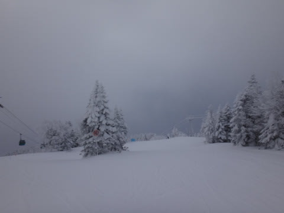
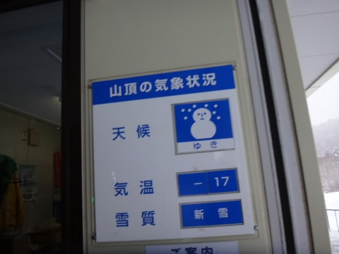
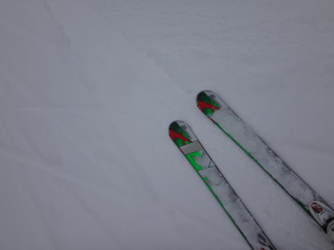
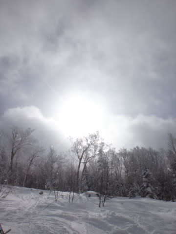
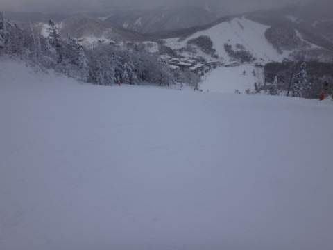

# 1月5日の志賀高原…速報モード

📅 投稿日時: 2014-01-06 02:16:16

🏷️ カテゴリ: [2014スキー滑走日記](c992167609b6415052179ee69ea1ea7d8.md)

なんとっ！

ついに私の志賀高原滞在も最終日がやってきました…

＃Skier_Sは志賀高原に住んでるわけじゃないので，お間違えなく(笑）．

今日も，リフトストップまで滑って．

K奈川県まで帰ってきたので．

明日から仕事というのに，帰宅は深夜のこんな時間という…

＃明日，無事に仕事行けるのか？？

ということで，詳細レポートは明日に譲って．

今日は速報モードで．

えー．本日は．

天気はあんまり良く無かったです…

んで．今シーズン一番の強烈な冷え込みで…

朝は，マイナス20度近くまで冷え込んだようですね～．

で．

冷えひえな中，午後2時過ぎまで雪がちらつき続けたにも

かかわらず．

パウダーを楽しめるほど積もったわけではなく．

滑り終わりに近い午後2時過ぎから，ようやく日が射し始めるという…

昼間は中途半端な降雪が続き，帰るまぎわの夕方に晴れだすという．

今日も，「嫌がらせか～！」と思う天気でした(涙)．

でも．

正月休み最終日というのもあって．

かなりすいてましたよ～．

(一の瀬ファミリー正面バーンに，誰も滑っていない…)

…これで天気が良ければ最高だったんだけどな～．

ってことで．

詳細レポートは，また明日っ！

＃明日ちゃんと会社にいけるかな…

## 💬 コメント一覧

### 💬 コメント by (Goku)
**タイトル**: Unknown
**投稿日**: 2014-01-06 19:35:21

あけましておめでとうございます。

最終日は私も行きましたがお会いできませんでしたね。

それにしても凄い！８日間の滑走距離は凄いことになってそう。

### 💬 コメント by (Skier_S)
**タイトル**: 今年もよろしくお願いします
**投稿日**: 2014-01-06 22:11:29

GokuさんのBlogを見て，志賀に来てらしたんだ～，

と思ったんですが…

お会いできませんでしたね～．

娘と一の瀬パノラマ＆天狗コースばかり

滑っていたのが原因でしょうか…

10時までは，焼額滑っていたんですが．

http://www.skiline.cc/skiing_day/17q7l4b3ctk

8日間での滑走距離は，Skiline様は500kmほどだと

おっしゃってます(笑)．

昼間は娘とすべることが多く，それほど稼げません

でした…

では，今年もよろしくお願いします～！

