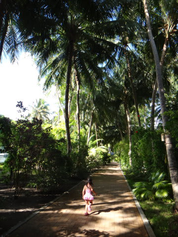
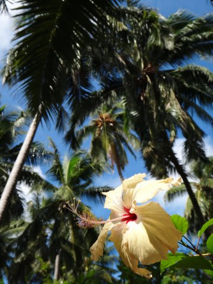
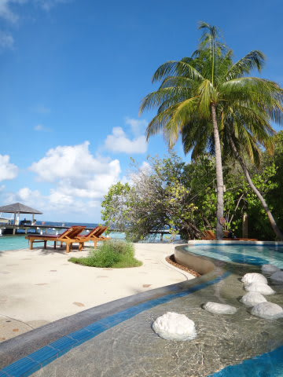
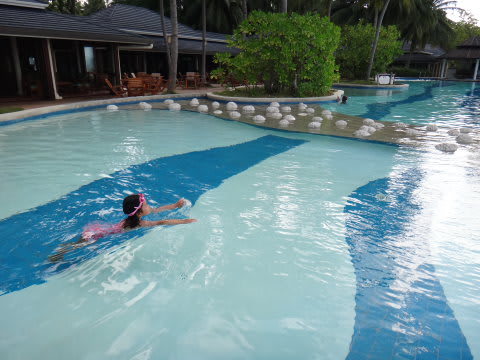
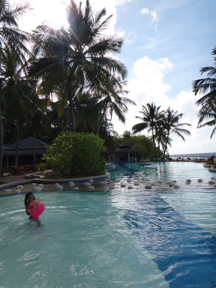
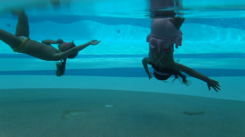
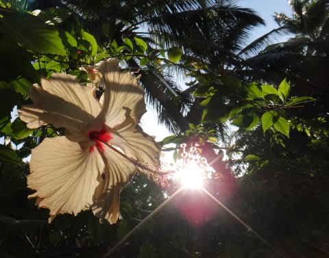
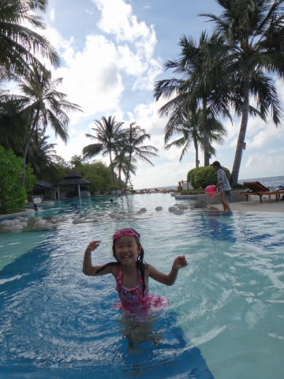

# 2012年　子連れモルジブ　ダイビング旅行記　その22

📅 投稿日時: 2012-11-26 00:00:16

うーむ．

スキーに行かなかった(行けなかった)涙の3連休．

最終日の午後だけ時間があったので．

ゲレンデに思いを馳せつつ，タイヤをスタッドレスに交換してました…

かぐらは23日夜からの積雪で，メインバーンだけじゃなく，

テクニカルもジャイアントもオープンしたみたいですね．

アサマ2000もコンディションよかったみたいですね…

(遠くを見る目）

…今週末は，ゲレンデに復活じゃ!

あー．

では．

スキーに行ってないので．

今日もダイビングレポートの続き，ってことで…

------

ということで．

いつもどおりの娘のリクエストにこたえて…

プールへ向かいます．

プールへ到着すると…

「まってました！」とばかりに

早速泳ぎ始める娘．

まさに．

水を得た魚ならぬ，水を得た娘…

で．

私も塩抜きと称して一緒にビーチボールで遊んでいたところ．

なんだか，先日娘と遊んでくれた子がやってきて．

そして，水中でぐるぐると前回り＆後回りをやり始めました．

それを見ていた娘…

まねをして，何とか回ろうとチャレンジし始めました．

「おいおい，いきなり無理だろ～」

と思っていたところ．

なんと．2-3回でコツを覚えたのか

すぐに一緒にぐるぐる回り始めたじゃあーりませんかっ！！！

え！えええっ！

な，なんとっ！

私「…娘，2ヶ月前まで水に顔つけるのすら好きじゃなかったのに…！」

7月の慶良間でシュノーケリングを覚えてから．

水に顔をつけるのが怖くなくなったらしく．

驚きの父親の目の前で，あれよあれよという間に，

前回りも後ろ回りも，それも息継ぎなしの2-3回連続で，

自由自在にこなすようになってしまった娘．

な，なんと…

なんだか．

4歳になって，成長したなぁ～．

子供の成長は早いなぁ…

＃自分のスキーもこんな風に上達してくれたら…

…そうこうしているうちに日が傾いてきました．

私「娘～．日が暮れるよ～．そろそろ上がろうよ～」

娘「いやーーーっ！まだ泳ぐ～っ！！！！」

いや．

もう，2時間くらい泳いでるから…

っていうか．もう日が沈むよ～っ！

でも．

水中でぐるぐるできるようになったのがうれしいのか．

今日もなかなかプールから上がろうとしない娘だった…
