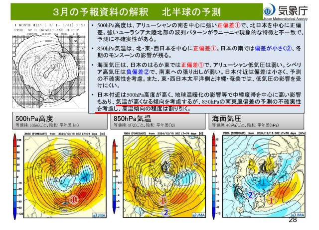

# 1～3月の気象庁3か月予報が出たので読み解いてみる…1月冷えてスキー場の積雪も多そう！2月は平年並み，3月は気温が上がりそう…（涙）

📅 投稿日時: 2024-12-27 01:03:16

🏷️ カテゴリ: [スキー天気予想](c6554f5c3c106093b511a8daae23757e8.md)

そろそろ年末休みが近づいて

来ていますが…

休みに向かって仕事の量が減るどころか，

「これ，年明けまでの宿題ね」という

宿題が次々増えていき，ホントに正月

休みに休んでいていいんだろうか…

と思う今日この頃（涙）

それでも，この年末休みは9連休（書類上は）！

9連休（書類上は）休めるんだから…

9連休（書類上は）のうち6日は志賀高原

出没予定！

…ホントなら9日間フルで滑りたい…←9連スキーは体と財布に厳しすぎるから！！

ってなことで．

年末休みが近づく本日，仕事をさぼって早めに休んで，

志賀高原で滑っている人もいっぱいいるよう

ですが…

本日も志賀高原から特派員の写真が送られてき

ました～！

うーん．

本日は朝のうちは晴れの予想でしたが．

どうやら朝は一瞬晴れていたけど，

すぐに曇りはじめちゃったようです（泣）

まぁ，朝の気温は-5℃程度だったようなので，

朝イチの気温の予想はぴったり当てた

ようですが…

晴れるはずの午前中に，山頂付近は

ガスが出るタイミングもあり…

残念ながらすっきり晴れることはなく．

午後は予想通り曇り空が続いた一日

だったようですが．

雪質は終日良かったみたいで，人も少なく

ガラガラだったようで，まぁ楽しめた一日

だったんじゃないでしょうか…

雪質は相変わらずいいままみたいです！

ってなことで．

冷え冷えの日々が続いているこの12月ですが．

12月24日に，[気象庁の1-3月の3か月予報](https://www.sunny-spot.net/chart/FCXX93.pdf)が発表に

なりました～！

果たして，この12月の冷え冷え祭りは

1月以降も続くのか？？

無事GWまで滑れるくらい，1-3月が

冷え冷え続きで雪が積もり続けてくれる

のか？？

早速読み解いてみましょう…！！

まずは3か月の平均気温ですが…

ふむ．

1月は激冷えと言わないまでも，高温になる

確率は20%と低いので，冷え気味の1月に

なりそうですね…！！

2月は平年並み，

そして…3月は気温が上がる確率が一番高く，

50％になってます…（涙）

あぁ…

冷え冷え祭りも1月で終わり，3月は気温が

上がっちゃうのか…

逆に1，2月は例年よりちょっとくらい気温が

上がっても雪が降るので，1，2月は冷えすぎ

なくていいから，3月に冷えてほしいんだけど…

そして．

積雪量の予想を見ると…

1，2月は平年より多め，3月は平年並み

ということで．

雪は結構積もりそうな感じですね…！！

そこはちょっと安心…

ってなことで．

ディープな世界に突っ込みたくない人は，

ここまで読み終わって．

「あぁ，1月は冷えて，3月は気温が上がるのね…」

と平和なところでこのBlogを読み終えてください．

はい．ここで読み終えるのが平和です．

と，念押ししたところで．

ここからがこのBlogの本領…！！

情報量が多い3か月予想の資料からごく一部を

抜き出して，簡単な(と書いている人は思っている)

解説を書いていきます…！

まずは1-3月の気象に大きな影響を与える，

エルニーニョ・ラニーニャの状況ですが…

どうやら，ラニーニャ現象ギリギリの

海水温のようで，今はエルニーニョ・ラニーニャ

どちらも発生してない状態みたいですね…

ただ，5か月平均の海水温ではラニーニャの

状況を満たしていなくても，ペルー沖

海水温はここ数か月は冷えているようなので，

ラニーニャの特徴が出ているようです！

で．1月を中心にラニーニャの特徴…

冬は冷えて積雪が多くなるという傾向が

強まり，3月にかけて弱まるという

予想がなされてます．

うーん．

今回は短命ラニーニャになりそう（というか，

5か月平均水温が-1.5℃低い状況が

6か月続くというラニーニャの定義を満たさ

なさそう）なので，3月にはラニーニャが

終わって冷え冷えが終わるということか…（泣）

とりあえず．

1月の詳細解説を読み込むと…

ふむ．200hPa流線関数を見ると．③の

日本付近は低気圧性循環になっていて．

これは赤丸の低圧性循環を回るように，

偏西風が水色矢印のように，日本付近で

南に下がることを意味しています…

日本付近で低圧性循環が出るのは，

ラニーニャの特徴ですね．

そのおかげで，850hPaの風向きを見ると…

偏西風が南にカーブしているのに沿って，

赤く括った③付近の部分で，風の流れが

カーブしているのがわかり．

日本付近は見事な北風になってます…！

そのおかげで，

1月の850hPa気温を見ると，

他のエリアがほとんど平年より高い

赤～オレンジに塗られている中，

①の日本付近だけ狙ったかのように

平年比マイナスの水色エリアになってます！

1月は日本だけピンポイントで冷えてる

感じ…！！

続いて，2月の200hPa流線関数を見ると…

まだ日本付近は①と③の高気圧性

循環に挟まれた，弱い低気圧性

循環が見られますね…

ただ，1月よりかなり低圧性循環は

弱待ってる感じ…

そのせいで，850hPaの風向き…風ベクトルは

赤く囲った日本付近では北風は弱まり，

ほぼ風速0の感じになっちゃってますね…（泣）

だもんで．

850hPa気温を見ると．

まだ日本の南にわずかにうっすら平年より

低い水色エリア（②）が残っているものの．

北日本は平年比＋のオレンジ色になってて．

本州中央はちょうど平年並みくらいって

感じですか…

さらに，3月の200hPa流線関数を見てみますが．

うーむ．

まだ①と③の高気圧性循環に囲まれる形で，

周りよりは赤色が薄いですが…

②の日本付近の低気圧性循環はさらに弱まり，

もう水色が残ってない感じ…

この日本付近の低気圧性循環の弱まりに

伴い，偏西風の南下もほぼ終わる感じで．

850hPaの風ベクトルを見ると．

赤く括った日本付近，南風になってます…（泣）

…確かにこれは気温が上がりそう…

日本付近の850hPa気温を見ると．

日本の南に，わずかに平年並みくらいの

白いエリアが残ってますが…

本州はもう，平年より気温が高い

エリアになってますね（泣）

でも，日本の南に②のエリアがなければ，

もっと気温が上がってただろうから．

最悪は避けた感じかな…

ってな感じで，3月は高温になりそうな

コンピュータの予想が出ているものの．

ここでまた気象庁の職人の読みが発揮

されており…

「気温が高くなる傾向を考慮するが，

850hPaの南東風偏差の予測の不確実性を

考慮し，高温傾向の程度は割り引く」

と書かれていて．

2枚前の図の南東風がそこまで強くならんだろう…

という読みから，コンピュータの予想値ほど高温に

ならないと読んでいるようです…！！

うん．

高温傾向は思いっきり割り引いてください！！

もう，平年より低いくらいまで割り引いても

いいくらいですよ…っ！！

と，大声で叫びたくなる，今回の3か月予報だった

わけですが．

とりあえず，簡単な200hPa流線関数と850hPa風

ベクトルの解析だけでこれだけの情報量になる，

この3か月予報．

もっとじっくり読み解くと，いろいろ面白い

ことが読み取れます…

3月のコンピュータの予想はよくわからんから，

予想の精度はまだ低そうだよね…

というのがわかってきます．

ってなことなので．

3月が平年より高温になるのかどうかは，

まだよくわからんというのが正直な

ところですが．

この予想が外れて，3月も激冷えになって，

3月も4月も最高の雪質で滑れることを

祈りましょう…！！←それは欲深すぎでは…？？

今日の記事も，ちょっとマニアックすぎたか…

## 💬 コメント一覧

### 💬 コメント by (カンタロス)
**タイトル**: Unknown
**投稿日**: 2024-12-27 08:02:09

エスさま、こんにちは。

もはや気象庁の職員になれる（それもかなりのレベル）感じですね！

今年も白馬で滑ってますが、最高です！

ここで解説された天気図をもとに白馬の天気を予測してスキーしてます（笑）

### 💬 コメント by (スシネコ)
**タイトル**: Unknown
**投稿日**: 2024-12-27 08:57:50

いやー、気象庁の資料の解説は分かりやすくて楽しいです。それでも未だに「北極振動」が発生するそもそもの原因というかメカニズムがよく理解できません (´・ω・`) 

28日の夜から現地入りして5日まで滞在します。今シーズンもよろしくお願いします。

### 💬 コメント by (副院長)
**タイトル**: Unknown
**投稿日**: 2024-12-27 16:41:43

いやー、あかん、例年は冷静にライブカメラやネットを見てられるのですが、今季は雪が多くて、我慢できません。取り合えず、友人の五竜のおうちに明日の夜から、参戦です。志賀には1月中旬から予定しています。今シーズンもよろしくお願いいたします。

### 💬 コメント by (Skier_S)
**タイトル**: 仕事納め終了！
**投稿日**: 2024-12-28 04:38:10

＞カンタロスさま

いや…冬の志賀高原の天気しかわからないので，気象関係の仕事はできません…

家のそばの天気が予想できないんですよ(笑)．

＞スシネコさま

分かりやすかったのならよかったです…

正月休みから志賀入りですね！それも9日間っ！！？？

志賀高原でお会いしましょう…！！

＞副院長さま

今シーズンは雪が多いですよ～！

1月中旬と言わず，正月休みに志賀にお越しください(笑)．

今シーズンも宜しくお願い致します！

