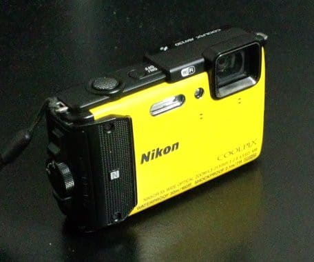
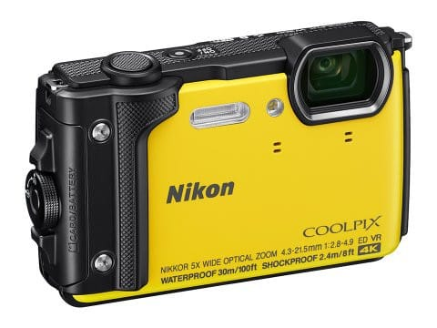
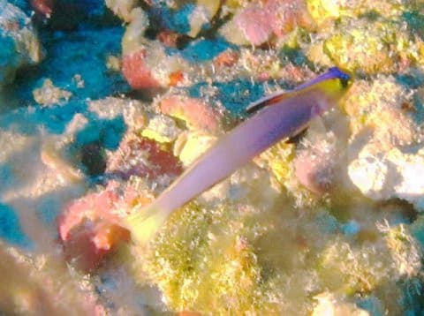

# 私が使ってるNikon Coolpix AW130の後継機種，A300が出たけど…これでパラオのマクロ穴の写真を撮ってる人がいたよ…

📅 投稿日時: 2017-10-17 01:07:28

🏷️ カテゴリ: [PC,カメラ&小物](c0d8caed13e597efe97b661a8ae56bed0.md)

えー．

Yetiが営業しなかったこの週末（涙）．

そのおかげでスキーネタが無いので．

いまさらながら，8月に行ってきたパラオの

ネタなのですが．

…っていうより．

まだ昨年のモアルボアルレポートが終わったばかりで．

パラオの話は，[帰国レポート](e4b942826f9b231b0e2e25d2b0349d5be.md)以外まだ何も

してませんけど…

そう．

この5月に，SONYのデジカメ，TX30をかぐらで

落っことしてしまい．

その後継機として購入した，

Nikon Coolpix AW130．

このカメラは，去年製造中止に

なっちゃいましたが…

今はこの機種の後継機種，A300が，

Nikonから発売されてます．

（NIKONホームページより拝借）

＃なんでAWシリーズじゃなく，Aシリーズなんだろう…

まぁ，見た目はAW130とほとんど変わらず．

機能も，30m防水はそのまま，1600万画素で

レンズも変更がなく．

耐衝撃性が2.1m→2.4mに変わったのと，

4k動画が撮れるようになった…

という以外は，ほとんど間違い探しのレベルの

違いしかない，この新型機種ですが．

パラオでは，AW130やA300を持って潜っていた人が

3人ほどいて．

いやーー．

このカメラ，ダイバーに売れてるなぁ…

…と，思っていたわけですが．

以前，妻用のダイビングカメラの買い替え時に．

このカメラにしようかと思ったけど，

[却下された理由](ee4568b58e63cfdcd9328bb87f9f6ff6c.md)が

「30m防水だと，深度30mを超えるパラオの

　マクロ穴に持っていけない！

　私の大好きなヘルフリッチの写真が撮れない！」

…ということだったのですが．

なんと．

今回のパラオで．ブルーコーナーのマクロ穴に

潜りに行く際に．

みんな，30m防水のA300をもって潜りに行ったのですが…っ！！

大丈夫か，みんなっ！！！

…と，思っていたのですが．

30m潜っても壊れないどころか．

みんな，30m防水のカメラで，

水深30mオーバーのマクロ穴にいる，

ヘルフリッチやらアケボノハゼを

撮ってるんですが…！？？

（妻撮影…これは40m防水のカメラで撮ってます）

そして．

エグジット後に．

船の上で，みんながA300やAW130で撮った写真を

見せてもらうと…

…ちゃんと写ってますよ（驚愕）

…それも，A300やAW130って．

撮った写真の水深が表示されるのですが．

表示された水深，-32m．

…なんだ…

AW130を買わなかった理由の，

このカメラだと，パラオのマクロ穴でヘルフリッチが撮れないから

というのは．

実は，大丈夫だったんだ～…………

…でも．

だけど．

保証性能以上で無理に使ってるわけで．

まぁ，今回はたまたま3人とも，全員揃って

運が良かっただけかもしれないし．

うん．

そうだ．

私は[（想定外に）S120](e04aeb3cf8430e5f7c82f212806214b7e.md)を買ったけど．

そのせいで，[えらく散財した](e8f922e68b4fdd9cf7ca08c2be560efd8.md)気がするけど．

それで良かったんだ…

と，ブルーコーナーのマクロ穴の写真が写っている

AW130を目の前に見ながら，

自分に言い聞かせる，Skier_Sなのだった…

## 💬 コメント一覧

### 💬 コメント by (KENKEN)
**タイトル**: AW130水没
**投稿日**: 2017-10-18 23:53:51

9月の座間味でやっちゃいました。

水深30mを超えてませんが、自分の不注意で( ﾉД`)ｼｸｼｸ…。

2年(30本)ほどダイビングを含めスキーでAW130使いましたが、パッキンの劣化もなくダイビングの記録を残す程度に使う分にはいいカメラでした。（意外と水深が浅い場所では水中色も綺麗）

今度A300を買うと思います。

ちなみにオリンパスのTG-2も水没経験がありますす(´；ω；`)ｳｩｩ。

経験的にはデジカメ設計水深＋20％位は大丈夫なのかなと(自己責任ですよ）

### 💬 コメント by (Skier_S)
**タイトル**: KENKENさま
**投稿日**: 2017-10-19 02:46:53

ありゃ！

AW130 ，水没させちゃいましたか…

不注意って，何かやっちゃったんですか？？

せめて，カードや電池が無事なら良かったんですが…

もし，次もダイビングに使うなら，TG-5＆ハウジングが

イイかもしれません．

ハウジング水没しても，カメラはもつので…

2重の防水，安心ですよ(笑)．

