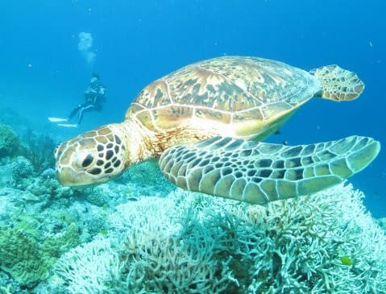
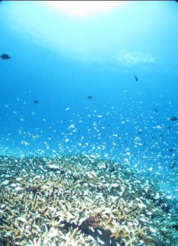
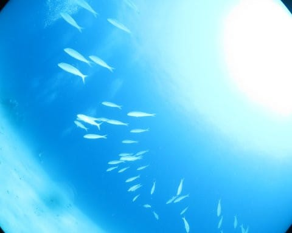
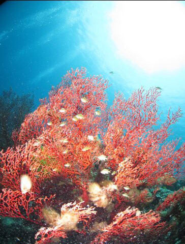

# 2024年8月，今年も座間味で親子ダイビング！エピローグ

📅 投稿日時: 2024-09-27 01:15:17

🏷️ カテゴリ: [ダイビング日記](ce3a7a8d424d112fce83ee85c81a0e344.md)

仕事がご無体で，長い連続した夏休みを

取るのは難しそうだったこの夏．

でも，プロローグに書いたように．

娘が高校生のうちに潜りに行けるのは

この夏がラストチャンスで．

娘は来年受験生で潜ることはできず．

再来年大学生になったら一緒に潜りに

行ってくれるのかわからないし．

そして受験で1年あけた再来年は，

80歳を過ぎるうちの両親はもう潜れない

可能性も高く．

この夏が，最後の3世代ダイビングになって

しまうのかも…？

という強迫観念から．

何とか山の日の3連休に絡め，

いつもの4泊5日より1日短い3泊4日で

座間味遠征を突っ込んだわけだけど．

それでも，

いつもより1日短い2日間でも，

天気にも海況にも恵まれ．

3世代でしっかり潜ってこれて．

さらに，今回のダイビングを見て．

うち両親…少なくとも母親は，後期高齢者

ながらも，しっかり1日3本，2日で計6本

潜ったという元気さだったので．

再来年でも潜れそうだな…

とちょっと安心した，今回のダイビング

だったわけだけど．

しかし．

何度も繰り返し書くけど．

娘は来年受験生で潜れないのだ．

「高校生」の娘とダイビングに行けるのは，

この夏が最後なのだ！！

…振り返ってみれば．

ついこの間Cカードをとらせたばかりと

思っていたのに．

Cカードがとれる小学5年生で早々に

講習を受けさせて．

子供が生まれたころから[夢に見た
親子ダイバーを実現して喜んだ](e3be9696d2e2a53f928e5127de6052062.md)と

いうのに．

Cカードをとらせてから6年もたったと

いうのに，

コロナのせいでまるまる3年潜ることが

できなかったブランクのせいで，

全然潜りに行けてないのだ…！！

親と一緒に潜りに行ってくれるかどうか

分からない大学生になる前に，もっと

娘と潜りに行っておきたいのだ…！！！

…行っておきたいのだ…

…行っておきたいのだ…

ということで．

いろいろなリミッターが外れてしまった私は．

3泊4日の座間味から帰宅して

中3日仕事したら，5泊6日でモアルボアルへ

出発する

という無謀プランで，

引き続き，モアルボアルへ潜りに行く

ことにしたのだった…

ってなことで．

これからまた，モアルボアルダイビング

旅行記が続きます…！！

（[全22回の目次はこちら](ec177fb85d6b57aca2bc5000eb94bf2fd.md)）

　

　

　

　

　

## 💬 コメント一覧

### 💬 コメント by (1kamakura)
**タイトル**: Unknown
**投稿日**: 2024-09-27 07:32:51

江戸の秋

パチパチパチパチ👏

わーい🙌楽しみです！

モアルボアル？

どこだろ？

調べてみます〜♪

### 💬 コメント by (Skier_S)
**タイトル**: ＞江戸の秋さま
**投稿日**: 2024-09-28 10:00:21

モアルボアルはフィリピンのセブ島西岸です~！

これで5回目になります．

過去の旅行記は，「このブログについて」のカテゴリーからたどれますので，

また暇なときに読んでやってください…！

