# 1月30，31日の週末の志賀高原スキー場の天気は…土曜朝はパウダーで午後は晴れそう！日曜は冷える終日晴れ，絶好のスキー日和の週末！

📅 投稿日時: 2021-01-28 03:00:59

🏷️ カテゴリ: [スキー天気予想](c6554f5c3c106093b511a8daae23757e8.md)

ということで．

昨日の記事で．

27日未明の志賀高原は雨

という，悲しい実況中継をしたわけですが．

その日の志賀高原がどうだったのか，

志賀近辺在住の特派員からのレポートに

よると…

あさイチの奥志賀，ふもとはプラス気温で

スタート（涙）

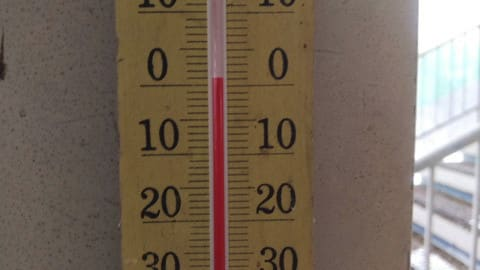

朝のうち，麓は霧雨っぽい感じで，

ウェアが濡れちゃう天気だったようで．

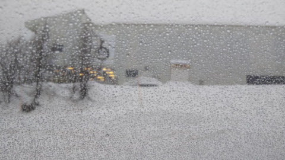

山頂はマイナス気温で，雨ではなかった

ようですが…

でも，ガスで見えず（泣）

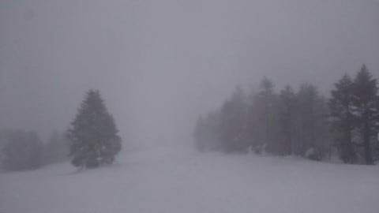

雪は，思いっきり湿った春の重めの雪で…

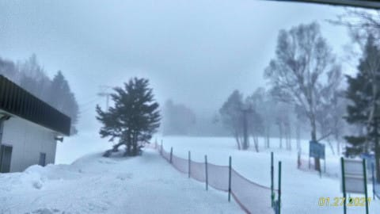

時折，ガスが切れるタイミングもあったようですが．

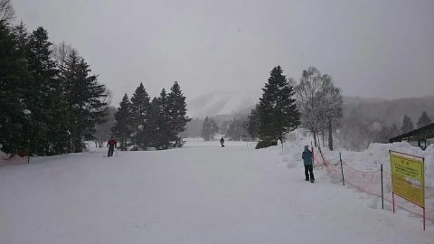

午後は冷える予想だったところ，

終日，山頂はギリギリマイナスキープ

程度の気温で，

意外と営業終了まで冷え込まず．

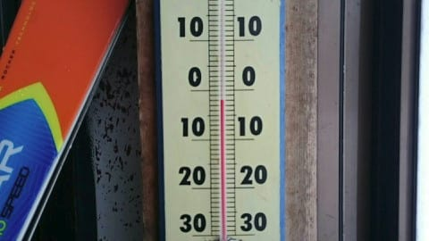

雪はカリカリになることなく，終日，

春の重めの雪のままだったようです…

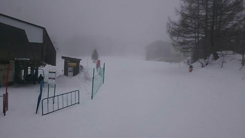

さらに午後1時過ぎに，焼額の2ゴンは

故障で営業中止となったようですね…（泣）

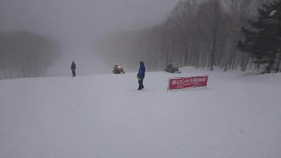

奥志賀ゴンドラ，1ゴンは止まらなかったのですが．

風もそこそこ強くなり，ガスと重めの雪に

悩まされて．

ちょっと大変な一日だったようです…

写真を送ってくれた特派員のみなさま，

ありがとうございました！

…ってなことで．

残念ながら気温が上がり，春の雪に

なってしまった志賀高原．

さて，これから週末にかけてどうなるのか．

いつも通り天気図を見てみましょう…

まずは28日（木）の850hpa図ですが．

志賀高原は，-3℃線がかかるくらいですね．

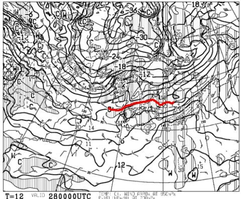

そして，地上天気図では降水域が

本州にかかってないので，

木曜は，昼間に0℃近くまで気温が

上がっちゃうかもしれないけど．

晴れ~曇りの穏やかな一日になりそう…

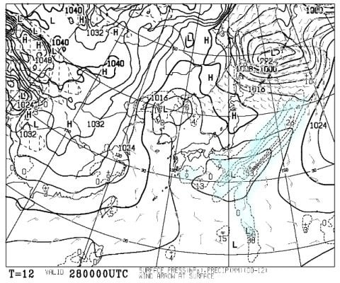

そして，29日（金）の850hpa気温を見ると…

なんだ，これはっ！！

赤い0℃線が沖縄近辺まで下がってる！！

志賀高原には，水色の-9℃線がかかってますよ！

これは，志賀高原は-10℃を下回る激冷え…！

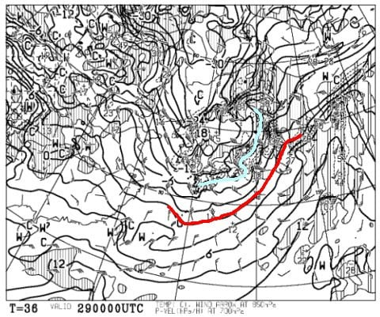

この日の地上天気図は．

日本海側に降水域がかかっているので…

降ります．

雪が降ります．

ただ，本格的に降り始めるのは朝からなので，

朝の積雪はそれほどないかな．

そして，二つ目玉の低気圧が

発達するので，風が強そう…！！

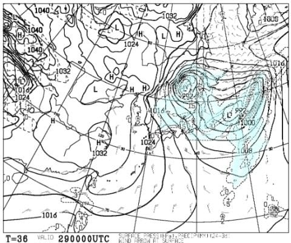

金曜は，吹雪いているのに強風でゴンドラが

動かないとかいうパターンもありそう…

うーん．焼額のイチゴンは止まらないで

いてくれるかな…

そして，肝心の週末．

30日の土曜の850hpa図を見ると．

この日も水色の-9℃線が志賀にかかって

いるので，冷え冷え！！

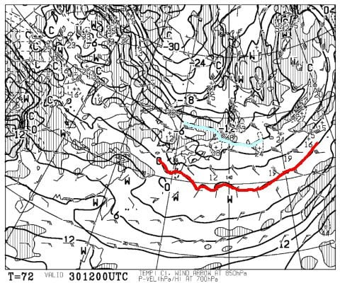

地上天気図は，日本海側に降水域が

かかっていますが…高気圧が本州中部まで

覆っているので．

雪はおそらく朝には弱まり，

午後には晴れていきそう！！

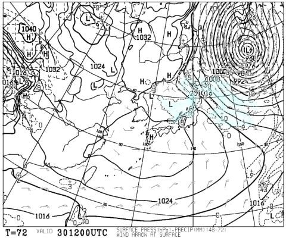

30日は，朝まで雪が積もってパウダーで，

昼に向かって晴れていき冷え冷えという，

最高のスキー日和かも！！！

で．31日の日曜．850hpa気温を見ると…

この日は，-3℃線が志賀にかかる程度で，

29，30日と2日間続いた冷え込みは緩みそう．

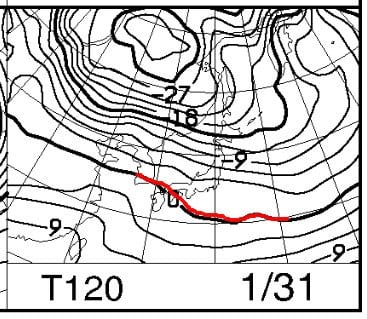

地上天気図は，見事に高気圧に覆われるので，

いい感じで晴れそう…！

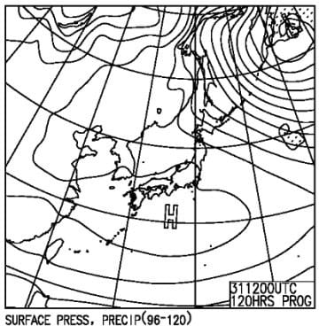

この日は絶好のスキー日和に

なりそうです！！

ということで．

まとめると．

28日(木)：朝は晴れそうかな…午後に向かって雲が

　増えていく，晴れ~曇りの一日．

　あさイチの気温は-5℃を下回る程度で，

　前日の高温で湿った雪が固まった

　硬めの圧雪でスタート！

　午前中はバーン全面コロコロが出そう…．

　標高の低いバーンは前日の雨で

　かなり水分を含んでいるので，

　アイスバーンチックになってるところも．

　昼間は0℃を超えるかどうか．

　日差しがあるところは，昼にはコロコロが

　緩んでちょうど滑り良くなるかも．

　一の瀬正面バーンとかは終日硬めの

　仕上がりかな？

29日(金)：朝から吹雪．朝の気温は

　-12~-13℃の激烈冷え冷え吹雪．

　奥志賀や高天ヶ原のゴンドラは

　営業ヤバいかも．

　雪は早朝から降り始めそうなので，

　朝の積雪はそれほどなさそう．

　10cmほどかな？

　ただ，昼間はひたすら吹雪き続けて，

　昼間の積雪だけで10~20cmは積もりそう．

　冷え冷えパウダーなので，風が強い

　ところは積もらなさそうだけど，

　ゲレンデは昼間も新雪が積もり続ける，

　激冷え吹雪の一日

30日(土)：朝までの積雪は20cm，多ければ30cm！！

　朝の気温は-12℃程度と，朝イチは

　冷え冷えパウダーねらい目！！

　圧雪バーンも，圧雪の上に5-10cmの

　冷え冷え雪．

　朝まで雪が降ってるだろうけど，すぐに

　止んで，昼に向かって晴れていく．

　午後は太陽も拝めそうで，気温は

　昼間も-7℃程度までしか上がらない

　ような冷え冷え．

　トップシーズン冷え冷え雪で，午後は

　晴れ間もありそうないい感じの一日！

　ただ，急斜面は一部硬い下地が

　出てくるかも…

31日(日）：朝から晴れ．晴天．

　朝の気温は-5℃以下まで冷える．

　あさイチは最高トップシーズンの冷え冷え

　雪が圧雪された，柔らかめの気持ちいい

　最高シマシマバーン！

　昼間は0℃くらいまで上がるので，

　日差しが強いバーンはちょっと雪が

　緩むかもしれないけど，日差しが

　強くないバーンは一日最高雪を

　キープ．

　晴れて冷え冷え雪が楽しめる，

　シーズンにそうそうなさそうな，

　超恵まれた一日！！

…という予想なので．この週末．

土曜はパウダー＆晴れ，

日曜は最高シマシマの晴れ…

と，スゲーいい週末になりそうな予感…！！

うーーーん．

すごく恵まれたトップシーズンの週末に

なりそうだけど．

この予想が外れて，槍やミサイルが降る

悪い週末になった時には．

その時には，スキーに行けない私の怨念を

感じ取ってください…

## 💬 コメント一覧

### 💬 コメント by (レインボー73)
**タイトル**: Unknown
**投稿日**: 2021-01-28 17:34:14

木曜日の志賀高原情報

昨日より冷え込んだのに大して硬くない。視界はいいし、昨日とは大違い。ヤケビから奥志賀、白樺からダイヤモンド。ここは最近最も圧雪が良くない。ファミリーは快適。タンネを横切って、高天の銀嶺へ。ここは下界並みの値段で満足できます。ざる蕎麦800円、２倍盛りの大盛りでも1100円、メガ唐揚げ800円、メガ唐揚げ定食1100円、みそラーメン800円。今日もgo to eatを利用させて頂きました。美味しかった。

新潟の高校のおかげなのか、西館が動いていました。ゲレンデはアイスコロコロでしたが、硬い滑る雪で、まあ楽しめました。ジャイアントへの登りも、一気登りができるアイス。助かりました。

パルスゴンドラで山の駅へ。かわいい女の子にオコジョのマスコットを買ってあげるためです。73になってもこの色気！

対象は小3の女の子。

これさえ買えればもう満足。あとはニゴンまっしぐら。

昨日、今年ウエアを２着買ったと書きましたが、３着でした。ボケててそんなことも忘れてます。４着目はカッパの濃紺を狙ってます。こんなこと妻に知られたらどうしよう。離婚されたら、持てない私には後がない。

### 💬 コメント by (レインボー73)
**タイトル**: Unknown
**投稿日**: 2021-01-28 19:53:03

お借りします。

西館さま

エス様ご不在の志賀高原ては、なかなかお会いできませんが、いかがお過ごしでしょうか。以前お約束しました曇りどめを、エス様があてにならぬ今（上から目線）、どうやってお渡ししましょうか。もし志賀にお越しいただけるなら、ご連絡くださいませ。是非とも一度、73歳の若者と御一緒いただけたらと、切望いたします。

### 💬 コメント by (Skier_S)
**タイトル**: 意外と雨の影響は少なくすんで良かった…
**投稿日**: 2021-01-29 04:49:48

＞かずさま

コメント，私だけ読める設定にしておきました．

応援ありがとうございます～！

＞レインボー73さま

コロコロは多かったようですが，ガチガチアイスバーンには

なってないようで，雨の影響はそれほどひどくなかったようですね…

ジャイアントもアイスバーンじゃなかったですか？

