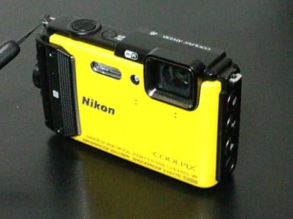

# 新カメラ，Nikon Coolpix AW130を使ってみて・その2…細かな不満はあるけど，スキー＆ダイビングにはおススメのカメラ！

📅 投稿日時: 2017-06-29 01:51:23

🏷️ カテゴリ: [PC,カメラ&小物](c0d8caed13e597efe97b661a8ae56bed0.md)

ということで．

新しく買ったデジカメ，ニコンのCoolpix AW130の

インプレッション．

[前回の記事](eed87bcf8e2b077a95dc9b05b7187af70.md)が長くなったので，その2です…

えー．

次の話題は．

暗所の撮影性能．

室内撮影も多い私にとっては，かなり

重要なポイントなのですが…

以前のSONYのカメラ，TX30の場合．

手ぶれするような薄暗いところだと，

自動でマルチショット合成による

手ぶれ除去が効いて．

こんな薄暗いホテルの部屋も，手持ちで

結構きれいに写りますし…

暗いメーターパネルも結構きれいに写ります…

しかし．

AW130だと．

「夜景」と認識されるか，手動で夜景モードに

入れないと，マルチショットが効かない感じで．

自動でマルチショット撮影されることは，

それほどありません…．

（マルチショットが効かず，思いっきり手ぶれ）

SONYのカメラではマルチショットが大活躍して，

こんな感じで，暗いところでも手持ちで行けたのですが…

この，AW130.

マルチショットが効かないだけじゃなく．

暗いところでも，なぜかISOが200までしか

上がらないプログラムになってるようで．

さらに手ぶれが大きめに出るという…（涙）

暗いところで，フラッシュOFFで撮った写真の

EXIF情報を読ませると…

うぎゃー！シャッタースピード（露出時間）1秒！

だのに，ISOは200までしか上がってません…（涙）

いや…シャッタースピード1秒，手持ちって無理だから（涙）．

なぜ，ISOオートで，ISO800や1600まで上がらないのかなぁ…

ISO800でもこの程度の画像が出るので．

（原寸画像）

この程度の絵が出てくれれば，

ISO200で遅いシャッタスピードになって

手ぶれを続出させるより，よっぽどマシです…

だもんで．

このAW130を使うにあたって，私は

フラッシュOFFで暗いところで撮影する場合，

いちいち手動でISO感度を上げてますが．

…多少絵が荒くなってもいいから，

暗いところではISO1600とかまで上げて

シャッタスピードを早めて手ぶれを抑える

プログラムにしてほしい…

そして．

もう一つの不満は，写真再生時．

私にとって極めて大切な，

シャッタースピード・絞り値・ISO値が

再生画面に表示されない…（泣）．

あまり必要のない撮影標高と気圧がしっかり出るのに，

撮影パラメータが全く出ないのは，なぜだ！？？

表示をONにする設定があるのでは…？？

と，マニュアルを見ても．

シャッタースピードや絞り値を，再生時に

見る手段はなさそう…（涙）．

薄暗くなってきて手ぶれしちゃったとき，

「今のはシャッタースピードどれだけ

　だったんだ？

　単にカメラのホールドが甘かっただけで，

　しっかり抑えれば写るシャッタースピード

　だったのか？

　それとも，ISOを上げなきゃ無理なシャッター

　スピードだったのか？

　そもそも，ISOナンボで撮影されたんだ？

　手ぶれ抑えるのに，ISOをいくつに

　設定すればいいんだ？」

…という感じで．

細かいマニュアル設定を駆使する私にとって，

これはけっこう致命的…

高度はいらんから，シャッタースピードとISO値を

出してくれ（懇願）

って感じで．

まぁ，細かな不満もあるけど．

いいところを挙げると．

やはり，このカメラ．

30mというハンパない防水性能と，

かなり頑丈そうなボディーはいいですね～．

レンズカバーが無いので心配したけど．

前玉…というか，カバーガラスですか．

レンズ部の一番表面のガラス，結構頑丈なようで．

今のところ，傷がついたりすることはありません．

さらに，どうやらこのカバーガラス．

水滴などが付きにくい加工がされているようで．

スマホのカメラでありがちな，指紋や汚れが

レンズ部についてしまって，写真がにじんじゃう

ようなこともないです…

こんな雨の日にも，レンズに水滴がついておらず，

きれいな写真のままです…

そして，鏡筒繰り出しがない構造のこのカメラ．

電源を入れての起動は早いですし．

そして，モニタは結構きれいです．

動画撮影でもそこそこ光学ズームは早く，

デジタルズームが効いてかなり望遠まで行けるので．

（ちょっと画質は荒くなるけど…）

十分使えます．

あと，動画撮影時にも静止画が撮れますが，

SONYのTX30ではできなかった，動画再生時の

再生動画からの静止画切り出しができるので．

ここは機能がアップしてます！

一瞬のシャッターチャンスを逃したくない時は，

あらかじめ動画で撮っておいて．

このタイミング！という画像を切り取ることで，

シャッターチャンスぴったりの写真が切り出せます．

で．

電池もちは，SONYのTX30よりず～っといいです．

SONYのTX30は，バッテリー能力が低下する極寒のスキー場で

動画を撮影すると，電池の電流不足ですぐシャットダウンするという．

フル充電の電池でも，極寒のスキー場では動画を

数本しか撮れない…という事態が起こりましたが．

AW130だと，その心配は無さそうかな～．

そして．

SONYのTX30のタッチパネルは，再生時は

スマホみたいに写真が次々見れて便利では

あったけど．

スキー場でグローブをしていると使いにくい

という欠点があったので．

グローブしたままでも問題なく使える，

ボタン式カメラがやっぱりスキーには向くのかな．

まぁ．

TX30と比べると，手ぶれの話だとか，

ちょいと重くて，大きいとか．

細かな不満はいくつかあれど．

とりあえず頑丈で，防水だし．

レンズ画角も十分．

モニタも合格レベル．

レスポンスもOKだし．

電池もちも優秀そう．

…ということで．

スキー＆ダイビングに使うには，

十分なカメラですね～…
