# 2021/3/19(金)の志賀高原スキー場特派員情報…そして私は今週末は夢は見れなさそう(涙)

📅 投稿日時: 2021-03-20 01:20:34

🏷️ カテゴリ: [日記](cc4b5682fb7b8b144980957a978653fb0.md)

来週月曜には緊急事態宣言がようやく

解除されそうな今日この頃．

今週末，スキー場へ復活したかった

ところですが…

仕事が切羽詰まっていてスキーに行くのは諦めました

まだ緊急事態宣言も解除された

訳でないので，

今週末は素直にStay homeです…

あぁ…

来週は緊急事態宣言が解除されるので．

土日でちゃんとスキーに行けるといいなぁ…

年度末なんて，嫌いだ～！！！！

ってなことで．

本日も志賀高原の特派員のレポート記事にて…

えー．

まず．

本日金曜の朝は．

日が射すものの，うっすらと雲がかかる

天気でスタート！

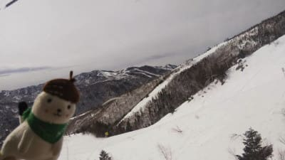

あさイチの気温は-1℃と…

今日もこの時期としてはちょい

高めの気温でスタート．

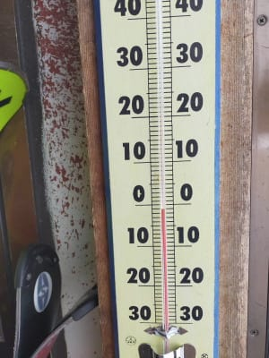

あさイチのゲレンデは…

一見いい感じのシマシマですが．

シマシマのまま固まった，

かなりの本気度の高いアイスバーンが

お出迎え！

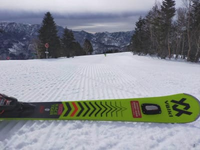

ホントに見た目いい感じのシマシマ

ですが…かなり硬かったようです…

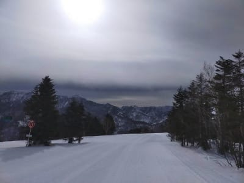

でも，午前中は青空も見え．

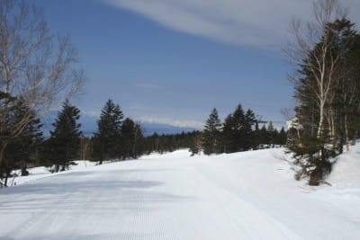

すぐにゲレンデも表面が緩み，

いい感じになっていったようですね…

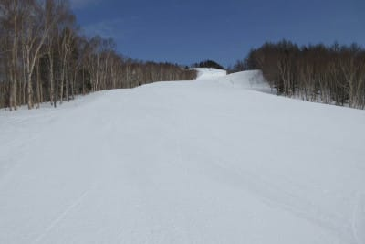

そして，人が少ない！

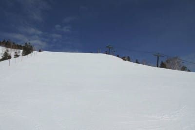

…ただ，焼額のサウスコースは修学旅行生が

いっぱい来ていたようですが…

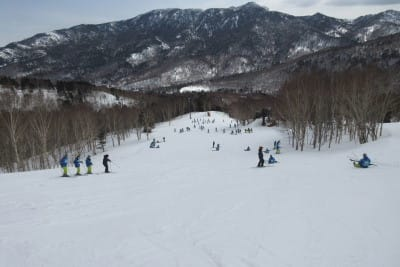

今日も標高の高い寺小屋は

結構良かったみたいで．

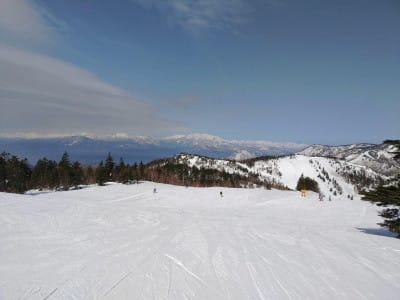

昼ごろになっても，雪質は良さそうに

見えますね！

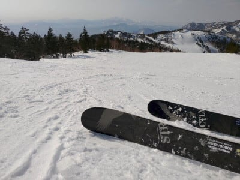

で，午後は予想通り，ちょっと雲が

増えていったようですが．

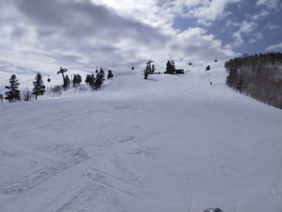

とはいえ，さすがに昼間は結構気温が

上がったので…

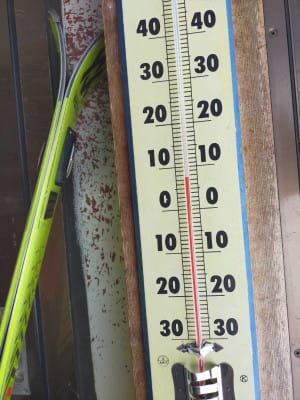

日当たりの良いバーンは，ちょっと

重い雪になっていったようです．

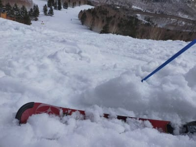

でも，人が少なかったので，

雪は緩んだものの，夕方まで結構

フラットだったようですね…！

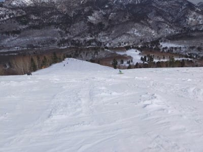

一の瀬や，

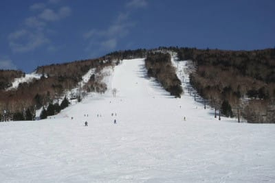

高天ヶ原方面も，雪は緩み気味ながらも．

下地までザブザブになってはいないようで．

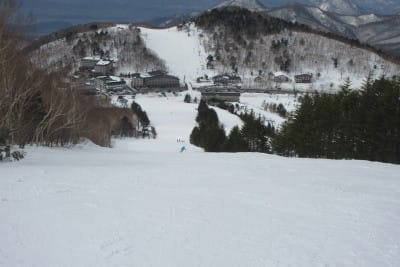

標高の低い，西館より下の部分は

微妙な雪質だったようですが．

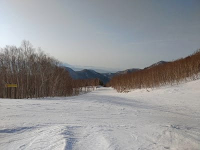

今日も一日，春スキーと割り切れば

そこそこ楽しめる，いいスキー日和

だったようです…！

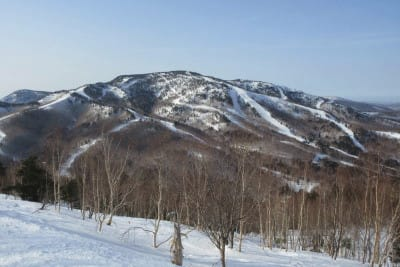

…そして．

今日繰り出した特派員は，いつにも

増して優秀だったようで．

なんと，一の瀬ファミリーのナイターの

写真まで送られてきました…！！！

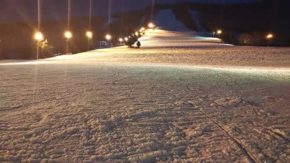

けど．

一の瀬ナイター，写真を見て分かるように．

ナイター前の圧雪がかかっておらず，

昼間に荒れた雪がそのまま凍った，

転倒者続出の超デンジャラス

ガタガタバーンだったようです…

こんな中を，

「ボコボコが固まって跳ね飛ばされそう」

とメッセージを書きながらも，

最終的には結局1時間半滑ったという

この特派員のレポートを見て．

「やはり，志賀高原の特派員は違う…」

と，今日もおかしな素晴らしい特派員に

感服した，Skier_Sだったのでした…

で．

明日20日(土)は．

昨日の予想通り，朝は晴れて午後は曇り．

朝から気温は高めで，昼間は+10℃まで

気温が上がりそうなので．

かなり重い春雪になってしまいそう．

まぁ，リフト営業中は雨が降らなさ

そうなだけ，マシと捉えましょう…

そして．明後日21日(日)は．

朝からリフトが動かせるか？という

激烈な南風で，かつ高温の雨粒が

吹き付けてくるという，

…いろんな意味で，

スキーヤーの精神力を鍛えてくれる天気

になるでしょう．

…果たして．

日曜は何名の特派員が生き残るのか！？？←自分が行かないとなると，完全他人事を楽しむモードになってないか？

## 💬 コメント一覧

### 💬 コメント by (Goku)
**タイトル**: Unknown
**投稿日**: 2021-03-20 19:33:05

今日は奥志賀第３と寺小屋が文句無しで優勝!

長野市が２０℃近くまで気温上昇したってのに、ほぼ緩みなしは素晴らしい。

お昼過ぎの高天ヶ原も程よく緩んで、なかなかのエッジ噛み具合。

やはりこの気温になれば、西斜面、北斜面、そして標高の高さがモノを言いますね。

でも、なんてったってSさんが愛して止まないヤケビGSコースの朝イチが最高でした。

### 💬 コメント by (Skier_S)
**タイトル**: ＞Gokuさま
**投稿日**: 2021-03-21 03:35:58

寺小屋も良かったんですね！！

滑りに行きたかった…（涙）

朝イチGSも滑りたかった…

でも，ゴンドラがやっぱり混みますね．

早く8人フル乗車できる状況に戻ってほしい…（切望）

