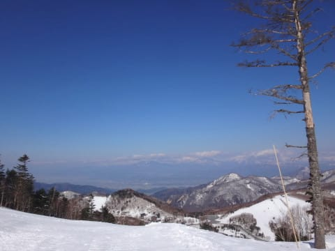
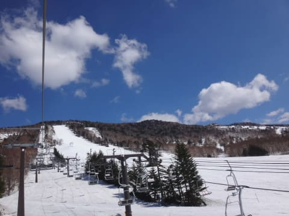
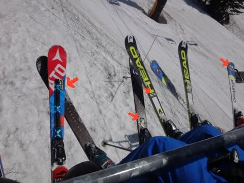
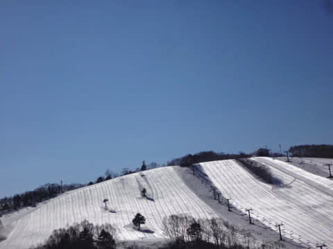

# そしてGWが終わって…20000mクラブな方々が残した名言集

📅 投稿日時: 2017-05-10 03:30:59

というわけで．

長きに渡ったGWが終わったわけですが．

[Skilineでのシーズン滑走標高差上位ランク](https://www.skiline.cc/myTop100#autodetect=false&resortLinkName=shigakogen&instanceLinkName=top100_sum_shigakogen_2016_2017)の

20000mクラブな方々も．

多くの方は9日連続．

あるいは2日＋5連休という期間，

ひたすら志賀高原で滑っていた…

という，正月休みより長いスキー漬けの

日々だったわけで…

そもそもみんな人と合わせないマイペースで，

それぞれ好き勝手なところを滑るため．

ハイシーズン中に集団で滑ることはほぼありえない，

20000mクラブな方々．

トップシーズンよりも，滑れるエリアが圧倒的に

狭くなってしまうこの時期．

ハイシーズンではありえないほどの高頻度で，

20000mクラブな方々と出会うわけで．

…4/30なんか，その時点での滑走標高差ランキング

1位～6位の全員が，一の瀬正面バーンに集結するという，

これまで私も見たこともないほどの，

トップシーズンでは絶対ありえない，

「危ない人が高密度で集まる特異点」と化し．

そして．

私の知っている限りでは．10人もいないはずの，

20000mクラブのゴールドシールを板に貼っている人．

そのうち4人が同じリフトに乗り合わせるなど…

滑れるエリアが限られるGW．

トップシーズンではありえない頻度で，

20000mクラブな方々と顔を合わせました…

だもんで，このGW中．

20000mクラブな方々と，ゲレンデで言葉を交わす

ことも多かったわけですが．

そこで，いろいろな名言（迷言？）を残してくれました…

名言その１．

GWの9連休，志賀高原を滑り倒した某氏．

7日目にお会いした時の一言．

　「7日間も滑っていると，飽きてきた」

…

…え？

えええっ！？？

飽きる？？

シーズン60日くらい，毎週末ひたすら志賀高原を滑り続ける

あなたが…

いまさら，「飽きる」

なんてことが，あるんですか…っ！？？

それも，GWはまだ2日も残ってますけど…？

…驚愕の一言でした．

＃しかし，このあとも．

＃某氏はリフトストップまでひたすら滑り続けてましたが…（笑）

名言その２．

9日中の8日間，志賀で滑った某大御所．

かなり重い雪＆悪天候でコンディションが悪く．

GWに滑り続けた疲労がたまっていた日の，

夕方近くの時の発言．

　「リフトが動いているから帰れない」

…いやいやいやいや．

別に，リフトが動いている時に帰っても

構わないと思うのですが…

リフトが動いているうちに帰ると

死んだりするわけじゃないと思うので，

帰っても大丈夫だと思うのですが…

でも．

やはり20000mクラブな方々．リフトが動き続ける

限り滑らなくてはならない…という，なにかの

呪いがかけられているようです．

名言その３．

リフト終了10分ちょい前に，一の瀬正面バーンで

出会った某氏．

手短に言葉を交わしたあと，この言葉を残して

全力でゲレンデを落下していったのですが…

　「あと2本乗らなきゃいけないんで」

…え？

…あと2本「乗れる」ではなくて，

「乗らなきゃいけない」んですか…っ！？？

義務ですね！？？

義務なのですねっ！？？

一体何が，この某氏を突き動かしているのか…

＃私はこのあと2本は乗れなかった…

＃ってか，普通のペースなら2本無理だから

名言その４．

そして．

このGWに聞いた名言のうちの，ベスト名言．

シーズン券で滑れる最終であり．

例年ならSkilineの標高差カウントのラストデーである，

GW最終日．

ラストデーのラスト搬器をGetして．

シーズンラストの1本を，感慨深げに滑り終えた

某氏がぼそりと一言．

　「長い戦いは終わった…」

…そうですか…

スキーとは，戦いだったんですね…

そのあとに続いた言葉．

「いや．決してuser1985aさんや，まうちゅうさん

　との戦いではなく．自分との戦いが終わった…」

す，ストイックすぎる…っ！！

…やはり，単に娯楽で滑っている私と，

志賀ベスト3に入る人では，心構えが違う…

…と，強く思った，Skier_Sなのでした…

いやーーー．

20000mクラブ．

濃い人が集まってるなぁ…

## 💬 コメント一覧

### 💬 コメント by (yumi)
**タイトル**: この記事、おもしろ過ぎ（困）
**投稿日**: 2017-05-10 18:12:33

毎日、頑張って山登りをしてくれた愛車のメンテナンスで、待ち時間にちょいと記事を覗いていたら、面白過ぎて思わず吹き出してしまって困りました。。。

名言も面白かったけど、Ｓさんの突っ込み最高！！

こんなに面白いブログを教えてくれたＷ69さんにも感謝です。

### 💬 コメント by (Goku)
**タイトル**: 世界ランキング
**投稿日**: 2017-05-10 19:13:59

skiline世界ランキング１００位以内に志賀のトップ５が入っていますね。

凄すぎです。

で、志賀７位までの方の標高差が抜き出てますね。

まさに神セブンです(笑)

そんな方々と一緒に滑れて、何だか誇らしく思えてきました。

『７日間・・・・飽きてきた』の前に『飲まず食わずで・・・』というフレーズが確かありましたよね？私はあれがマジでウケました～（爆）

### 💬 コメント by (しんちゃん)
**タイトル**: 濃い～ですねぇ
**投稿日**: 2017-05-10 22:26:01

凄い名言（迷言？）の数々、爆笑してしまいました(笑)

そんな濃い～方々と今シーズンお話しできただけでも光栄です。

そんなS様も、一ノ瀬で20000mクラブの方と暴走されているとき、リフト乗り場付近で名言（迷言？）を言われていましたよ。「ついていけない」って。(笑)(^^;

Ｓ様のあれだけのスピードで滑っていてもついていけないなんて、と思っていたのですが、世界ランキングにも入っている方々と比べるとうなづけるなと思いました。。。

### 💬 コメント by (KENKEN)
**タイトル**: 名言(迷言？)面白すぎです。
**投稿日**: 2017-05-10 23:38:09

名言(迷言？)笑かして貰いました。

でも今シーズンSさんがある日の最後の一本で言った"今日はさすがに疲れました"の一言は、この人もスキーで疲れるんだ( ; ゜Д゜)と自分にはとても衝撃でした。

今シーズンは本当に凄い人達を見すぎました(゜ﾛ゜;ﾉ）ﾉ。

### 💬 コメント by (Skier_S)
**タイトル**: 数多くの名言が生まれました
**投稿日**: 2017-05-11 05:02:43

＞yumiさま

今回の記事，楽しんでもらえたようで…

良かったです（笑）

20000mクラブな方々は，ネタの宝庫です．

＞Gokuさま

いやーーー．

今シーズンのトップ７は，またハイレベルな

争いでしたよね．

しかし．

「飲まず食わず休まずでもう7日間も

滑ってる」

というのも衝撃でした…

＞しんちゃんさま

いやーー．

ここには書けないような，数多くの

名言や伝説が，今回も続出しました．

20000mクラブの皆さん，すごすぎます（笑）．

…しかし，ホントに20000mクラブのコアな

みなさんは速いので，私は全くついて行けません．

一緒に滑るのは，2本が限度です…（涙）

＞KENKENさま

いやいやいや．

このGW，私もかなり疲れましたよ．

やっぱり，雪が重いし，早朝から滑ると

夕方にはもうヘロヘロでした…

何度もコース上でたそがれてました（笑）．

そんな私の横を，止まらずに追い越していく，

20000mクラブな方々…

「やっぱり，サイボーグは違う」

と思ってしまいます（笑）．

### 💬 コメント by (茶色いねこ)
**タイトル**: Unknown
**投稿日**: 2017-05-14 12:44:43

私の知らない世界の人達の名言(迷言?)ですが、すごすぎて(爆)

楽しませて頂きました〜

### 💬 コメント by (w69)
**タイトル**: 来シーズンが楽しみ
**投稿日**: 2017-05-15 15:21:16

皆さんの極めてアブノーマルなご活躍を刺激に、今年はしっかり楽しませて頂きました。。言い忘れましたが私の奥志賀ゴンドラ48本の記録に、もう一つ追い風がありました。ロイヤルファミリーのおかげだと思うのですが、その日はリフトの間引きがなかったのです。とにかく滑る以外の走り続けるなどの動作がとても疲れました（ばか）。S様、ゴールドワッペンを楽しみにしています。車や釣り道具にも貼っちゃおうかなあ。

たった今、山奥の仙人生活からひとまず帰ってきました。帰ったらまずはこのブログです。ありがとう。

この世界に引き入れてくださったyumirinさんけいじとよださんご夫妻に感謝です。お二人とも今年もトータル333333mを達成されましたね。面白すぎます。

### 💬 コメント by (Skier_S)
**タイトル**: アブノーマルな世界です（笑）
**投稿日**: 2017-05-16 02:06:11

＞茶色いねこさま

いや．

ホントに，

この人たち，すごすぎますから…

私が極めて凡人に思えます．

ぜひ，実際に志賀高原でこの人たちを

見つけてみてください．

感動しますから…

＞w69さま

奥志賀48本の記録は，20000mクラブの中でも

たびたび話題に上ります…

すごい記録です．

たぶん，今後抜かれることは無いかと思います…

凄すぎです．

来シーズン，ゴールドステッカーお渡しします．

20枚配布ですので，いろんなところに貼ってください．

山菜採りは一区切りついて，下山されたのですね…

私は相変わらずスキー三昧です．

引き続きこのBloｇをご愛読ください～！

