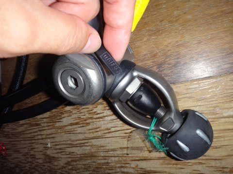
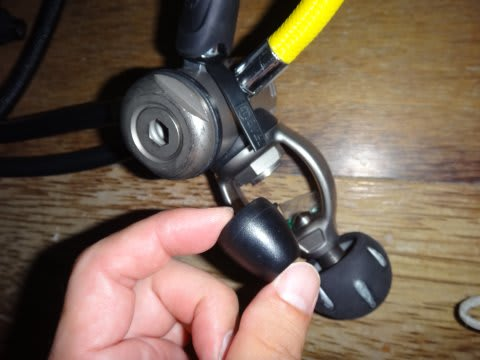
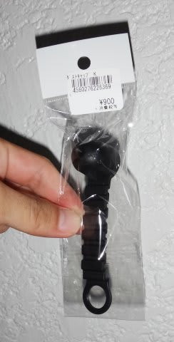
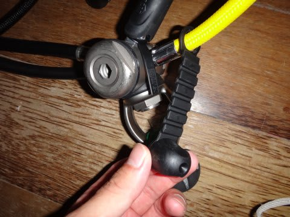

# レギュレータのダストキャップが！？？

📅 投稿日時: 2016-09-20 05:06:07

えー．

なぜか祭日の本日も会社に行っており（涙）．

休みがない今日この頃，いかがお過ごしでしょうか．

＃というより，この時間に更新していることがマズいのでは…？

ってことで．

本日は記事を書く時間がないので．

小ネタをば…

この夏休み，モアルボアルに行ってきたわけですが．

その直前，ダイビング器材を準備している時．

レギュレータを荷造りしようとしていると…

え，ええっ！？？？

な，何てことだ～っ！！

ファーストステージのダストキャップを

レギュにぶら下げるバンドが切れちゃって，

ダストキャップが外れてるじゃないかっ！！？？

これがいかに致命的か．

…ダイバーなら分かるはず…

ダイバーは，レギュをタンクから外した後，

何より最初に「ダストキャップをはめる」という

動作を教え込まれます．

すぐにキャップをしないと

レギュの中に水が入ってしまい，

レギュが壊れてしまうので…

で．ダストキャップがこんな状態では．

タンクにレギュを付けた後．

狭いボートの上でダストキャップを

なくさないように保管するのは至難の業だし．

タンクからレギュを外したあと，

すぐにキャップができないじゃないですか！

特に，ダイビングスタッフがレギュの付け外しを

してくれるフィリピンでは…

ダストキャップが無いレギュがどう扱われるか

分からず，危険極まりない…っ！！

で．

出発は明日だ．

どうしよう…？？

とりあえず，出発当日，早めに家を出て．

成田空港に行く途中にちょっと寄り道して，

ダイビング用品店に立ち寄ると…

あった．

あったよ．

ダストキャップが修理部品として置いてありましたよ．

…取りつけてみたところ．

メーカーが違うので，取り付け具合が

ちょっと微妙な感じだったけど…

まぁ，何とか使えそうで一安心．

しかし．

約15年モノのレギュ．

ちゃんとオーバーホールしてるけど．

そういや，ダストキャップは交換したこと

なかったなぁ…

これ，旅行先で起きたら．

レギュをレンタルで借りなきゃならなかったかも？？

ダストキャップって，オーバーホール

対象部品ではないけど．

壊れると途方に暮れる部品なので．

今回，たまたま出発前に気づいて良かった…！

そして．

たまたま出発当日に寄ったダイビング用品店に，

在庫があって良かった…！

と，

とりあえず「良かったこと」にして

自分を満足させた，Skier_Sなのでした…
