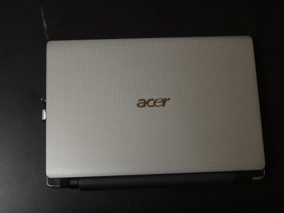
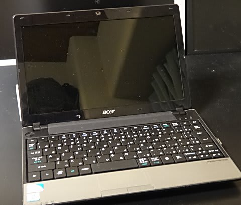

# ふむ？ノートパソコンの時計が起動時にリセットされる…分解・修理だっ！！

📅 投稿日時: 2014-10-16 00:13:21

とゆーわけで．

ひとつ前のエントリに書きました通り．

今朝…というか．

今から約24時間前に，パラオのホテルを出て．

それから国際線に乗って，今朝成田帰国．

そのまま出社したわけですが．

…会社から，つい先ほど帰ってくるという．

朝会社に着いた時にすでにヘロヘロだったのに，

さらに一日ハードワークをこなし．

先ほど帰ってきました…

…すごく長い一日だった…

…死ぬかと思った．

また明日，仕事に行けるかなぁ…

とりあえず．

今日は，出発前に書きためておいた，

ちょっといつもと違うネタを…

---

パラオ出発前のこと．

旅行先での写真整理と保存用に活用している，

ACERのASPIRE1830Zという，

5年モノの激安ノートパソコンを立ち上げたとき．

なんだか，Windows updateも走らないし，

そのほか不思議な現象が起こり．

「あれれ？」

と，思ったんですが．

な～んだ．

PCの時計が，2010年1月にリセットされちゃってるよ…

　「よしよし，時計をセットしたらちゃんと動くようになった．

　これでOK!」

…と，

安心していたところ．

次に起動したときも，またまた時計がリセットされているという

悲しい現象（涙）が…

私は，ノートパソコンを使わない時はバッテリーを外すという

習性をもっているので．

「これは，RTC（リアルタイムクロック）用の

　バックアップバッテリーが空っぽになっちゃって，

　時計がリセットされているんだろうなぁ～．

　とりあえず，電源をしばらくつないでおけば，

　バックアップバッテリーが充電されるだろうから，

　直るはず…！」

と，楽観して．

しばらく電源につないで放置しておき．

それから再起動してみたところ…

ぐはぁ！

時計がまだリセットされてるよっ！！！！

0:00に戻ってるよ！

「…

　も，もしかすると．このパソコン．

　RTCのバックアップ電池が，2次電池じゃなくて

　1次電池なのか？？？」

デスクトップPCのように，マザーボードがむき出しで，

割と簡単に電池交換できるならいいけど．

ノートPCのバックアップ電池で一次電池なんて，

そんなのあるの…？？？？

と，思って，いろいろ調べてみたところ．

最近はコストダウンのため，一次電池を使っている

ノートPCがほとんど，とな…

私のようにバッテリーを普段は外しておくって

人じゃなければ，バッテリーからの給電があるので，

一次電池でもほぼ半永久的にもつはず…

さらに，時計用のLSI（RTC)の消費電力がすごく減って，

ボタン電池でも基本的に5年以上持つはず…

ってことで，現在ではほとんどのノートPCが，

コストダウンのために，充電ができないボタン電池を

RTCバックアップ用に使っているとのこと．

…そうだったのか．

私のように，毎回バッテリーを外す人は想定外だったのか？

あるいは，ノートパソコンなんて，5年間も使わないよね…

という想定なのか？？

とりあえず，私は「想定外」の使い方をしているようで．

…ってことは．

ってことは．

ノートPCを分解して，RTC用ボタン電池を交換しないと．

この

「毎回時計リセット地獄」が続くのね…

実に，実にめんどくさい．

まぁ，普通．

交換するかもしれないRTCバックアップ電池って，

おそらく交換しやすい場所についてるよね…

という楽観的観測のもと．

貧乏金なしな我が家では，ノートパソコンを

買い替えるなどという余裕がないため．

5年前に激安で買ったノートパソコンを

修理して使うしかない！

ってことで．

ACER ASPIRE 1830Zを

分解することになったのでした…

（続く）
