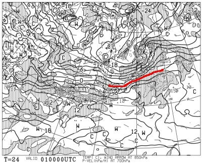
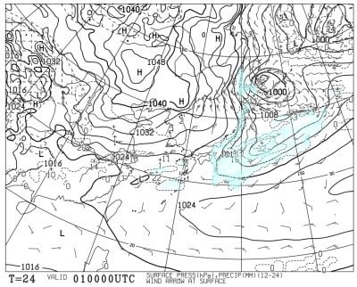
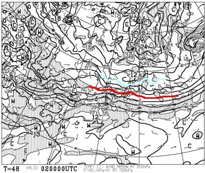
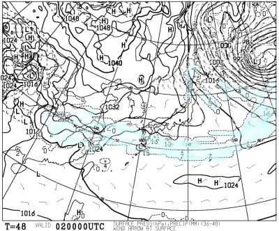
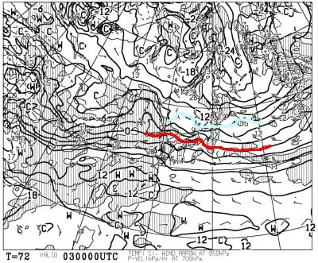
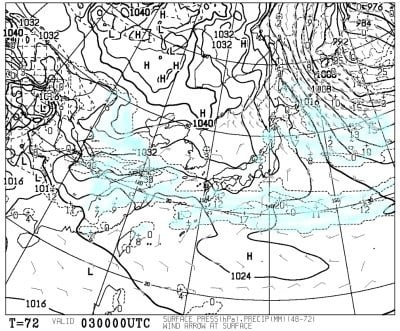
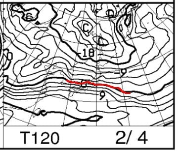
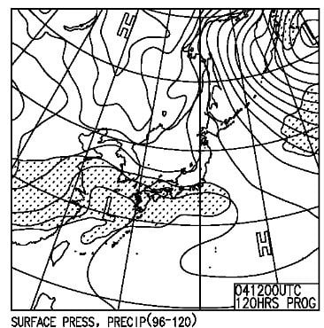

# 2月3，4日の週末の志賀高原スキー場の天気は…土曜は雪がぱらつく曇り空，日曜は曇りのち晴れ間も．2日ともそこまで気温が上がらず，コンディションは良さそう

📅 投稿日時: 2024-02-01 01:49:38

なんだか，本日の志賀高原．

雪が降っても夜からだろうなぁ…

と思っていたら，昼過ぎには雪が

ぱらついていたみたいですね…

降ったのはちらついた程度で，

積もるほどではなかったようですが．

今日の昼間は降れば液体の危険性も

あったところ，降ったのは液体じゃなく

個体だったので，とりあえず一安心…

ってなことで．

トップシーズンの最高コンディションが

崩れるかもという，液体が降るデンジャラス

デーは無事乗り越えたので．

これから今週末までは，気温もそんなに

上がらなくて，雪が悪くなる心配はない

です！ご安心を！！

という感じなので，

これから週末にかけてどうなるか，

今後の天気図を見てみるわけですが…

まず，2月1日の850hPa図を見てみると．

赤い0℃線が志賀高原に結構近づいて

ますが，志賀高原は-3℃線がかかっている

くらいなので…

平年より高めの気温だけど，このくらいなら

雪は全く緩みませんね．

そして，地上天気図を見ると…

うん．

志賀高原にも降水域がかかっているので．

明日は積もるほどではないにしろ，雪が

ぱらつく一日になりますね…

続いて，2日(金)の850hPa図ですが．

この日は水色の-9℃線が志賀高原に

近づいてるので，かなり冷えそう！！

ただ，この日の地上天気図は…

志賀高原に降水域がかかってないので，

この日はせっかく冷えても積雪は

全くなさそう．

うーん．そろそろ積雪が欲しいんですけど…

で．

肝心の週末，3日(土)の850hPa気温を見ると．

この日も水色の-9℃線が志賀高原に近づく

ので，結構冷えそう！！

まぁ，これが平年の1月の冷え込みのレベル

なんですけどね…

ただ，この日の地上天気図も…

志賀高原付近にかすかに降水域が

かかってるっぽく見えるけど…

残念ながら，そこまで積もらない感じ．

積もらないのに中途半端に曇って，

雪がぱらつくならすっきり晴れてほしい…

で．4日(日)の850hPa気温を見ると．

この日は赤い0℃線が北上して，

志賀高原には-3℃線が近づくレベル

ですが…

まぁ，1月とみると気温は高めだけど，

雪質が悪くなる気温じゃないので心配なし．

この日の地上天気図は，太平洋側には

網掛けの降水域がかかってるけど…

日本海側には高気圧の裾がかかってるし，

晴れ～曇り程度かな．

ってなことで，まとめると．

2月1日(木)：昨日の予想では降らない

　予想だったけど…最新の天気図だと

　朝までに5-10cmくらい雪が積もって

　いるか？ちょっと重めの雪．

　朝の気温は-6℃程度．

　あさイチはうっすら新雪が圧雪

　された柔らかめの滑りいいバーン．

　昼間は積もるほどではない雪がパラパラ

　降ったり止んだり．

　昼間もそんなに気温が上がらず，

　比較的いいコンディションで滑れそう．

2日(金)；朝までに数cm雪が積もるかな？

　あさイチはまぁまぁ冷えて，うっすら

　新雪が圧雪されたいいコンディション．

　基本的に曇り空の一日で，時折一瞬雪が

　舞ったり，雲が薄くなって日が射したり．

　トップシーズンらしい一日．

3日(土)：朝までに1-2cm，うっすら積雪．

　この日もあさイチは冷えて，-12℃くらい

　まで冷え込みそう．

　あさイチは冷えたシマシマにうっすら

　かすかに新雪が乗った，冷え冷えGood

　コンディション！

　天気は小雪が舞う一日．

　雪は積もるほどじゃない．

　もしかすると夕方は晴れるかも…

　結構寒いよ！！

4日(日)：朝の積雪は0．

　朝のうちは雲が残りそうだけど…

　午前中から晴れ間も見えるかも？

　あさイチの気温は-6～7℃程度？

　晴れると放射冷却でもっと冷える．

　あさイチは冷えて締まったハイ

　シーズンの最高圧雪！

　昼間は気温が上がりそうだけど，

　マイナス気温はキープしそうなので，

　そこまで雪は緩まない．

　昼間は曇りか，運が良ければ日が

　差す穏やかなスキー日和になり，

　雪も締まって荒れにくいので

　結構いいコンディションかも…！

…という感じで．

本日の雨の危機を乗り越えたので，

今週末はトップシーズンらしい

週末が過ごせそう…！

特に日曜は天気も回復傾向で

良いかも．

ただ．

これからしばらく積雪がなく，そろそろ積雪が

欲しいところ…

5日(月)に10～20cmくらい雪が積もるかも

しれないけど．ちょっと気温が高めで…

今の予想からわずかにずれると，空から

降ってくるのが液体になるかも…

5日に降ってくるのが液体じゃなきゃ，

来週3連休もいい感じの週末が迎えられ

そうな感じかな…

とりあえず．

今週末はまだいいコンディションで

楽しめそうですよ～！！
