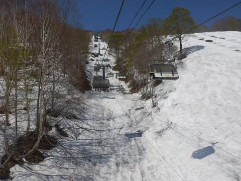
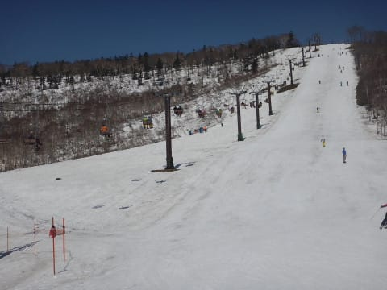
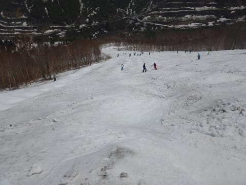
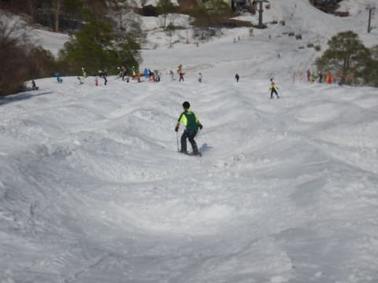

# 5月20日，土曜日のかぐら，写真たっぷりで詳細レポート…暑かったけど，雪はたっぷり．来週も問題なし！

📅 投稿日時: 2017-05-22 00:02:39

🏷️ カテゴリ: [2017スキー滑走日記](c7d777cecfc91bdf0fa464ad62c6d49ab.md)

えー．

昨日，ある程度詳細なレポートをした，

土曜のかぐらですが．

写真がまだまだいっぱいあるので，

今日は追加の写真をたっぷり放出します～！！

昨日は，リフト券売り場がすごい列という

写真を載せましたが…

これだけで済まず．

リフト券を買った後，ロープウェー乗り場の

列もこんな感じで，すごい列です（泣）

ロープウェーに乗るまで，20分くらい

かかりました…（涙）．

20分ほど並んで，ロープウェーに

乗りますが…

この日は朝からすっきり晴天で，

朝から「暑い！」と思うほど．

で．

ロープウェーに乗って，みつまたゲレンデに

やってきますが…

先週はまだ雪が残っていた，みつまた

大会バーン．

うーーーむ．

もう雪はほぼ消えましたね～（涙）

でも．

ロープウェーからみつまたリフトへのコースは，

まだ雪がしっかり残っているし．

みつまたコースも，先週より幅は狭くなったけど．

まだしっかり雪の厚みはありますね～．

そして，みつまたからゴンドラへ滑り込むコースも．

まだ十分な幅があり．

来週までピスラボじゃなく，雪を滑って

行けるかな～．

ゴンドラ乗り場も待ちました（涙）．

…ちなみに．

みつまたエリア近辺は，

かなりこいつに頼るところが多い感じで．

全体的に，雪はしっかり固まってる…

というより，かなり強引に固められている

感じです（笑）．

という感じで．

ゴンドラに乗って．

やってきました，

かぐらゲレンデ！

いつもなら廊下になっている，

高速リフトへ滑りこむコースも

幅いっぱい雪がついてますし…

クワッドリフト下にまだこんなに

雪が残ってるなんて！

メインバーンは，コース端の部分，

ちょっと土が出てきちゃってるものの…

でも，まだほぼ幅いっぱい滑れる感じ！

雪質は，朝イチからちょいとゆるめでは

あったものの…

でも，板が潜ってしまうほどのザブザブではなく．

朝のメインバーンは，比較的

気持ちよく飛ばせたかな！

リフト待ちは，9時半ごろはこんな感じだったけど…

うげげげげ！！

10時にはこんな感じで．

10分近い待ちになっちゃいました…（涙）

だもんで．

リフト待ちを避けて，

パノラマコースへ移動！

いやーーー．

まさか，5月20日を過ぎて，

まだパノラマコースが滑れるとはっ！！

去年とは大違い…

パノラマのリフト待ちは最大この程度で．

まぁ，混雑してる高速リフトよりは

マシかな～．

パノラマは，午前中はいい感じだったけど．

午後はコース真ん中，ちょっと穴が開いてきたので…

まだ雪はたくさんあるように見えますが，

まぁ，来週は滑れないでしょう…

んで．

パノラマをしばらく回して，11時ごろに

クワッドリフトに戻ってくると…

ありゃ？

クワッドリフトが飛び乗りに近い

ガラガラになってるんですがっ！？？？

うーむ．

みんな早めにお昼に行ったのかなぁ？？

ってわけで．

クワッドに戻り，今度はジャイアントコースを

攻めるのだ！

ジャイアントコース，とりつき部分は

まだ大丈夫だけど…

途中，ちょっと一部だけ土が出ちゃってる

ところが…（涙）

でも，そこ以外は全然問題なし！

ただ，コブは全体的に浅かったかな～．

いつもはコースが切れかける，

最後の部分も全然問題なし！

ジャイアントは，来週も行けそうですね～！

で，今度はテクニカルコースにやってきますが…

こちらも意外とコブは浅め．

テクニカルは，ジャイアントに比べ，

途中のコブ溝がちょっとヤバい感じに

なっていて…

急斜面になる部分，

ほぼ全部のラインで，コブ溝に

土が出てたのが惜しい！

来週は厳しいかな～．

いやー．

しかし．

ピカピカ晴天のこの日．

昼間の日差しが強くて．

もう，Tシャツで十分なほど暑かったですが．

でも，意外と雪は粘りつかず，

結構板が滑りましたね～．

そして，午後になると．

メインバーンは…

ありゃりゃりゃ！

すごい人口密度…（涙）

昼より人が増えたかな？

だもんで．

昼間は飛び乗りできるくらいガラガラだった

リフトも，午後1時半以降になると…

あら？

またリフト待ちが増えちゃったんですが…（涙）

昼間にリフト待ちが減った際，

午前中は動いていた，並行してるペアリフト．

午後はこいつを止めちゃったのが，

ちょっと残念…

これだけの人間がガンガン滑っている

わけなので．

午後2時ごろになってくると．

メインバーンのコブ化がかなり進んできて…

午後3時には…

Oh！

コブ祭り！！

コース全面，コブフェスティバル絶賛開催中っ！！

リフト営業終了の，午後4時近くになると．

さらに掘削作業が進み…

もう，ジャイアントやテクニカルなんかの

不整地コースよりコブが深いんですが！？？

しかし．これだけのコブになっても，

コブ溝に土が出てないのがすごいなぁ…

まだ，パークのキッカーも雪がたっぷり

あるおかげで，巨大なままだし．

…ホントに，今シーズンのかぐら，

すごいわ…

ってな感じで．

午後4時になると．

残念ながら，かぐらゲレンデは終了！

下山タイムです…

ゴンドラコースは，まだまだ雪が

たっぷり残ってるし．

まぁ，来週まで問題なく

スキーで下山できそうな勢いですね～．

ゴンドラに滑りこむコースの

雪もまだ心配なさそうだし．

みつまたゲレンデも…

下山連絡用って言ってるけど．

これって，

オープン直後のYetiより，

よっぽど幅が広いのでは！？？？

ってか，去年は．

この時期に，かぐらメインバーンが

これよりひどかった気が…

ってことで．

たっぷりの写真でお分かりのように．

まだまだ来週も楽しめそうですよ～！

## 💬 コメント一覧

### 💬 コメント by (しんちゃん)
**タイトル**: すごい人口密度
**投稿日**: 2017-05-22 00:02:24

スキーされる方、結構いるんですね。

人口密度が高くて驚きました。(@_@)

### 💬 コメント by (Skier_S)
**タイトル**: しんちゃんさま
**投稿日**: 2017-05-22 00:54:12

いやー．

この時期のかぐら，例年すごいですよ．

ってか，この時期はもう月山・かぐら・横手など，

滑れるところが限られるので，

人が集中する感じです…

